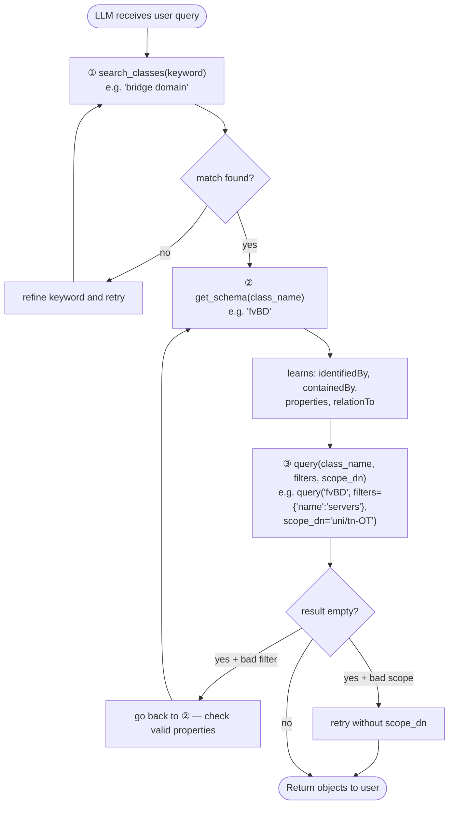
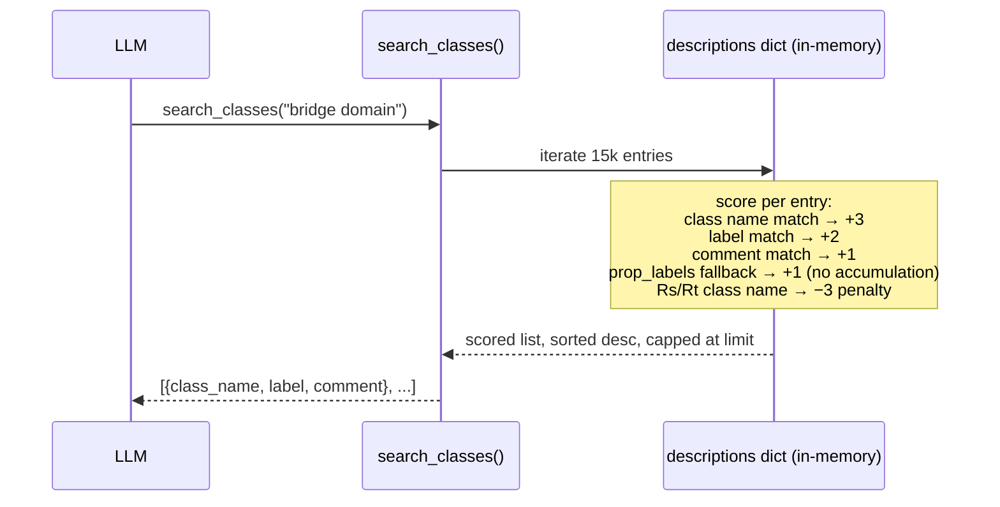
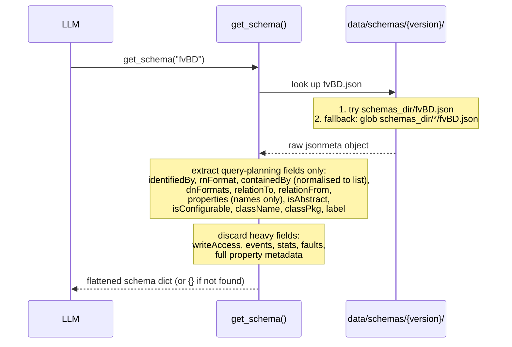
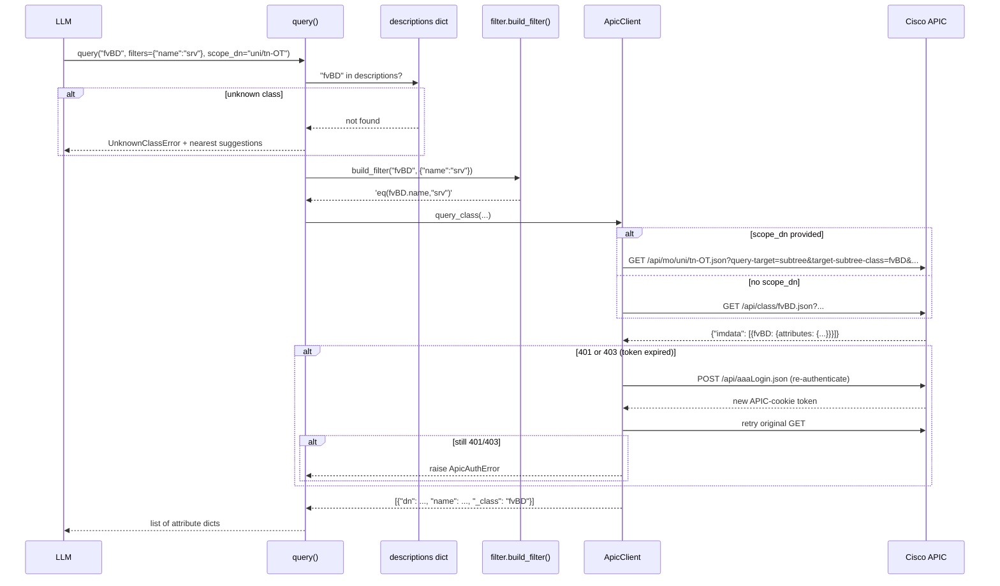
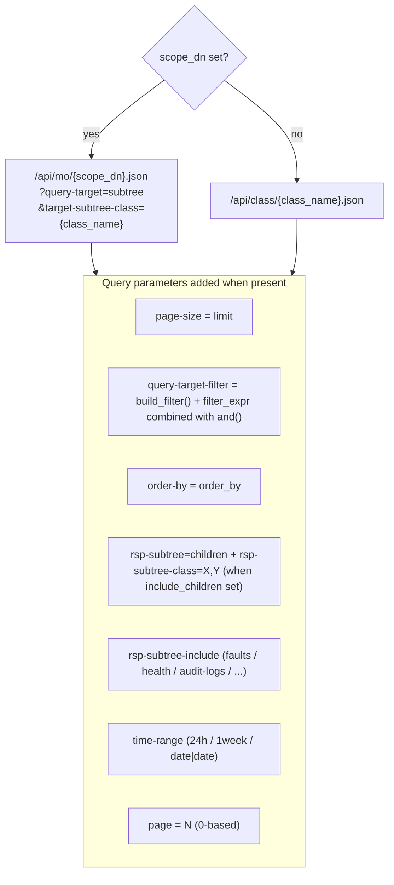

# Data Flow

## LLM mandatory tool sequence

The three tools **must** be called in this order. Skipping `search_classes` or `get_schema` causes silent empty results because the APIC returns `[]` for unknown class names or wrong attribute names without any error.

---

## search_classes — internal flow

---

## get_schema — internal flow

---

## query — internal flow

---

## APIC query URL construction

The URL and query parameters built by `ApicClient.query_class()`:

