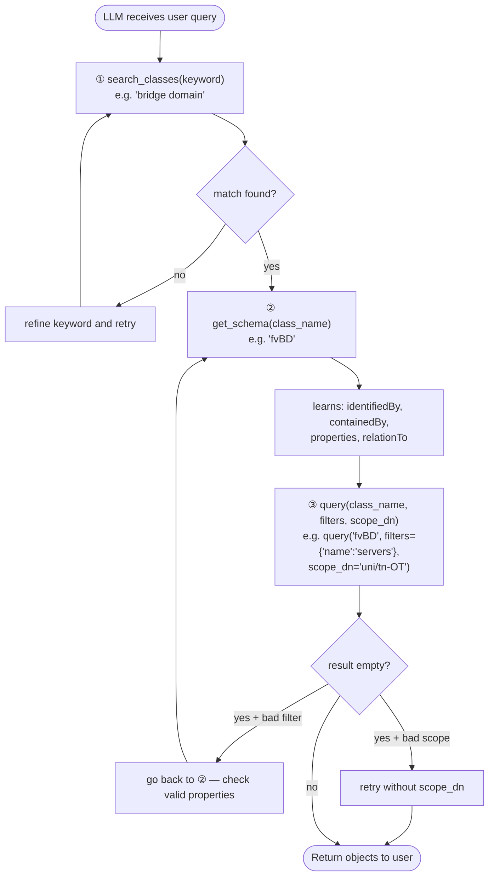
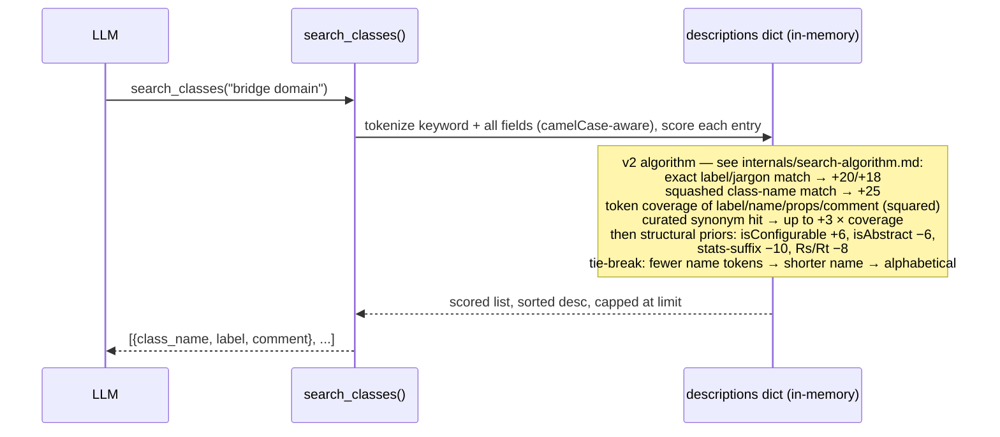
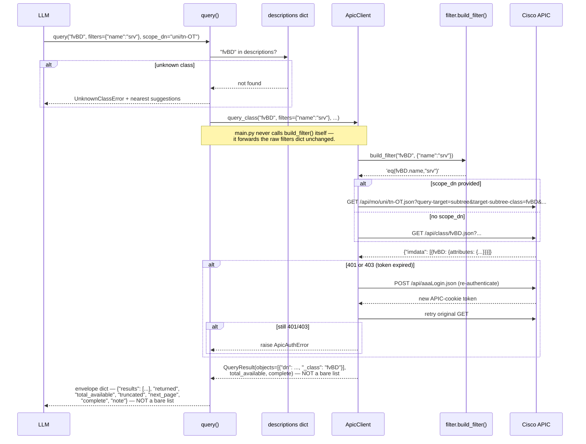
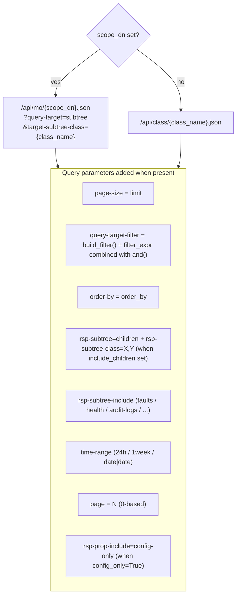

# Data Flow

## LLM mandatory tool sequence

For **discovery**, the three core tools **must** be called in this order. Skipping `search_classes` or `get_schema` causes silent empty results because the APIC returns `[]` for unknown class names or wrong attribute names without any error. When you already hold an exact DN, `get_by_dn` reads it directly and `count` tallies a class — both bypass the discovery sequence.

```mermaid
flowchart TD
    START([LLM receives user query]) --> S1

    S1["① search_classes(keyword)\ne.g. 'bridge domain'"]
    S1 --> D1{match found?}
    D1 -->|no| RETRY["refine keyword and retry"]
    RETRY --> S1
    D1 -->|yes| S2

    S2["② get_schema(class_name)\ne.g. 'fvBD'"]
    S2 --> NOTE2["learns: identifiedBy, containedBy,\nproperties, relationTo"]
    NOTE2 --> S3

    S3["③ query(class_name, filters, scope_dn)\ne.g. query('fvBD', filters={'name':'servers'},\nscope_dn='uni/tn-OT')"]
    S3 --> D3{result empty?}
    D3 -->|yes + bad filter| GOBACK["go back to ② — check valid properties"]
    GOBACK --> S2
    D3 -->|yes + bad scope| S3B["retry without scope_dn"]
    S3B --> DONE
    D3 -->|no| DONE

    DONE([Return objects to user])
```

---

## search_classes — internal flow

```mermaid
sequenceDiagram
    participant LLM
    participant tool as search_classes()
    participant desc as descriptions dict (in-memory)

    LLM->>tool: search_classes("bridge domain")
    tool->>desc: tokenize keyword + all fields (camelCase-aware), score each entry
    Note over desc: v2 algorithm — see internals/search-algorithm.md:<br/>exact label/jargon match → +20/+18<br/>squashed class-name match → +25<br/>token coverage of label/name/props/comment (squared)<br/>curated synonym hit → up to +3 × coverage<br/>then structural priors: isConfigurable +6, isAbstract −6,<br/>stats-suffix −10, Rs/Rt −8<br/>tie-break: fewer name tokens → shorter name → alphabetical
    desc-->>tool: scored list, sorted desc, capped at limit
    tool-->>LLM: [{class_name, label, comment}, ...]
```

---

## get_schema — internal flow

```mermaid
sequenceDiagram
    participant LLM
    participant tool as get_schema()
    participant fs as data/schemas/ (resolved)

    Note over fs: resolve_schemas_dir() runs ONCE at server startup —<br/>picks the flat dir or the right versioned subdirectory.<br/>load_schema() itself never globs; it does one direct<br/>stat/open of schemas_dir/fvBD.json, no subdirectory search.
    LLM->>tool: get_schema("fvBD")
    tool->>fs: read fvBD.json directly
    fs-->>tool: raw jsonmeta object

    Note over tool: extract query-planning fields only:<br/>identifiedBy, rnFormat, containedBy (normalised to list),<br/>contains (child classes, flat notation),<br/>dnFormats, relationTo, relationFrom,<br/>properties (names only), isAbstract,<br/>isConfigurable, className, classPkg, label<br/>+ property_details, opt-in only (include_property_details<br/>or properties_filter), skipped by default for token economy

    Note over tool: discard heavy fields:<br/>writeAccess, events, stats, faults,<br/>full property metadata

    tool-->>LLM: flattened schema dict (or {} if not found)
```

---

## query — internal flow

```mermaid
sequenceDiagram
    participant LLM
    participant tool as query()
    participant desc as descriptions dict
    participant apic as ApicClient
    participant filter as filter.build_filter()
    participant cisco as Cisco APIC

    LLM->>tool: query("fvBD", filters={"name":"srv"}, scope_dn="uni/tn-OT")

    tool->>desc: "fvBD" in descriptions?
    alt unknown class
        desc-->>tool: not found
        tool-->>LLM: UnknownClassError + nearest suggestions
    end

    tool->>apic: query_class("fvBD", filters={"name":"srv"}, ...)
    Note over tool,apic: main.py never calls build_filter() itself —<br/>it forwards the raw filters dict unchanged.
    apic->>filter: build_filter("fvBD", {"name":"srv"})
    filter-->>apic: 'eq(fvBD.name,"srv")'

    alt scope_dn provided
        apic->>cisco: GET /api/mo/uni/tn-OT.json?query-target=subtree&target-subtree-class=fvBD&...
    else no scope_dn
        apic->>cisco: GET /api/class/fvBD.json?...
    end

    cisco-->>apic: {"imdata": [{fvBD: {attributes: {...}}}]}

    alt 401 or 403 (token expired)
        apic->>cisco: POST /api/aaaLogin.json (re-authenticate)
        cisco-->>apic: new APIC-cookie token
        apic->>cisco: retry original GET
        alt still 401/403
            apic-->>tool: raise ApicAuthError
        end
    end

    apic-->>tool: QueryResult(objects=[{"dn": ..., "_class": "fvBD"}],<br/>total_available, complete) — NOT a bare list
    tool-->>LLM: envelope dict — {"results": [...], "returned",<br/>"total_available", "truncated", "next_page",<br/>"complete", "note"} — NOT a bare list
```

---

## APIC query URL construction

The URL and query parameters built by `ApicClient.query_class()`:

```mermaid
flowchart TD
    SD{scope_dn set?}

    SD -->|"yes"| URL_MO["/api/mo/{scope_dn}.json\n?query-target=subtree\n&target-subtree-class={class_name}"]
    SD -->|"no"| URL_CLASS["/api/class/{class_name}.json"]

    URL_MO --> PARAMS
    URL_CLASS --> PARAMS

    subgraph PARAMS["Query parameters added when present"]
        P1["page-size = limit"]
        P2["query-target-filter = build_filter() + filter_expr combined with and()"]
        P3["order-by = order_by"]
        P4["rsp-subtree=children + rsp-subtree-class=X,Y (when include_children set)"]
        P5["rsp-subtree-include (faults / health / audit-logs / ...)"]
        P6["time-range (24h / 1week / date|date)"]
        P7["page = N (0-based)"]
        P8["rsp-prop-include=config-only (when config_only=True)"]
    end
```

