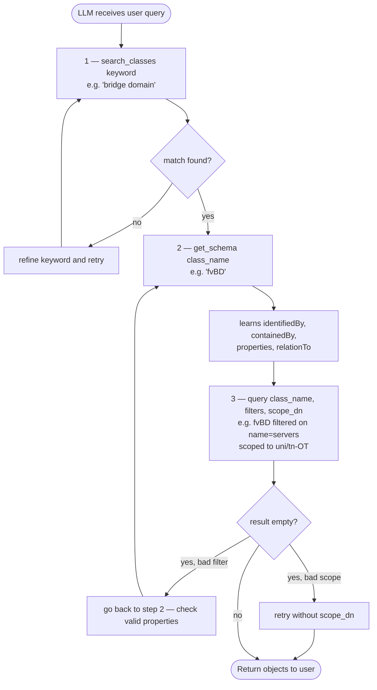
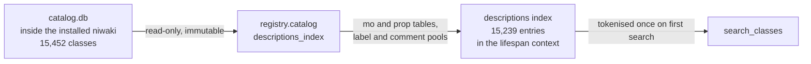
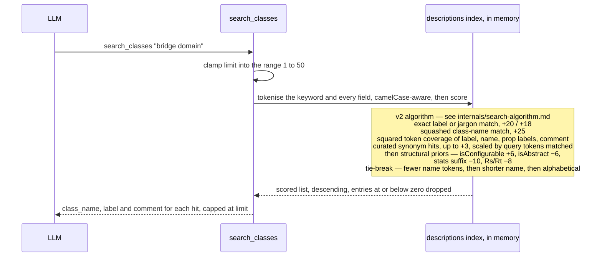
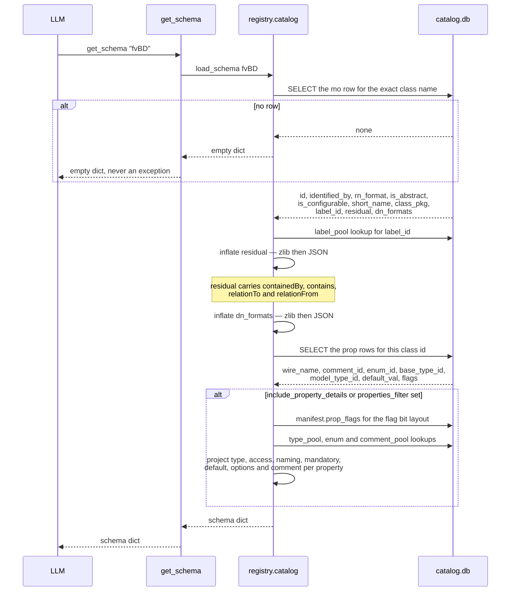
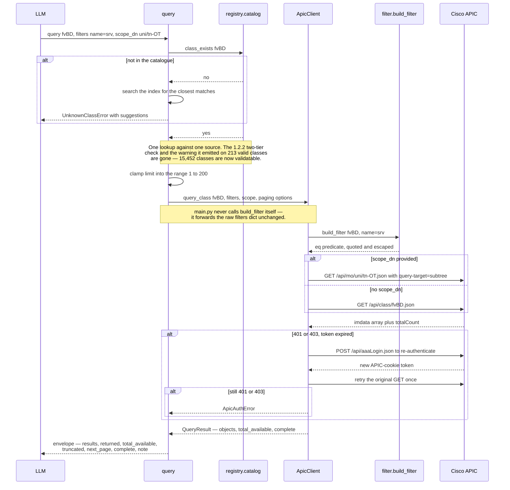
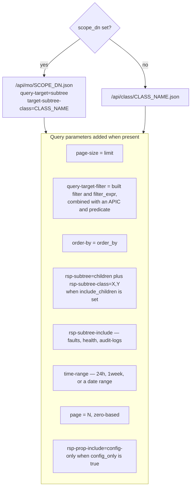

# Data Flow

Two data sources feed the five tools, and they never mix. `search_classes` and `get_schema` are answered entirely from process-local data — the in-memory search index and the SQLite catalogue that ships inside the `niwaki` dependency. `query`, `get_by_dn`, and `count` go to the live APIC. The object model tells the agent what to ask for; only the fabric knows what is actually there.

---

## LLM mandatory tool sequence

For **discovery**, the three core tools **must** be called in this order. Skipping `search_classes` or `get_schema` causes silent empty results, because the APIC returns `[]` for unknown class names or wrong attribute names without any error. When you already hold an exact DN, `get_by_dn` reads it directly and `count` tallies a class — both bypass the discovery sequence.

```mermaid
flowchart TD
    START([LLM receives user query]) --> S1

    S1["1 — search_classes keyword<br/>e.g. 'bridge domain'"]
    S1 --> D1{"match found?"}
    D1 -->|"no"| RETRY["refine keyword and retry"]
    RETRY --> S1
    D1 -->|"yes"| S2

    S2["2 — get_schema class_name<br/>e.g. 'fvBD'"]
    S2 --> NOTE2["learns identifiedBy, containedBy,<br/>properties, relationTo"]
    NOTE2 --> S3

    S3["3 — query class_name, filters, scope_dn<br/>e.g. fvBD filtered on name=servers<br/>scoped to uni/tn-OT"]
    S3 --> D3{"result empty?"}
    D3 -->|"yes, bad filter"| GOBACK["go back to step 2 — check valid properties"]
    GOBACK --> S2
    D3 -->|"yes, bad scope"| S3B["retry without scope_dn"]
    S3B --> DONE
    D3 -->|"no"| DONE

    DONE([Return objects to user])
```

Class names are matched with SQLite's BINARY collation, so the name you carry from step 1 into steps 2 and 3 must be exact: `fvBd` does not resolve to `fvBD`.

---

## Startup — where the index comes from

Both local tools depend on work done once, inside the FastMCP lifespan, before the first request is served.

```mermaid
flowchart LR
    db["catalog.db<br/>inside the installed niwaki<br/>15,452 classes"]
    cat["registry.catalog<br/>descriptions_index"]
    idx["descriptions index<br/>15,239 entries<br/>in the lifespan context"]
    tools["search_classes"]

    db -->|"read-only, immutable"| cat
    cat -->|"mo and prop tables,<br/>label and comment pools"| idx
    idx -->|"tokenised once on first search"| tools
```

The index is smaller than the class collection by design. `descriptions_index()` drops any class with nothing searchable — no label, no comment, no useful property label — which is exactly the **213-class** gap between the 15,452 classes the catalogue holds and the 15,239 it indexes. Those 213 classes are still valid arguments to `get_schema`, `query`, and `count`; they simply cannot be reached through `search_classes`.

The dict is built once and reused for the process lifetime, because `descriptions.search()` caches its tokenised form against that dict's identity.

---

## search_classes — internal flow

```mermaid
sequenceDiagram
    participant LLM
    participant tool as search_classes
    participant desc as descriptions index, in memory

    LLM->>tool: search_classes "bridge domain"
    tool->>tool: clamp limit into the range 1 to 50
    tool->>desc: tokenise the keyword and every field, camelCase-aware, then score
    Note over desc: v2 algorithm — see internals/search-algorithm.md<br/>exact label or jargon match, +20 / +18<br/>squashed class-name match, +25<br/>squared token coverage of label, name, prop labels, comment<br/>curated synonym hits, up to +3, scaled by query tokens matched<br/>then structural priors — isConfigurable +6, isAbstract −6,<br/>stats suffix −10, Rs/Rt −8<br/>tie-break — fewer name tokens, then shorter name, then alphabetical
    desc-->>tool: scored list, descending, entries at or below zero dropped
    tool-->>LLM: class_name, label and comment for each hit, capped at limit
```

No part of this path touches the catalogue at request time, and none of it changed in 2.0: the scorer, its synonym table, and its structural priors are the same code, now fed by an index rebuilt from the catalogue instead of read from a file. Measured over the 74-query golden set: **Recall@1 78.4%, Recall@5 94.6%, MRR 0.846**. The suite asserts those three as exact equalities rather than floors, along with the top-5 of every golden query, so a ranking that merely *shifts* fails the build. `tests/perf/` caps a single search over the full index at 200 ms.

---

## get_schema — internal flow

```mermaid
sequenceDiagram
    participant LLM
    participant tool as get_schema
    participant cat as registry.catalog
    participant db as catalog.db

    LLM->>tool: get_schema "fvBD"
    tool->>cat: load_schema fvBD
    cat->>db: SELECT the mo row for the exact class name
    alt no row
        db-->>cat: none
        cat-->>tool: empty dict
        tool-->>LLM: empty dict, never an exception
    end
    db-->>cat: id, identified_by, rn_format, is_abstract,<br/>is_configurable, short_name, class_pkg,<br/>label_id, residual, dn_formats

    cat->>db: label_pool lookup for label_id
    cat->>cat: inflate residual — zlib then JSON
    Note over cat: residual carries containedBy, contains,<br/>relationTo and relationFrom
    cat->>cat: inflate dn_formats — zlib then JSON
    cat->>db: SELECT the prop rows for this class id
    db-->>cat: wire_name, comment_id, enum_id, base_type_id,<br/>model_type_id, default_val, flags

    alt include_property_details or properties_filter set
        cat->>db: manifest.prop_flags for the flag bit layout
        cat->>db: type_pool, enum and comment_pool lookups
        cat->>cat: project type, access, naming, mandatory,<br/>default, options and comment per property
    end

    cat-->>tool: schema dict
    tool-->>LLM: schema dict
```

### Shape of the result

`load_schema()` returns the query-planning view of a class, never the raw model:

| Key | Always present | Notes |
|---|---|---|
| `className`, `classPkg`, `rnFormat` | yes | scalars copied from the `mo` row |
| `identifiedBy` | yes | the attributes that name an instance — use them as filter keys |
| `isAbstract`, `isConfigurable` | yes | booleans |
| `label` | yes | empty string when the class has none |
| `containedBy` | yes | parent classes in `pkg:Class` notation |
| `dnFormats` | yes | empty list when the catalogue stores none |
| `contains` | when non-empty | child class names, flattened and sorted, ready to pass straight back to `get_schema`, `query`, or `include_children` |
| `relationTo` | when non-empty | `{relClass: {targetClass, cardinality}}`, colon notation kept |
| `relationFrom` | when non-empty | `{relClass: {sourceClass}}`, colon notation kept |
| `properties` | when the class has any | sorted attribute names |
| `property_details` | on demand only | present when `include_property_details=True` or `properties_filter` is set |

Four points about that output are easy to get wrong:

- **Property names are wire names.** `descr`, not `description`. The catalogue also stores a readable name for each property; this server never reads it, because a readable name is syntactically valid to the APIC and comes back with `[]` and no error.
- **`relationTo[*].cardinality` is empty for every entry.** That has always been true and is unchanged in 2.0 — the real cardinality lives on the relation class itself.
- **An unknown class returns `{}`, not an exception.** An agent recovers from an empty result; it does not recover from a traceback. The only exception this path raises is `DescriptionsLoadError`, and it means the catalogue is missing or unreadable — a broken installation, not a missing class.
- **`contains` is flattened, `relationTo` and `relationFrom` are not.** Strip the colon before querying a relation class.

### What `property_details` projects

Requested per property, never by default — many classes carry more than a hundred properties, and the point is to protect the agent's context.

| Field | Emitted when |
|---|---|
| `type` | the ACI `modelType`, falling back to the primitive base type |
| `access` | always — `read-write`, `create-only`, or `read-only`, collapsed from the flag bits |
| `naming` | the property is part of the DN |
| `mandatory` | the property is required on create |
| `default` | the catalogue declares a non-empty default |
| `options` | the property is enumerated |
| `comment` | the property has a comment |

The flag bit layout is read from the catalogue's `manifest.prop_flags` rather than hard-coded, and checked against the nine flags this projection needs the first time it is read. A layout change upstream fails loudly instead of silently shifting every access mode by one bit.

Two shapes are filtered rather than passed through, exactly as the 1.2.2 reader filtered them: the `defaultValue` marker entry inside an enum blob, whose local name is not a value the APIC accepts, and the string `"null"` inside a pooled comment, which is how "no comment" is encoded.

### One behavioural change

Properties whose type is `mo:MoClassId`, `mo:StatsPropId`, `mo:StatsClassId`, or `mo:PropId` no longer carry an `options` list — 274 properties across the four types, all with no enum in the catalogue. One `mo:MoClassId` property previously enumerated 17,653 options, which is the entire class list restated inside a single property. Nothing else about `property_details` changed.

---

## query — internal flow

```mermaid
sequenceDiagram
    participant LLM
    participant tool as query
    participant cat as registry.catalog
    participant apic as ApicClient
    participant filter as filter.build_filter
    participant cisco as Cisco APIC

    LLM->>tool: query fvBD, filters name=srv, scope_dn uni/tn-OT

    tool->>cat: class_exists fvBD
    alt not in the catalogue
        cat-->>tool: no
        tool->>tool: search the index for the closest matches
        tool-->>LLM: UnknownClassError with suggestions
    end
    cat-->>tool: yes
    Note over tool,cat: One lookup against one source. The 1.2.2 two-tier<br/>check and the warning it emitted on 213 valid classes<br/>are gone — 15,452 classes are now validatable.

    tool->>tool: clamp limit into the range 1 to 200
    tool->>apic: query_class fvBD, filters, scope, paging options
    Note over tool,apic: main.py never calls build_filter itself —<br/>it forwards the raw filters dict unchanged.
    apic->>filter: build_filter fvBD, name=srv
    filter-->>apic: eq predicate, quoted and escaped

    alt scope_dn provided
        apic->>cisco: GET /api/mo/uni/tn-OT.json with query-target=subtree
    else no scope_dn
        apic->>cisco: GET /api/class/fvBD.json
    end

    cisco-->>apic: imdata array plus totalCount

    alt 401 or 403, token expired
        apic->>cisco: POST /api/aaaLogin.json to re-authenticate
        cisco-->>apic: new APIC-cookie token
        apic->>cisco: retry the original GET once
        alt still 401 or 403
            apic-->>tool: ApicAuthError
        end
    end

    apic-->>tool: QueryResult — objects, total_available, complete
    tool-->>LLM: envelope — results, returned, total_available,<br/>truncated, next_page, complete, note
```

The envelope is not a bare list, and `truncated: true` must never be read as a maximum, a minimum, a total, or a complete list. `total_available` is the APIC-reported size of the matching set regardless of how much was fetched; `fetch_all=True` walks pages until a short page ends the loop or a safety cap of 25 pages or 5,000 objects sets `complete: false`.

`count` follows the same validation path — the identical `class_exists` guard, so the two tools can never disagree about whether a class is known — then issues the same class or subtree request with a page size of 1 and reads `totalCount` from the envelope.

---

## APIC query URL construction

The URL and query parameters built by `ApicClient.query_class()`:

```mermaid
flowchart TD
    SD{"scope_dn set?"}

    SD -->|"yes"| URL_MO["/api/mo/SCOPE_DN.json<br/>query-target=subtree<br/>target-subtree-class=CLASS_NAME"]
    SD -->|"no"| URL_CLASS["/api/class/CLASS_NAME.json"]

    URL_MO --> PARAMS
    URL_CLASS --> PARAMS

    subgraph PARAMS["Query parameters added when present"]
        P1["page-size = limit"]
        P2["query-target-filter = built filter and filter_expr,<br/>combined with an APIC and predicate"]
        P3["order-by = order_by"]
        P4["rsp-subtree=children plus rsp-subtree-class=X,Y<br/>when include_children is set"]
        P5["rsp-subtree-include — faults, health, audit-logs"]
        P6["time-range — 24h, 1week, or a date range"]
        P7["page = N, zero-based"]
        P8["rsp-prop-include=config-only when config_only is true"]
    end
```

`page` is deliberately excluded from the shared parameter builder: a `fetch_all` loop reuses the same base parameters and varies only that one value.

---

## See also

- [System overview](overview.md) — components, startup sequence, the catalogue boundary
- [Search algorithm](../internals/search-algorithm.md) — the scoring axes behind `search_classes`
- [`get_schema`](../tools/get_schema.md) and [`query`](../tools/query.md) — full parameter reference
