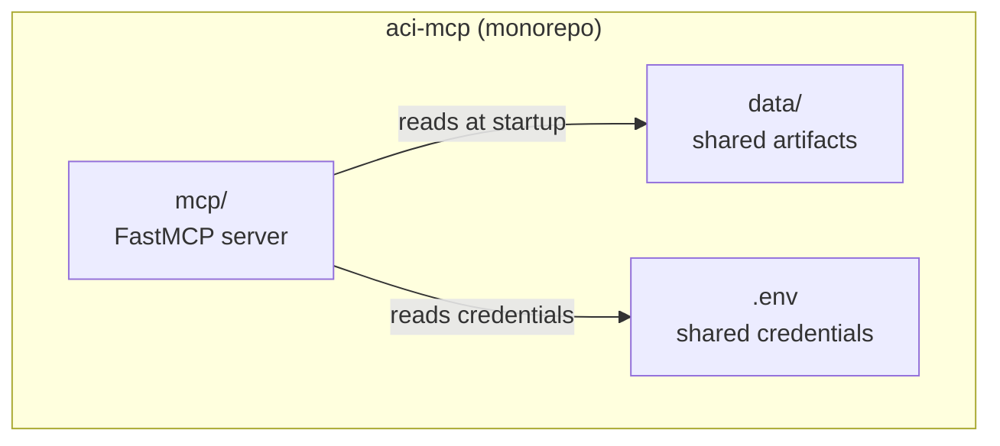
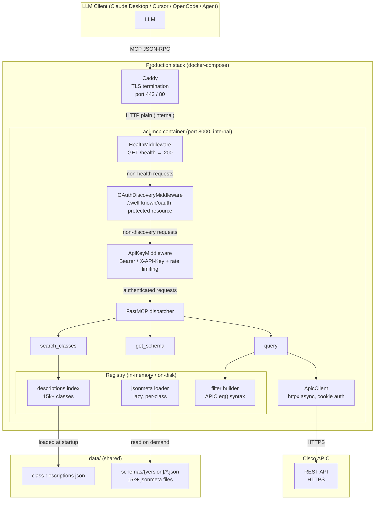
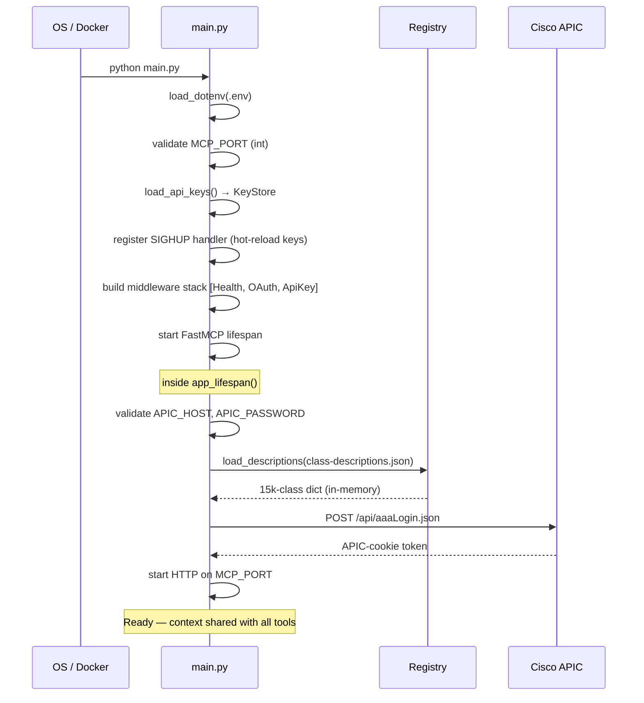

# System Overview

## What aci-mcp does

`aci-mcp` is a [Model Context Protocol](https://modelcontextprotocol.io) server that gives any MCP-compatible LLM client read access to a Cisco ACI fabric — without any hardcoded class knowledge in the model or the server.

It exposes **three generic tools**. The LLM calls them in sequence to discover, inspect, and query any ACI object class — including classes added after the model was trained.

---

## Monorepo layout



`mcp/` reads `data/` (schema bundle) and `.env` (APIC credentials) at the repo root.

---

## Component architecture



---

## Middleware stack

Three middleware layers wrap FastMCP, outermost first:

| Order | Middleware | Purpose |
|---|---|---|
| 1 (outermost) | `HealthMiddleware` | Intercepts any HTTP request to `/health` and returns `{"status":"ok"}` — no auth required. Pure ASGI, zero overhead. |
| 2 | `OAuthDiscoveryMiddleware` | Serves RFC 9728 Protected Resource Metadata at `/.well-known/oauth-protected-resource`. Required by MCP 2025-03-26-compliant clients before authentication. |
| 3 | `ApiKeyMiddleware` | Validates `Authorization: Bearer` or `X-API-Key` tokens. Applies per-IP rate limiting (30 failed attempts / 60 s). Returns `WWW-Authenticate: Bearer resource_metadata="..."` on 401. |

`/.well-known/*` and `/register` bypass `ApiKeyMiddleware` entirely so OAuth discovery and dynamic client registration are never blocked by auth.

---

## Request path

| Step | Where | What happens |
|---|---|---|
| 1 | LLM client | Sends MCP tool call over JSON-RPC |
| 2 | Caddy | Terminates TLS, proxies to port 8000 |
| 3 | `HealthMiddleware` | Passes through (not `/health`) |
| 4 | `OAuthDiscoveryMiddleware` | Passes through (not a discovery path) |
| 5 | `ApiKeyMiddleware` | Validates bearer token — 401 or 429 if invalid/rate-limited |
| 6 | FastMCP dispatcher | Routes to the correct tool function |
| 7 | Tool | Reads registry or calls APIC |
| 8 | `ApicClient` | Builds URL + filter params, sends HTTPS GET to APIC |
| 9 | APIC | Returns `imdata` JSON array |
| 10 | Tool | Flattens objects, adds `_class` key, returns list |
| 11 | FastMCP | Serialises response as MCP JSON-RPC result |

---

## Startup sequence



---

## Key design decisions

### Lazy schema loading

`registry/schema.py` reads individual jsonmeta files on demand. There is no upfront scan of 15 000+ files. The first `get_schema("fvBD")` call reads the file from disk; subsequent calls read it again — the OS page cache is the caching layer. Heavy jsonmeta fields (`writeAccess`, `events`, `stats`, `faults`) are discarded at load time to keep tool responses token-efficient.

### Class validation before APIC

`query()` checks `class_name` against the in-memory `descriptions` dict before forwarding to `ApicClient`. The APIC silently returns `[]` for unknown classes. This pre-check returns a typed `UnknownClassError` with nearest matches so the LLM can self-correct without an extra `search_classes()` round-trip.

### Stateless HTTP

`stateless_http=True` — each MCP request is an independent HTTP call. No session state on the server side. Horizontal scaling is trivial; memory footprint stays flat.

### SIGHUP hot-reload

Sending `SIGHUP` to the server process reloads `MCP_API_KEYS` from `.env` without a restart. The `KeyStore.reload()` call is atomic under a `threading.Lock`, so in-flight requests continue with the old key set uninterrupted.

```bash
kill -HUP $(pgrep -f "python main.py")
```

### Single credentials file

`mcp/` reads `.env` at the monorepo root — APIC credentials and server settings in one place.
