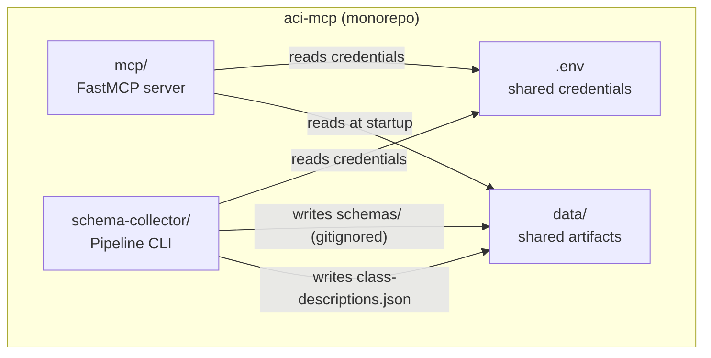
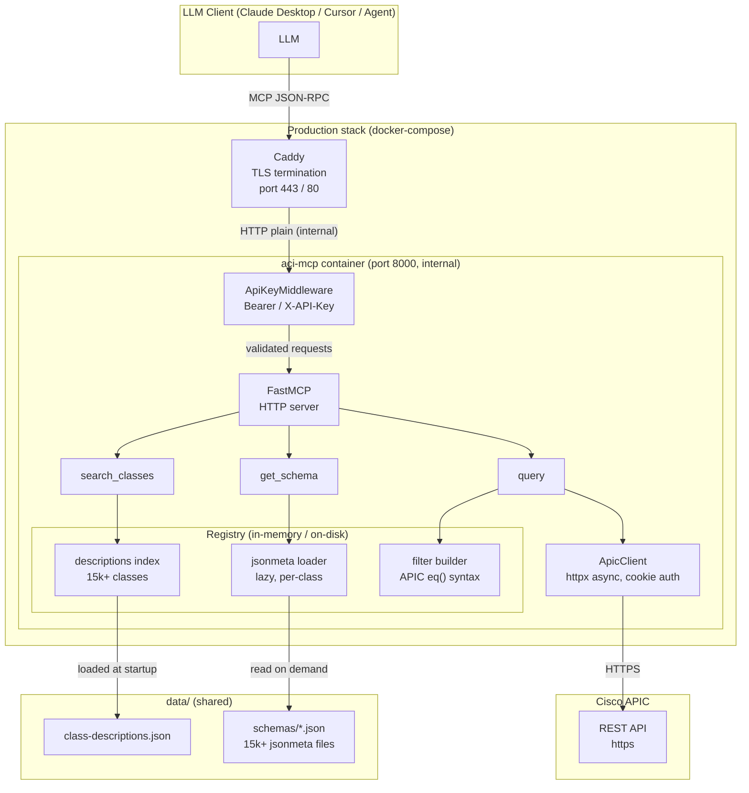
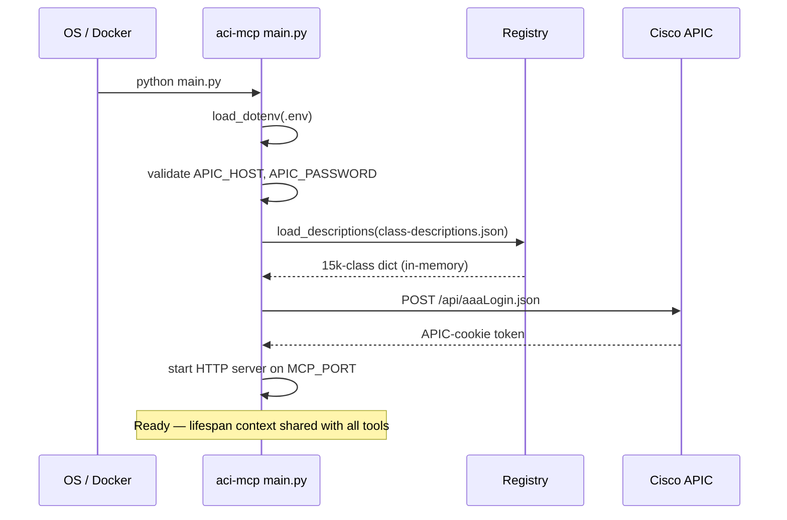

# System Overview

## What aci-mcp does

aci-mcp is a [Model Context Protocol](https://modelcontextprotocol.io) server that gives any MCP-compatible LLM client (Claude Desktop, Cursor, custom agents) read access to a Cisco ACI fabric without any hardcoded class knowledge in the model or the server.

The server exposes **three generic tools**. The LLM calls them in sequence to discover, inspect, and query any ACI object class — even classes that did not exist when the model was trained.

---

## Monorepo layout

The two projects are independent Python packages under `uv`. They share `data/` and `.env` at the repo root.

---

## Component architecture

---

## Request path summary

| Step | Where | What happens |
|---|---|---|
| 1 | LLM client | Sends MCP tool call over JSON-RPC |
| 2 | Caddy | Terminates TLS, proxies to port 8000 |
| 3 | `ApiKeyMiddleware` | Validates `Authorization: Bearer` or `X-API-Key` header |
| 4 | FastMCP dispatcher | Routes to the correct tool function |
| 5 | Tool | Reads registry / calls APIC |
| 6 | `ApicClient` | Builds URL + filter params, sends HTTPS GET to APIC |
| 7 | APIC | Returns `imdata` JSON array |
| 8 | Tool | Flattens objects, adds `_class` key, returns list |
| 9 | FastMCP | Serialises response as MCP JSON-RPC result |

---

## Startup sequence

---

## Key design decisions

### Lazy schema loading

`registry/schema.py` reads individual jsonmeta files on demand — there is no upfront scan of 15 k+ files at startup. The first `get_schema("fvBD")` call reads `fvBD.json`; subsequent calls for the same class hit the file again (no in-memory cache needed — OS page cache is sufficient for the usage pattern).

Heavy jsonmeta fields (`writeAccess`, `events`, `stats`, `faults`) are discarded at load time to keep tool responses token-efficient.

### Class validation before APIC

`query()` checks `class_name` against the in-memory `descriptions` dict **before** forwarding to `ApicClient`. The APIC silently returns `[]` for unknown classes — this pre-check catches typos and returns a typed `UnknownClassError` with nearest matches so the LLM can self-correct.

### Stateless HTTP

The server runs with `stateless_http=True` — each MCP request is an independent HTTP call with no session state on the server side. This makes horizontal scaling trivial and keeps the memory footprint flat.

### Single credentials file

Both `mcp/` and `schema-collector/` read the `.env` at the monorepo root. No duplication, no sync issue.
