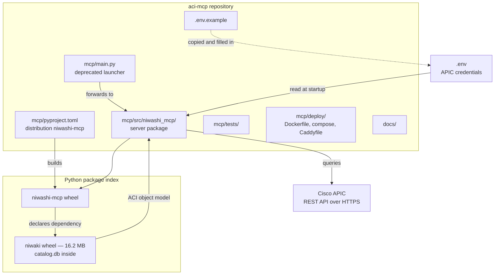
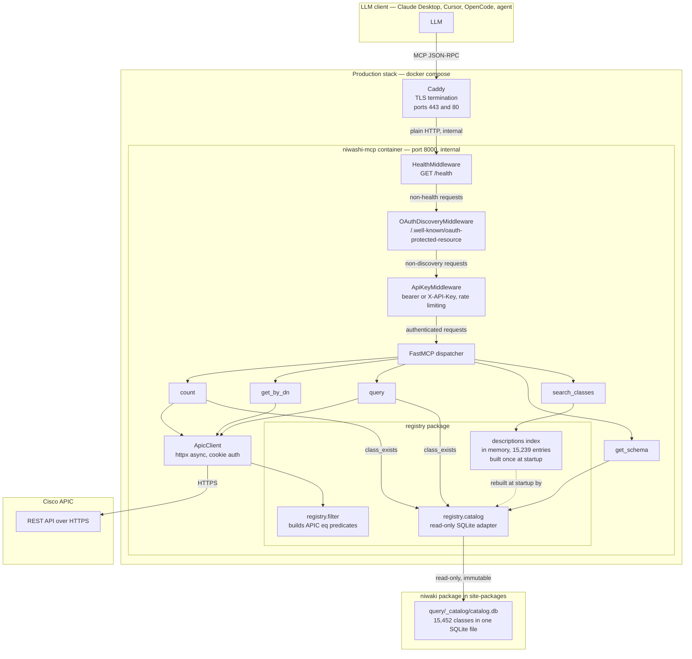
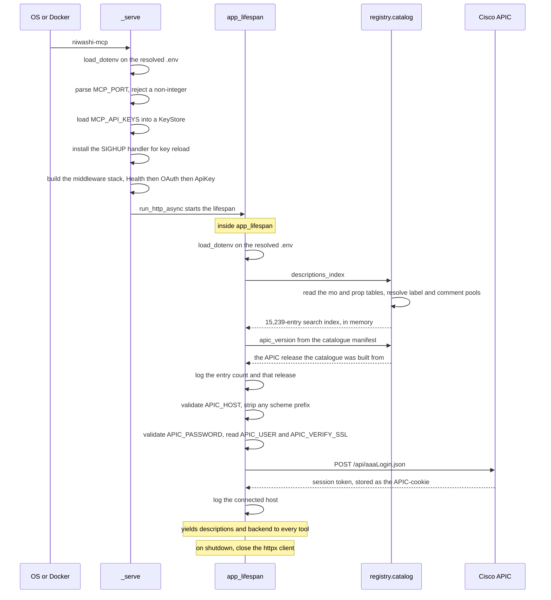

# System Overview

## What this server does

`niwashi-mcp` is a [Model Context Protocol](https://modelcontextprotocol.io) server that gives any MCP-compatible LLM client read access to a Cisco ACI fabric — without any hardcoded class knowledge in the model or the server.

It exposes a **small set of generic tools**. For discovery, the LLM calls the three core tools (`search_classes` → `get_schema` → `query`) in sequence to discover, inspect, and query any ACI object class — including classes added after the model was trained. Two shortcuts round out the surface: `get_by_dn` reads a known DN directly, and `count` tallies a class without transferring objects.

The five tools and their signatures are unchanged from 1.2.2. What changed in 2.0 is where the ACI object model comes from.

### Names

| Thing | Value |
|---|---|
| PyPI distribution | `niwashi-mcp` |
| Import package | `niwashi_mcp` — source under `mcp/src/niwashi_mcp/` |
| Console command | `niwashi-mcp` |
| Git repository | `aci-mcp` |

`python main.py` from `mcp/` still starts the server through a deprecated shim that emits a `DeprecationWarning` and forwards to `niwashi_mcp.main:main`. It is scheduled for removal in 3.0; prefer `niwashi-mcp` or `python -m niwashi_mcp.main`.

---

## Where the object model comes from

Until 1.2.2 the server read raw jsonmeta files from a schema bundle that had to be downloaded and unpacked next to a git checkout. In 2.0 it reads a single SQLite catalogue that ships **inside the `niwaki` dependency**, so installing the server installs the object model with it.

| | 1.2.2 | 2.0 |
|---|---|---|
| Install | `git clone` + download script + `tar` | `uvx niwashi-mcp` |
| Download | 98.8 MB | 16.2 MB — the niwaki wheel |
| On disk | 1.83 GB | 32.8 MB |
| Docker image | 3.97 GB | 457 MB |

The catalogue is `catalog.db`, resolved at runtime as `<niwaki package dir>/query/_catalog/catalog.db` — 36,229,120 bytes, built from **APIC 6.0(9c)**, holding **15,452 classes** and 332,297 property rows. `mcp/pyproject.toml` pins the dependency to `niwaki>=1.8,<2.0`; the version installed here is 1.8.0.

Three consequences follow from the file being a build artefact inside a wheel:

- It is opened **read-only and immutable** — `file:…?immutable=1` — which lets SQLite skip locking entirely.
- Exactly **one connection per process** is opened and cached. A second connection would load a second copy of the string pools into memory for no benefit.
- The APIC release the model describes is now pinned by the dependency, not chosen by the operator. It changes when niwaki changes, which is why it is logged at startup.

That last point deserves care: the version logged at startup is the release the **catalogue** was generated from, read from the catalogue's own `manifest` table. It says nothing about the version of the fabric the server is connected to.

---

## Repository layout


```mermaid
graph TD
    subgraph repo["aci-mcp repository"]
        pkg["mcp/src/niwashi_mcp/<br/>server package"]
        proj["mcp/pyproject.toml<br/>distribution niwashi-mcp"]
        shim["mcp/main.py<br/>deprecated launcher"]
        tests["mcp/tests/"]
        deploy["mcp/deploy/<br/>Dockerfile, compose, Caddyfile"]
        docs["docs/"]
        envex[".env.example"]
    end

    subgraph pypi["Python package index"]
        dist["niwashi-mcp wheel"]
        niwaki["niwaki wheel — 16.2 MB<br/>catalog.db inside"]
    end

    envfile[".env<br/>APIC credentials"]
    apic["Cisco APIC<br/>REST API over HTTPS"]

    proj -->|"builds"| dist
    pkg --> dist
    dist -->|"declares dependency"| niwaki
    niwaki -->|"ACI object model"| pkg
    shim -->|"forwards to"| pkg
    envex -.->|"copied and filled in"| envfile
    envfile -->|"read at startup"| pkg
    pkg -->|"queries"| apic
```

There is no `data/` directory in this repository and no bundle to fetch. The schema-collection tooling that produced the old bundle was never published and is not part of the repository; from 2.0 the published artefact it feeds is niwaki, not a release asset consumed by a download script.

---

## Component architecture


```mermaid
graph TB
    subgraph client["LLM client — Claude Desktop, Cursor, OpenCode, agent"]
        llm["LLM"]
    end

    subgraph prod["Production stack — docker compose"]
        caddy["Caddy<br/>TLS termination<br/>ports 443 and 80"]
        subgraph mcp_server["niwashi-mcp container — port 8000, internal"]
            health["HealthMiddleware<br/>GET /health"]
            oauth["OAuthDiscoveryMiddleware<br/>/.well-known/oauth-protected-resource"]
            auth["ApiKeyMiddleware<br/>bearer or X-API-Key, rate limiting"]
            fm["FastMCP dispatcher"]
            t1["search_classes"]
            t2["get_schema"]
            t3["query"]
            t4["get_by_dn"]
            t5["count"]
            subgraph registry["registry package"]
                desc["descriptions index<br/>in memory, 15,239 entries<br/>built once at startup"]
                cat["registry.catalog<br/>read-only SQLite adapter"]
                filt["registry.filter<br/>builds APIC eq predicates"]
            end
            apic_client["ApicClient<br/>httpx async, cookie auth"]
        end
    end

    subgraph apic["Cisco APIC"]
        rest["REST API over HTTPS"]
    end

    subgraph dep["niwaki package in site-packages"]
        db["query/_catalog/catalog.db<br/>15,452 classes in one SQLite file"]
    end

    llm -->|"MCP JSON-RPC"| caddy
    caddy -->|"plain HTTP, internal"| health
    health -->|"non-health requests"| oauth
    oauth -->|"non-discovery requests"| auth
    auth -->|"authenticated requests"| fm
    fm --> t1
    fm --> t2
    fm --> t3
    fm --> t4
    fm --> t5
    t1 --> desc
    t2 --> cat
    t3 -->|"class_exists"| cat
    t3 --> apic_client
    t4 --> apic_client
    t5 -->|"class_exists"| cat
    t5 --> apic_client
    apic_client --> filt
    cat -->|"read-only, immutable"| db
    desc -.->|"rebuilt at startup by"| cat
    apic_client -->|"HTTPS"| rest
```

`build_filter()` is called from inside `ApicClient` — `query_class()` and `count_class()` — not from the tool functions in `main.py`, which never import `registry.filter`.

---

## The catalogue boundary

**`registry/catalog.py` is the only module in the codebase that imports `niwaki` or `sqlite3`.** Not `main.py`, not the tools, not `ApicClient`, not a single test module: nothing else knows that the object model happens to be a database today. Grep for either import and you land in that one file.

This is a deliberate architectural constraint, not an accident of the migration:

- The adapter reproduces the previous reader's output shape exactly, so the swap is invisible to every caller. `tests/baseline/` asserts that as equality, not as a floor.
- Replacing the storage engine again is a change of one module's body, never of its shape. Rollback is equally cheap.
- The SQL is hand-written because `niwaki.catalog`'s public accessors do not yet expose the fields this server needs — `rn_format`, `class_pkg`, `is_configurable`, containment, relations, the ACI `modelType` of a property, its write access. Those queries are confined to this one module precisely so that adopting the public API later touches nothing else.

Two related choices are visible at the boundary and worth stating, because both are silent when wrong:

- **Wire names only.** Every property in the catalogue carries a wire name — `descr` — and a readable name — `description`. This server reads `wire_name` and nothing else. A readable name reaches the APIC, is syntactically valid, and returns `[]` without an error.
- **The server does not use niwaki's own full-text index.** `catalog.py` reads the `mo` and `prop` tables and rebuilds the search index this server has always used, so the v2 scorer, its synonym table, and its structural priors are unchanged by the migration.

---

## Middleware stack

Three middleware layers wrap FastMCP, outermost first:

| Order | Middleware | Purpose |
|---|---|---|
| 1 — outermost | `HealthMiddleware` | Intercepts any HTTP request to `/health` and returns `{"status":"ok"}` — no auth required. Pure ASGI, zero overhead. |
| 2 | `OAuthDiscoveryMiddleware` | Serves RFC 9728 Protected Resource Metadata at `/.well-known/oauth-protected-resource`. Probed by spec-compliant MCP clients before authentication. |
| 3 | `ApiKeyMiddleware` | Validates `Authorization: Bearer` or `X-API-Key` tokens with `hmac.compare_digest`. Applies a per-IP fixed-window limit of 30 failed attempts per 60 s. Returns `WWW-Authenticate: Bearer resource_metadata="…"` on 401. |

`/.well-known/*` and `/register` bypass `ApiKeyMiddleware` entirely so OAuth discovery and dynamic client registration are never blocked by auth. An empty key store makes the middleware a pass-through, and startup logs a warning to that effect.

---

## Request path

| Step | Where | What happens |
|---|---|---|
| 1 | LLM client | Sends MCP tool call over JSON-RPC |
| 2 | Caddy | Terminates TLS, proxies to port 8000 |
| 3 | `HealthMiddleware` | Passes through — not `/health` |
| 4 | `OAuthDiscoveryMiddleware` | Passes through — not a discovery path |
| 5 | `ApiKeyMiddleware` | Validates the token — 401 or 429 if invalid or rate-limited |
| 6 | FastMCP dispatcher | Routes to the tool function |
| 7 | Tool | Reads the in-memory index or the catalogue, and calls the APIC when the tool needs live data |
| 8 | `ApicClient` | Builds URL and query parameters, sends an HTTPS GET to the APIC |
| 9 | APIC | Returns an `imdata` JSON array |
| 10 | Tool | Shapes the response: `query` flattens objects, each gaining a `_class` key, into an envelope — `{"results", "returned", "total_available", "truncated", "next_page", "complete", "note"}`; `count` returns `{"class_name", "count", "scope_dn", "filters"}`; `get_by_dn` returns the flattened object, or a `{"found": false, …}` dict |
| 11 | FastMCP | Serialises the response as an MCP JSON-RPC result |

Steps 8 and 9 do not occur for `search_classes` and `get_schema`: both are answered entirely from process-local data.

---

## Startup sequence

`main()` is a thin synchronous wrapper over `_serve()`, which prepares the HTTP layer; the FastMCP lifespan then builds the registry and connects to the APIC.


```mermaid
sequenceDiagram
    participant OS as OS or Docker
    participant serve as _serve
    participant life as app_lifespan
    participant cat as registry.catalog
    participant apic as Cisco APIC

    OS->>serve: niwashi-mcp
    serve->>serve: load_dotenv on the resolved .env
    serve->>serve: parse MCP_PORT, reject a non-integer
    serve->>serve: load MCP_API_KEYS into a KeyStore
    serve->>serve: install the SIGHUP handler for key reload
    serve->>serve: build the middleware stack, Health then OAuth then ApiKey
    serve->>life: run_http_async starts the lifespan

    Note over life: inside app_lifespan
    life->>life: load_dotenv on the resolved .env
    life->>cat: descriptions_index
    cat->>cat: read the mo and prop tables, resolve label and comment pools
    cat-->>life: 15,239-entry search index, in memory
    life->>cat: apic_version from the catalogue manifest
    cat-->>life: the APIC release the catalogue was built from
    life->>life: log the entry count and that release
    life->>life: validate APIC_HOST, strip any scheme prefix
    life->>life: validate APIC_PASSWORD, read APIC_USER and APIC_VERIFY_SSL
    life->>apic: POST /api/aaaLogin.json
    apic-->>life: session token, stored as the APIC-cookie
    life->>life: log the connected host
    Note over life: yields descriptions and backend to every tool
    Note over life: on shutdown, close the httpx client
```

Two details of that order matter in practice. The registry is built **before** any APIC contact, so a broken installation fails on `DescriptionsLoadError` rather than on a confusing authentication error. And `APIC_HOST` / `APIC_PASSWORD` are validated **before** the login attempt, so a missing variable raises `ConfigurationError` with the variable named instead of surfacing as a connection failure.

The `.env` file itself is resolved in a fixed order: `ACI_MCP_ENV_FILE` if set, then `./.env`, then the repository root when the code is running from a verified checkout, then `~/.config/niwashi-mcp/.env`. A checkout is recognised by the presence of `mcp/pyproject.toml`, never by path arithmetic alone — installed into `site-packages`, that arithmetic would silently yield a directory that exists and means nothing.

---

## Key design decisions

### One module owns the data source

See [The catalogue boundary](#the-catalogue-boundary). It is the central structural decision of 2.0 and the reason the release could be reviewed as a data-layer swap rather than a rewrite.

### The search index is built once

`catalog.descriptions_index()` runs exactly once, inside the lifespan, and the resulting dict is placed in the lifespan context. This is not merely a startup optimisation: `descriptions.search()` caches its tokenised index against the **identity** of the dict it is handed, so rebuilding the dict per call would re-tokenise 15,239 entries on every search. `tests/perf/` asserts a budget of under 200 ms for a single search over the full index.

Search quality is unchanged by the migration: Recall@1 78.4%, Recall@5 94.6%, MRR 0.846 over the 74-query golden set.

### Class validation has a single source

`query()` and `count()` both call `catalog.class_exists()` before touching the APIC. The APIC does not reject an unknown class name — it returns `[]` — so an unvalidated typo would read as an empty fabric. A failed check raises `UnknownClassError` carrying the closest matches instead, so the LLM can self-correct without an extra `search_classes()` round-trip. The two tools share the identical guard and can never disagree about whether a class is known.

In 1.2.2 this check had two tiers — the descriptions index first, then a fallback to the schema files — because the two collections disagreed by 213 classes and emitted a warning on every one of them. Both now derive from the same catalogue, so the fallback is gone and the validatable universe is the full **15,452** classes. The 213-class gap still exists, but only in the other direction and only for search: those classes carry no label, no comment, and no useful property label, so there is nothing to index and `search_classes` cannot return them. They remain queryable by name.

### Case sensitivity is structural

Class names are matched with SQLite's default BINARY collation, so `fvBd` does not resolve to `fvBD`. Under the previous file-based reader this hazard needed a hand-written guard, because a case-insensitive filesystem resolved `fvBd.json` to `fvBD.json`. The storage engine now enforces it.

### Stateless HTTP

`stateless_http=True` — each MCP request is an independent HTTP call, with no server-side session state. Horizontal scaling is trivial and the memory footprint stays flat.

### SIGHUP hot-reload

Sending `SIGHUP` reloads `MCP_API_KEYS` from `.env` without restarting the process. `KeyStore.reload()` swaps the frozenset atomically under a `threading.Lock`, so in-flight requests continue against the old key set uninterrupted.

```bash
kill -HUP $(pgrep -f niwashi-mcp)
```

### Container ships no data

`mcp/deploy/Dockerfile` installs the package with `uv pip install --no-deps .` after `uv sync --frozen --no-dev`, so the image runs exactly what a `pip install` produces. The object model arrives as an ordinary dependency; there is no bundle to copy in and no volume to mount for it. The container runs as a non-root user and its command is `niwashi-mcp`.

---

## Removed in 2.0

Anything below is gone from the running server. It appears here only so that a reader coming from 1.2.2 documentation can map the old names.

| Removed | Replacement |
|---|---|
| `data/` directory and the schema bundle | the catalogue inside the `niwaki` dependency |
| `data/schemas/*.json` jsonmeta files | the `mo` and `prop` tables of `catalog.db` |
| `data/class-descriptions.json` | `catalog.descriptions_index()`, rebuilt at startup |
| the bundle download script | nothing — `uvx niwashi-mcp` installs everything |
| `registry/schema.py` and `resolve_schemas_dir()` | `registry/catalog.py` |
| the `schemas_dir` entry in the lifespan context | nothing — no directory to resolve |
| `ACI_MCP_DATA_DIR` | nothing — the catalogue's location is derived from the installed package |
| `SchemaLoadError` in practice | `DescriptionsLoadError` — the catalogue is missing or unreadable. The class is still defined but nothing raises it. |

Environment variables actually read by the server are `APIC_HOST`, `APIC_USER`, `APIC_PASSWORD`, `APIC_VERIFY_SSL`, `MCP_PORT`, `MCP_API_KEYS`, and `ACI_MCP_ENV_FILE`. See [settings reference](../configuration/settings.md).

---

## See also

- [Data flow](data-flow.md) — the mandatory tool sequence and the internal flow of each tool
- [Registry internals](../internals/registry.md) — the catalogue adapter, the descriptions index, the filter builder
- [APIC client](../internals/apic-client.md) — cookie auth, retries, URL construction
