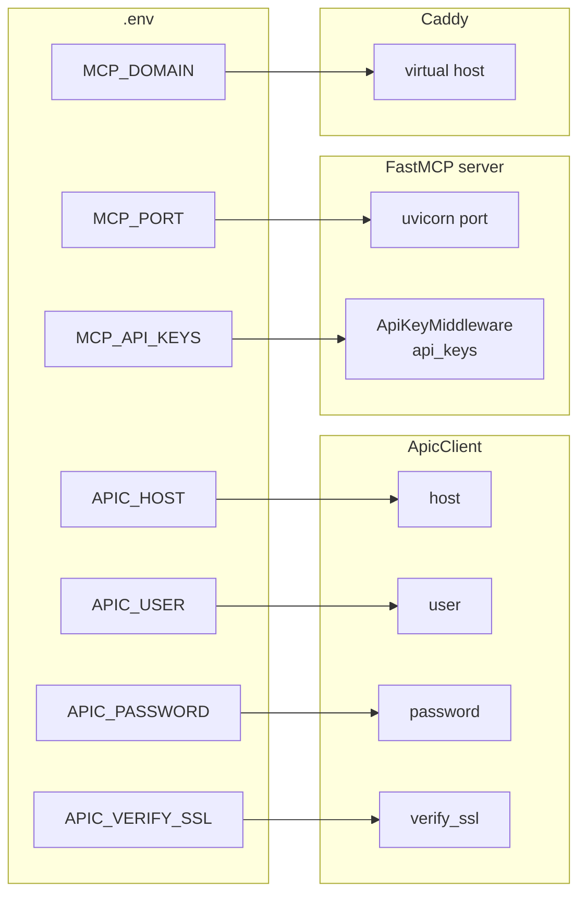

# Settings Reference

All configuration is via environment variables loaded from `.env` at the **monorepo root** (or from the real environment). Copy [`.env.example`](../../.env.example) to `.env` and fill in the required values before starting the server.

---

## Variable map



---

## APIC connection

| Variable | Required | Default | Description |
|---|---|---|---|
| `APIC_HOST` | **Yes** | — | APIC hostname or IP address. **No scheme** — write `10.0.0.1` not `https://10.0.0.1`. The server always connects over HTTPS. |
| `APIC_USER` | No | `admin` | APIC username. |
| `APIC_PASSWORD` | **Yes** | — | APIC password. Never logged. |
| `APIC_VERIFY_SSL` | No | `false` | Set to `true` to enforce TLS certificate verification when connecting to the APIC. Leave `false` for lab environments with self-signed certs. |

### Validation

- `APIC_HOST` — any `http://` or `https://` prefix is stripped automatically. An empty value raises `ConfigurationError` at startup.
- `APIC_PASSWORD` — empty value raises `ConfigurationError` at startup.
- `APIC_VERIFY_SSL` — any value other than `"true"` (case-insensitive) is treated as `false`.

---

## MCP server

| Variable | Required | Default | Description |
|---|---|---|---|
| `MCP_PORT` | No | `8000` | TCP port the MCP HTTP server listens on. Must be an integer — a non-integer value raises `ConfigurationError` at startup. |
| `MCP_API_KEYS` | Production: **Yes** | — | Comma-separated list of pre-shared bearer tokens. Empty = authentication disabled (development only). |

### Generating API keys

```bash
python -c "import secrets; print(secrets.token_urlsafe(32))"
```

Run once per client/consumer. Each key is independent — revoking one does not affect others.

### MCP_API_KEYS format

```
MCP_API_KEYS=token1,token2,token3
```

Clients send either:
```
Authorization: Bearer token1
```
or:
```
X-API-Key: token1
```

Whitespace around commas is stripped. Empty segments are ignored. Comparison is case-sensitive and uses `hmac.compare_digest` (constant-time — no timing oracle).

### No-op mode (development)

When `MCP_API_KEYS` is empty or unset, the `ApiKeyMiddleware` is not attached and all requests pass through. A warning is logged at startup:

```
WARNING  aci-mcp  MCP_API_KEYS is not set — server is running WITHOUT authentication.
```

---

## HTTPS / Caddy

| Variable | Required | Default | Description |
|---|---|---|---|
| `MCP_DOMAIN` | Yes (when using docker-compose) | — | Public hostname or internal FQDN for Caddy to serve TLS. See [HTTPS deployment](../deployment/https.md). |

---

## Precedence

Variables are loaded in this order (later values win):

1. System environment
2. `.env` at monorepo root (loaded via `python-dotenv`)

If `.env` does not exist, system environment variables are used directly. This is the normal behaviour inside Docker containers.

---

## Full example

```dotenv
# .env — copy from .env.example

APIC_HOST=10.41.71.11
APIC_USER=admin
APIC_PASSWORD=Cisco1234!
APIC_VERIFY_SSL=false

MCP_PORT=8000
MCP_API_KEYS=abc123xyz,def456uvw

MCP_DOMAIN=mcp.mycompany.internal
```
