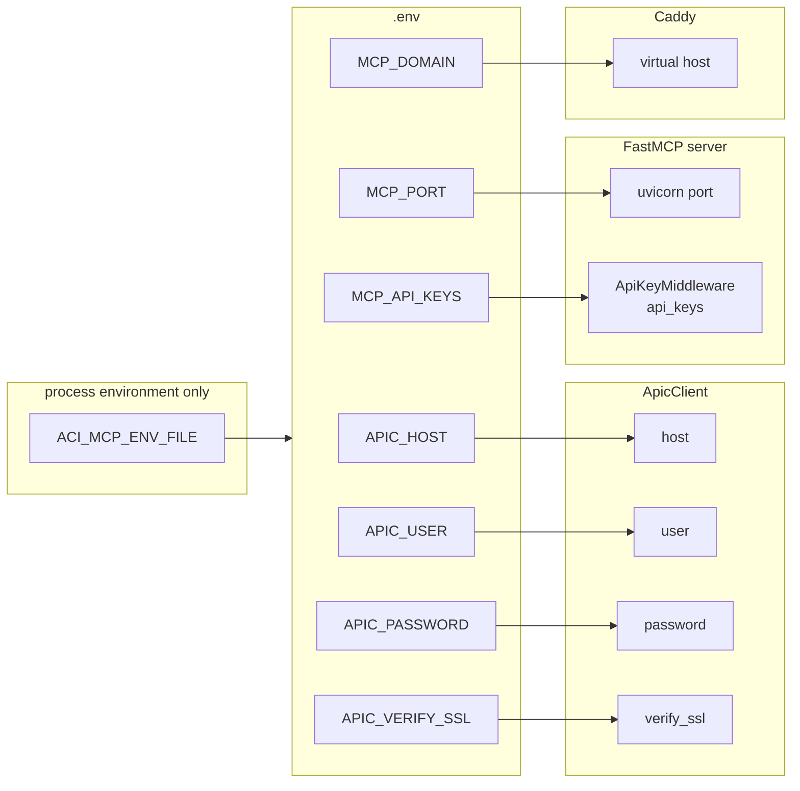

# Settings Reference

All configuration is via environment variables. The server loads a `.env` file
at startup if it finds one (see [Where `.env` is found](#where-env-is-found)),
then reads everything from the process environment. Copy
[`.env.example`](../../.env.example) to `.env` and fill in the required values
before starting the server.

There is no data-directory setting. The object model ships inside the `niwaki`
dependency, so there is nothing to point the server at.

---

## Variable map


```mermaid
graph LR
    subgraph env[".env"]
        E1["APIC_HOST"]
        E2["APIC_USER"]
        E3["APIC_PASSWORD"]
        E4["APIC_VERIFY_SSL"]
        E5["MCP_PORT"]
        E6["MCP_API_KEYS"]
        E7["MCP_DOMAIN"]
    end

    subgraph shell["process environment only"]
        X1["ACI_MCP_ENV_FILE"]
    end

    subgraph apic_client["ApicClient"]
        A1["host"]
        A2["user"]
        A3["password"]
        A4["verify_ssl"]
    end

    subgraph server["FastMCP server"]
        S1["uvicorn port"]
        S2["ApiKeyMiddleware<br/>api_keys"]
    end

    subgraph caddy["Caddy"]
        C1["virtual host"]
    end

    E1 --> A1
    E2 --> A2
    E3 --> A3
    E4 --> A4
    E5 --> S1
    E6 --> S2
    E7 --> C1
    X1 --> env
```

---

## APIC connection

| Variable | Required | Default | Description |
|---|---|---|---|
| `APIC_HOST` | **Yes** | — | APIC hostname or IP address. A leading `http://` or `https://` is stripped, so either form works; the server always connects over HTTPS. |
| `APIC_USER` | No | `admin` | APIC username. |
| `APIC_PASSWORD` | **Yes** | — | APIC password. Never logged. |
| `APIC_VERIFY_SSL` | No | `false` | Set to `true` to enforce TLS certificate verification when connecting to the APIC. Leave `false` for lab environments with self-signed certs. |

### Validation

- `APIC_HOST` — any `http://` or `https://` prefix is stripped and surrounding whitespace trimmed. An empty value raises `ConfigurationError` at startup.
- `APIC_PASSWORD` — empty value raises `ConfigurationError` at startup.
- `APIC_VERIFY_SSL` — any value other than `"true"` (case-insensitive) is treated as `false`.

---

## MCP server

| Variable | Required | Default | Description |
|---|---|---|---|
| `MCP_PORT` | No | `8000` | TCP port the MCP HTTP server listens on. Must be an integer — a non-integer value raises `ConfigurationError` at startup. |
| `MCP_API_KEYS` | Production: **Yes** | — | Comma-separated list of pre-shared bearer tokens. Empty = authentication disabled (development only). Re-readable at runtime with `SIGHUP`. |

### Generating API keys

```bash
python -c "import secrets; print(secrets.token_urlsafe(32))"
```

Run once per client/consumer. Each key is independent — revoking one does not affect others.

### MCP_API_KEYS format

```dotenv
MCP_API_KEYS=token1,token2,token3
```

Clients send either:

```http
Authorization: Bearer token1
```

or:

```http
X-API-Key: token1
```

Whitespace around commas is stripped. Empty segments are ignored. Comparison is case-sensitive and uses `hmac.compare_digest` (constant-time — no timing oracle).

### No-op mode (development)

The `ApiKeyMiddleware` is always attached, regardless of `MCP_API_KEYS`. When the key store is empty (`MCP_API_KEYS` empty or unset), the middleware no-ops internally — it lets every request through instead of checking a key. A warning is logged at startup:

```text
WARNING  aci-mcp  MCP_API_KEYS is not set — server is running WITHOUT authentication.
```

---

## Env file location

| Variable | Required | Default | Description |
|---|---|---|---|
| `ACI_MCP_ENV_FILE` | No | — | Absolute path to the `.env` file to load. Must be set in the **process environment** — it selects the file, so it cannot be read from inside it. |

### Where `.env` is found

`ACI_MCP_ENV_FILE` wins outright when set. Otherwise the first of these that
exists is used:

1. `./.env` — relative to the working directory the server was started from
2. `<repo root>/.env` — only when running from a git checkout, and only when
   the layout is *verified* (a `mcp/pyproject.toml` must be there). Installed
   into `site-packages`, this candidate is skipped rather than resolved to some
   unrelated parent directory.
3. `~/.config/niwashi-mcp/.env` — the per-user location for an installed server
   that is not run from any particular directory

If none exists, `./.env` is attempted and its absence is not an error — the
process environment is used directly. This is the normal case inside a
container.

---

## HTTPS / Caddy

| Variable | Required | Default | Description |
|---|---|---|---|
| `MCP_DOMAIN` | Yes (when using docker-compose) | — | Public hostname or internal FQDN. Read by **Caddy**, not by the server — it is substituted into the `Caddyfile` virtual-host block. See [HTTPS deployment](../getting-started/https.md). |

---

## Precedence

`.env` is loaded via `python-dotenv` with `override=False` (the library default): it only fills in variables that aren't already set in the process environment. **The system environment wins, not `.env`.** If you export `APIC_HOST` (or any other variable) in your shell, editing `.env` has no effect until you unset the shell variable or start a fresh shell.

The one exception is the SIGHUP hot-reload path, which explicitly calls `load_dotenv(ENV_FILE, override=True)` — a running server that receives SIGHUP re-reads the same `.env` it resolved at startup and lets it override the current process environment. Only `MCP_API_KEYS` is re-applied; the APIC connection is not rebuilt.

```bash
kill -HUP <pid>
```

---

## Full example

```dotenv
# .env — copy from .env.example

APIC_HOST=10.41.71.11
APIC_USER=admin
APIC_PASSWORD=Cisco1234!
APIC_VERIFY_SSL=false

MCP_PORT=8000
MCP_API_KEYS=abc123xyz,def456uvw

MCP_DOMAIN=mcp.mycompany.internal
```

---

## Removed in 2.0

| Variable | Why it is gone |
|---|---|
| `ACI_MCP_DATA_DIR` | Pointed at the jsonmeta schema directory. There is no data directory in 2.0 — the object model is a SQLite catalogue inside the `niwaki` package, located from the installed package itself. Setting this variable has no effect. |
