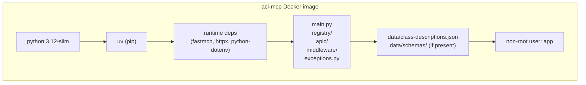

# Docker Deployment

Single-container deployment — exposes the MCP server on a host port directly (no TLS). Use this for internal networks where TLS is terminated upstream, or as a stepping stone before the full [HTTPS stack](https.md).

---

## Build

The build context must be the **repo root** (not `mcp/`) because the Dockerfile copies both `mcp/` source and `data/` artifacts.

```bash
# From repo root
docker build -f mcp/deploy/Dockerfile . -t aci-mcp:latest
```

### What the image contains



Dev dependencies (`pytest`) are **not** installed — `uv sync --frozen --no-dev`.

---

## Run

```bash
docker run --env-file .env -p 8000:8000 aci-mcp:latest
```

With API key authentication enabled:

```bash
docker run \
  --env-file .env \
  -e MCP_API_KEYS=your-secret-token \
  -p 8000:8000 \
  aci-mcp:latest
```

---

## Environment variables

Pass via `--env-file .env` (recommended) or individual `-e KEY=value` flags.

All variables are documented in [settings reference](../configuration/settings.md). The image reads `.env` from the working directory if present, but the standard Docker approach is to inject via `--env-file`.

---

## Health check

The Dockerfile does not define a `HEALTHCHECK` — the `docker-compose.yml` uses a Python one-liner:

```yaml
healthcheck:
  test: ["CMD", "python", "-c", "import urllib.request; urllib.request.urlopen('http://localhost:8000/health')"]
  interval: 30s
  timeout: 5s
  retries: 3
  start_period: 15s
```

If the FastMCP `/health` endpoint is not available in your version, replace with a TCP check:

```yaml
healthcheck:
  test: ["CMD-SHELL", "python -c \"import socket; s=socket.create_connection(('localhost',8000),2)\""]
```

---

## Updating data/ without rebuilding

Mount `data/` as a volume to inject updated schemas without rebuilding the image:

```bash
docker run \
  --env-file .env \
  -v $(pwd)/data:/app/data:ro \
  -p 8000:8000 \
  aci-mcp:latest
```

This is useful after running `aci-collect` on a new APIC version — just restart the container.
