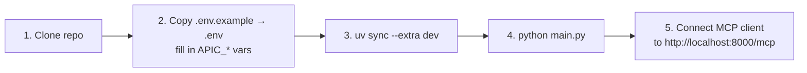

# Quickstart — Local Development

Get the server running locally in under 5 minutes.

## Prerequisites

- Python 3.12+
- [uv](https://github.com/astral-sh/uv) (`pip install uv` or `brew install uv`)
- A reachable Cisco APIC (IP + credentials)
- The `data/` folder populated — either from the repo or from running `aci-collect`

---

## Steps



### 1 — Clone and enter the repo

```bash
git clone <repo-url>
cd aci-mcp
```

### 2 — Configure credentials

```bash
cp .env.example .env
```

Edit `.env` — the minimum required fields:

```dotenv
APIC_HOST=10.41.71.11
APIC_USER=admin
APIC_PASSWORD=Cisco1234!
```

Leave `MCP_API_KEYS` empty for local dev — auth is disabled automatically.

### 3 — Install dependencies

```bash
cd mcp
uv sync --extra dev   # --extra dev includes pytest
```

### 4 — Start the server

```bash
python main.py
```

Expected output:

```
INFO  aci-mcp  Registry loaded — 15432 class descriptions
INFO  aci-mcp  Connected to APIC — 10.41.71.11
WARNING aci-mcp  MCP_API_KEYS is not set — server is running WITHOUT authentication.
INFO  fastmcp  Starting MCP server 'aci-mcp' with transport 'http' on http://0.0.0.0:8000/mcp
```

### 5 — Connect an MCP client

**Claude Desktop** — add to `claude_desktop_config.json`:

```json
{
  "mcpServers": {
    "aci-mcp": {
      "url": "http://localhost:8000/mcp"
    }
  }
}
```

**Ready-made config** — use [`mcp/client/aci-mcp.json`](../../mcp/client/aci-mcp.json) directly.

---

## Running tests

```bash
cd mcp

# All tests
uv run pytest

# Single file
uv run pytest tests/unit/test_filter.py

# Performance tests only
uv run pytest tests/perf/ -v

# With coverage
uv run pytest --tb=short -q
```

---

## Changing the port

```dotenv
MCP_PORT=8002
```

Or override at launch:

```bash
MCP_PORT=8002 python main.py
```

---

## If data/ is missing

Run `aci-collect` to rebuild the data files:

```bash
cd schema-collector
uv sync
uv run aci-collect run
```

This requires a live APIC and takes ~5 minutes on a typical fabric (15k+ classes).
