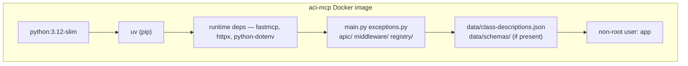

# Docker Deployment

Single-container deployment — exposes the MCP server directly on a host port (no TLS).
Use this for internal networks where TLS is terminated upstream, or as a stepping stone before the full [production stack](https.md).

---

## Build

The build context must be the **repo root** (not `mcp/`) because the Dockerfile copies both `mcp/` source and `data/` artifacts.

```bash
# From repo root
docker build -f mcp/deploy/Dockerfile . -t aci-mcp:latest
```

### What the image contains



Dev dependencies (`pytest`, `pytest-cov`) are **not** installed — `uv sync --frozen --no-dev`.

---

## Run

```bash
docker run --env-file .env -p 8000:8000 aci-mcp:latest
```

With API key authentication:

```bash
docker run \
  --env-file .env \
  -e MCP_API_KEYS=your-secret-token \
  -p 8000:8000 \
  aci-mcp:latest
```

---

## Health check

The server exposes `GET /health` (served by `HealthMiddleware` before any auth) and returns:

```json
{"status": "ok"}
```

To test:

```bash
curl http://localhost:8000/health
```

The `docker-compose.yml` uses this endpoint for its healthcheck:

```yaml
healthcheck:
  test: ["CMD", "python", "-c", "import urllib.request; urllib.request.urlopen('http://localhost:8000/health')"]
  interval: 30s
  timeout: 5s
  retries: 3
  start_period: 15s
```

---

## Environment variables

Pass via `--env-file .env` (recommended) or individual `-e KEY=value` flags.
All variables are documented in the [settings reference](../configuration/settings.md).

---

## Updating data/ without rebuilding

Mount `data/` as a read-only volume to inject updated schemas without rebuilding the image:

```bash
docker run \
  --env-file .env \
  -v $(pwd)/data:/app/data:ro \
  -p 8000:8000 \
  aci-mcp:latest
```

This is useful after updating the schema bundle — restart the container and the new schemas are live.
