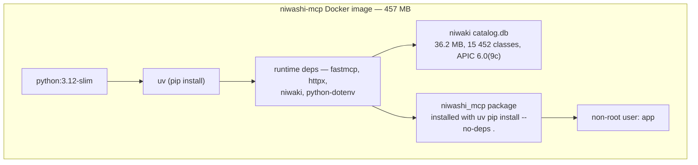

# Docker Deployment

Single-container deployment — the MCP server on a host port, no TLS. Use it on
an internal network where TLS is terminated upstream, or as a step on the way to
the full [production stack](https.md).

---

## Build

```bash
# From the repo root
docker build -f mcp/deploy/Dockerfile . -t niwashi-mcp:latest
```

The build context must be the **repo root**, not `mcp/`, for one reason:
`mcp/pyproject.toml` declares `readme = "../README.md"`, so the README has to be
in place before any step reads the project metadata — including `uv sync`. The
Dockerfile copies it to `/README.md` before touching the dependencies.

### What the image contains


```mermaid
graph TD
    subgraph image["niwashi-mcp Docker image — 457 MB"]
        base["python:3.12-slim"]
        uv["uv (pip install)"]
        deps["runtime deps — fastmcp, httpx,\nniwaki, python-dotenv"]
        cat["niwaki catalog.db\n36.2 MB, 15 452 classes, APIC 6.0(9c)"]
        src["niwashi_mcp package\ninstalled with uv pip install --no-deps ."]
        user["non-root user: app"]
    end

    base --> uv --> deps --> cat
    deps --> src --> user
```

There is no data layer to copy. The ACI object model arrives as part of the
`niwaki` dependency — one SQLite file inside the installed package — which is
what took the image from 3.97 GB in 1.2.2 to 457 MB here.

Two details worth knowing before you debug an image that behaves oddly:

- **The package is installed, not copied file by file.** `uv pip install
  --no-deps .` runs against the source copied into `/app/src`, so the container
  runs exactly what a `pip install` of the wheel produces. Container and wheel
  cannot drift apart.
- **Dependencies come from the lockfile.** `uv sync --frozen --no-dev` installs
  from `mcp/uv.lock`, so the APIC release the object model describes is fixed by
  the lock, not by the build date. Dev dependencies (`pytest`, `pytest-cov`,
  `ruff`) are not installed.

The entrypoint is `CMD ["niwashi-mcp"]` — the console script, resolved from
`/app/.venv/bin` on `PATH`. The process runs as the non-root user `app` and the
image exposes port 8000.

---

## Run

```bash
docker run --env-file .env -p 8000:8000 niwashi-mcp:latest
```

With API key authentication:

```bash
docker run \
  --env-file .env \
  -e MCP_API_KEYS=your-secret-token \
  -p 8000:8000 \
  niwashi-mcp:latest
```

No `.env` is baked into the image, and none is expected: `--env-file` puts the
values in the process environment, where the server reads them directly. If you
would rather mount the file, `WORKDIR` is `/app` and the server looks for a
`.env` in its working directory, so `-v $(pwd)/.env:/app/.env:ro` is picked up —
it must be readable by the `app` user. Real environment variables win over the
file either way.

---

## Health check

`GET /health` is served by `HealthMiddleware` ahead of every other middleware,
so it never needs a bearer token:

```bash
curl http://localhost:8000/health
```

```json
{"status": "ok"}
```

`docker-compose.yml` probes the same endpoint, from inside the container, with
the interpreter already present in the image:

```yaml
healthcheck:
  test: ["CMD", "python", "-c", "import urllib.request; urllib.request.urlopen('http://localhost:8000/health')"]
  interval: 30s
  timeout: 5s
  retries: 3
  start_period: 15s
```

The 15-second `start_period` covers the startup work, and the endpoint answers
only once that work is done: the search index is rebuilt from the catalogue,
then the server authenticates against the APIC, and only then does the HTTP app
begin accepting requests. So a container that never reaches healthy has usually
not failed at the catalogue — look for `Connected to APIC` in the logs, and for
what came after it if it is there.

---

## Environment variables

Pass them with `--env-file .env` or as individual `-e KEY=value` flags. Only
`APIC_HOST` and `APIC_PASSWORD` are mandatory — `APIC_USER` defaults to `admin`.
`MCP_PORT` moves the listener off 8000 inside the container, in which case the
`-p` mapping has to follow it; `MCP_API_KEYS` turns authentication on. All of
them, with defaults and validation rules, are in the
[settings reference](../configuration/settings.md).

---

## Changing the APIC version the image describes

There is no volume to mount and no bundle to refresh. The object model lives
inside the `niwaki` wheel, pinned by `mcp/uv.lock`, so changing it means
changing a dependency:

```bash
cd mcp
uv lock --upgrade-package niwaki    # within the declared range, niwaki>=1.8,<2.0
cd ..
docker build -f mcp/deploy/Dockerfile . -t niwashi-mcp:latest
```

The APIC release the new catalogue was generated from is logged at startup:

```text
Registry loaded — 15239 class descriptions (niwaki catalogue, APIC 6.0(9c))
```

That line exists precisely because the version is no longer an operator's
choice. A silent dependency upgrade would otherwise change the object model an
agent reasons about with nothing in the record to show it.
