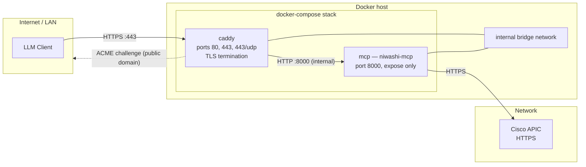

# HTTPS with Caddy

Production deployment — Caddy terminates TLS and proxies to the MCP server. The
MCP container is never published on a host port; it is reachable only from the
Compose network.

---

## Architecture


```mermaid
graph LR
    subgraph internet["Internet / LAN"]
        client["LLM Client"]
    end

    subgraph host["Docker host"]
        subgraph compose["docker-compose stack"]
            caddy["caddy\nports 80, 443, 443/udp\nTLS termination"]
            mcp["mcp — niwashi-mcp\nport 8000, expose only"]
        end
        net["internal bridge network"]
    end

    subgraph apic_net["Network"]
        apic["Cisco APIC\nHTTPS"]
    end

    client -->|"HTTPS :443"| caddy
    caddy -->|"HTTP :8000 (internal)"| mcp
    caddy -.->|"ACME challenge (public domain)"| internet
    mcp -->|"HTTPS"| apic
    caddy --- net
    mcp --- net
```

The two service names are `caddy` and `mcp` — that is how you address them in
every `docker compose` subcommand below, and `mcp:8000` is the upstream in the
`Caddyfile`.

Nothing in this layer changed in 2.0. The MCP container no longer carries a data
bundle, so it is smaller and starts without touching a volume, but Caddy
terminates the same TLS and proxies to the same port and endpoint.

---

## Quick start

### 1 — Prepare .env

Both services read `../../.env` relative to the compose file — that is `.env` at
the **repo root**, one file for the pair. `MCP_DOMAIN` is consumed by Caddy, the
rest by the server.

```dotenv
APIC_HOST=your-apic.example.com
APIC_USER=admin
APIC_PASSWORD=your_password

MCP_API_KEYS=your-generated-token-here
MCP_DOMAIN=mcp.yourdomain.com
```

Generate a token:

```bash
python -c "import secrets; print(secrets.token_urlsafe(32))"
```

`MCP_API_KEYS` takes a comma-separated list, so each client can hold its own
token and be revoked on its own. Leaving it empty starts the stack with
authentication disabled and only a log line to say so — behind a public
hostname, that is an open proxy to your APIC.

### 2 — Start the stack

```bash
docker compose -f mcp/deploy/docker-compose.yml up -d
```

Caddy declares `depends_on: mcp: condition: service_healthy`, so it starts only
once the MCP container's healthcheck (`GET /health`) passes. Both services
restart `unless-stopped`.

Compose takes the project name from the directory holding the file, which makes
it `deploy` — hence containers named `deploy-mcp-1` and `deploy-caddy-1`, and an
image `deploy-mcp`. Pass `-p niwashi-mcp` on every invocation if you would
rather it were something else.

### 3 — Verify

```bash
# Both containers up and healthy
docker compose -f mcp/deploy/docker-compose.yml ps

# TLS and the proxy — /health is served ahead of auth, no token needed
curl https://mcp.yourdomain.com/health

# Authentication is really on — expect 401 with a WWW-Authenticate header
curl -i https://mcp.yourdomain.com/mcp
```

A `200 {"status": "ok"}` on the first and a `401` on the second is the whole
check: the certificate is trusted, Caddy reaches the container, and the endpoint
is closed to callers with no token. Anything other than `401` on the second means
the request went through to FastMCP unauthenticated — `MCP_API_KEYS` never
reached the server, and the startup logs will carry the warning that says so.

Point your MCP client at `https://mcp.yourdomain.com/mcp` with one of the tokens
as a bearer credential. `X-API-Key: <token>` is accepted as an alternative for
clients that cannot set `Authorization`.

---

## Certificate modes

### Public domain — Let's Encrypt (automatic)

Set `MCP_DOMAIN` to a real public hostname. Caddy obtains and renews
certificates over ACME with no extra configuration.

Requirements:

- Ports 80 and 443 reachable from the internet
- A DNS A record for `MCP_DOMAIN` pointing at the host

### Internal / LAN — Caddy built-in CA

Set `MCP_DOMAIN` to an internal FQDN (`mcp.corp.internal`, say). Caddy issues
the certificate from a CA it generates on first start and keeps in the
`caddy_data` volume.

Clients will reject that certificate until its root is in their trust store. The
root has to be copied out of the volume — `caddy trust` run inside the container
is not the answer: it installs the root into the *container's* trust store, and
it reaches the certificate through the admin API on `localhost:2019`, which this
`Caddyfile` disables with `admin off`.

```bash
# Copy the root out of the caddy_data volume
docker compose -f mcp/deploy/docker-compose.yml cp \
  caddy:/data/caddy/pki/authorities/local/root.crt ./caddy_root.crt
```

Then install `caddy_root.crt` once per client machine:

```bash
# macOS
sudo security add-trusted-cert -d -r trustRoot \
  -k /Library/Keychains/System.keychain caddy_root.crt

# Debian / Ubuntu
sudo cp caddy_root.crt /usr/local/share/ca-certificates/caddy_root.crt
sudo update-ca-certificates
```

```powershell
# Windows (elevated PowerShell)
Import-Certificate -FilePath caddy_root.crt -CertStoreLocation Cert:\LocalMachine\Root
```

---

## Security headers

The `Caddyfile` adds these to every response:

| Header | Value |
|---|---|
| `Strict-Transport-Security` | `max-age=31536000; includeSubDomains` |
| `X-Content-Type-Options` | `nosniff` |
| `X-Frame-Options` | `DENY` |
| `Server` | *(removed)* |

The Caddy admin API is off (`admin off` in the global block), so nothing on
`localhost:2019` is reachable — which also rules out reconfiguring a running
Caddy over the API.

---

## Persistent volumes

| Volume | Purpose |
|---|---|
| `caddy_data` | TLS certificates, ACME account keys, the internal CA |
| `caddy_config` | Caddy runtime config |

Both survive `docker compose down` and restarts. **Do not delete `caddy_data`.**
On a public domain it forces certificate reissuance and can hit Let's Encrypt
rate limits; on an internal domain it regenerates the CA, and every client you
have already configured stops trusting the server.

The MCP container mounts nothing. Its object model ships inside the image, so
there is no state to preserve on that side — it can be destroyed and recreated
freely.

---

## Logs

```bash
# Caddy access logs — structured JSON on stdout, level INFO
docker compose -f mcp/deploy/docker-compose.yml logs caddy

# MCP server logs
docker compose -f mcp/deploy/docker-compose.yml logs mcp

# Follow both
docker compose -f mcp/deploy/docker-compose.yml logs -f
```

The MCP container's first lines identify the object model it loaded and the APIC
it authenticated against:

```text
Registry loaded — 15239 class descriptions (niwaki catalogue, APIC 6.0(9c))
Connected to APIC — your-apic.example.com
```

---

## Updating

```bash
# Rebuild the MCP image from the current source
docker compose -f mcp/deploy/docker-compose.yml build mcp

# Replace only the MCP container — Caddy stays up, TLS is never interrupted
docker compose -f mcp/deploy/docker-compose.yml up -d --no-deps mcp
```

`--no-deps` is what keeps this a zero-downtime restart on the TLS side. Without
it Compose evaluates `caddy`'s dependency on a healthy `mcp` and may cycle Caddy
along with it.

---

## Rotating API keys without a restart

The server reloads `MCP_API_KEYS` on `SIGHUP` — it re-reads the `.env` file it
resolved at startup, with override, and swaps the key set in place.

That mechanism does **not** work in the stack as shipped, and the reason is worth
stating rather than discovering. `env_file:` in Compose injects the values into
the container's environment; it does not put a file inside the container. The
server therefore looks for `/app/.env`, finds nothing, and the reload is a no-op
on the values already in `os.environ`. Editing `.env` on the host changes
nothing until the container is recreated.

To make rotation live, give the container the file as well:

```yaml
services:
  mcp:
    env_file: ../../.env
    volumes:
      - ../../.env:/app/.env:ro
```

Then edit `MCP_API_KEYS` at the repo root and signal the process:

```bash
docker compose -f mcp/deploy/docker-compose.yml kill -s HUP mcp
```

The server logs how many keys it loaded, or warns that the list came back empty
and authentication is now off. Without the mount, rotate keys the plain way:
edit `.env`, then `up -d --no-deps mcp`.
