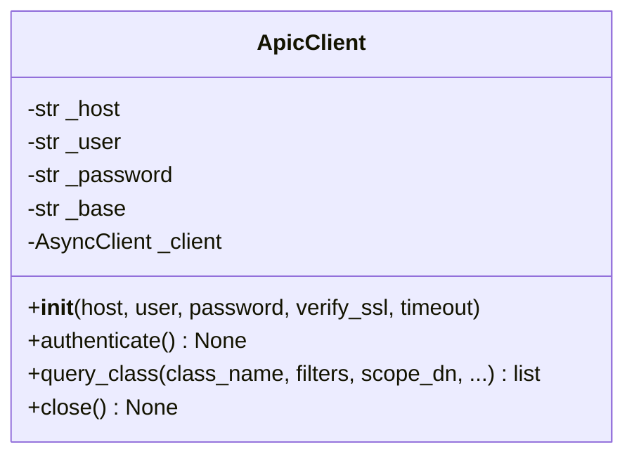
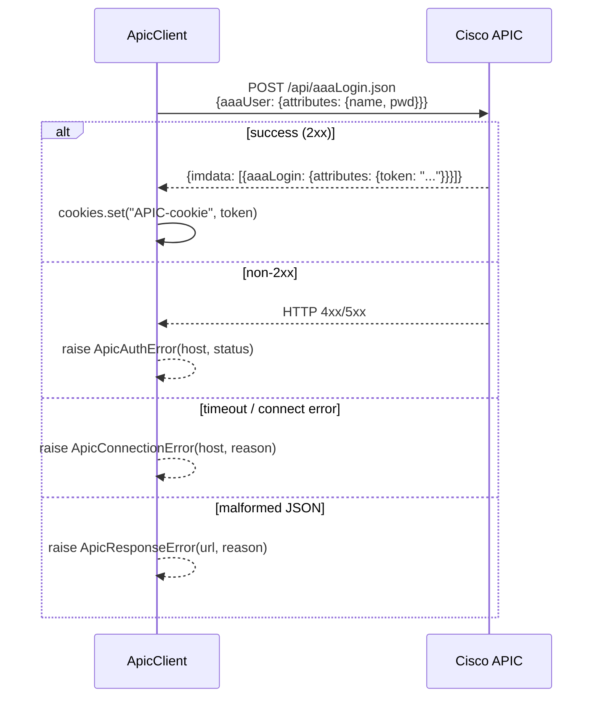
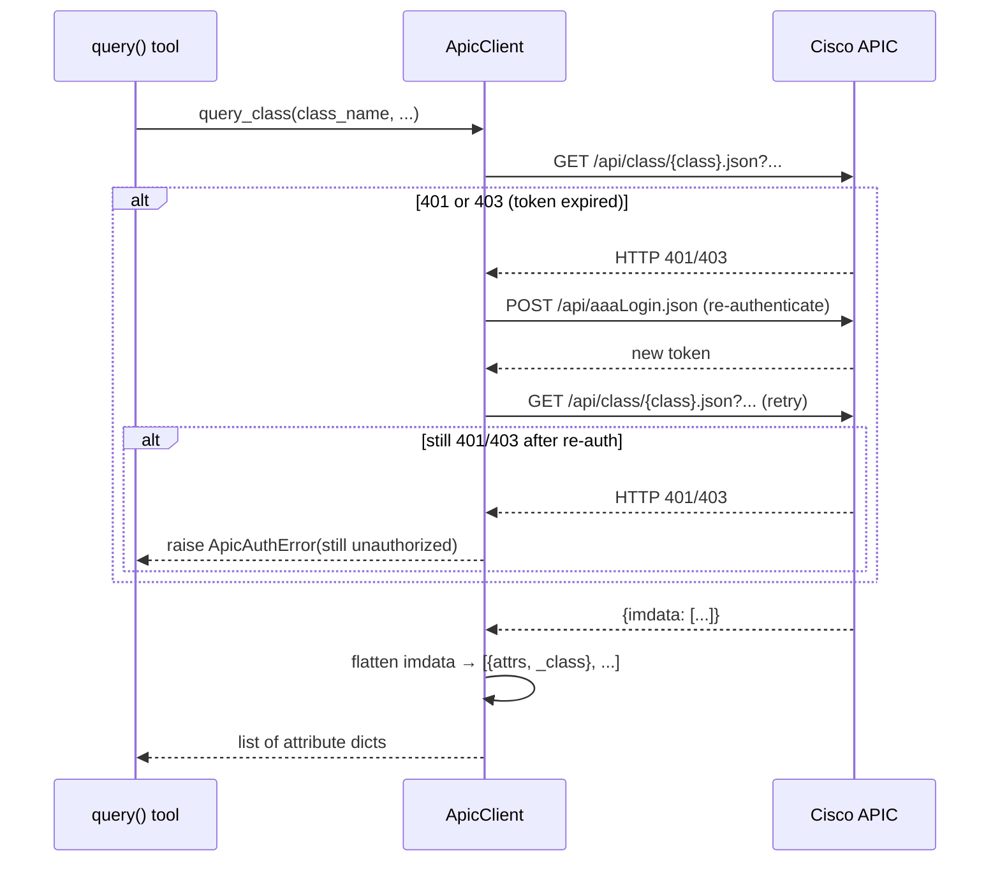

# Internals: APIC Client

`mcp/apic/client.py` — async HTTP client for the Cisco APIC REST API.

---

## Class overview



A single `ApicClient` instance is created at server startup in `app_lifespan()` and shared across all tool invocations via the FastMCP lifespan context. It is **never** instantiated per-request.

---

## Authentication flow



The token is stored as a cookie on the underlying `httpx.AsyncClient` instance, so all subsequent requests include it automatically.

---

## Query flow with re-auth



---

## URL construction

| Condition | URL pattern |
|---|---|
| `scope_dn` provided | `/api/mo/{scope_dn}.json?query-target=subtree&target-subtree-class={class}` |
| No `scope_dn` | `/api/class/{class}.json` |

The subtree query is more efficient for large fabrics — it limits the APIC search to the subtree under the given DN rather than scanning all objects of the class.

---

## httpx configuration

```python
httpx.AsyncClient(
    verify=verify_ssl,   # False by default — APIC labs often have self-signed certs
    timeout=30.0,        # Per-request timeout in seconds
)
```

`verify_ssl=False` suppresses SSL certificate warnings for lab APICs. Set `APIC_VERIFY_SSL=true` in production.

---

## imdata parsing

APIC returns objects in this structure:

```json
{
  "imdata": [
    {
      "fvBD": {
        "attributes": { "dn": "...", "name": "...", ... },
        "children": [
          { "fvSubnet": { "attributes": { ... } } }
        ]
      }
    }
  ]
}
```

`query_class()` flattens this to a plain list:

```python
[
  {
    "dn": "uni/tn-OT/BD-servers",
    "name": "servers",
    "_class": "fvBD",
    "_children": [
      { "ip": "10.0.1.1/24", "_class": "fvSubnet" }
    ]
  }
]
```

Children are only included when `include_children` is set.

---

## Exception mapping

| httpx exception | aci-mcp exception |
|---|---|
| `httpx.TimeoutException` | `ApicConnectionError` |
| `httpx.ConnectError` | `ApicConnectionError` |
| `resp.status_code in (401, 403)` | triggers re-auth; then `ApicAuthError` if still failing |
| `resp.json()` raises `ValueError` | `ApicResponseError` |
| `"imdata"` missing from body | `ApicResponseError` |
