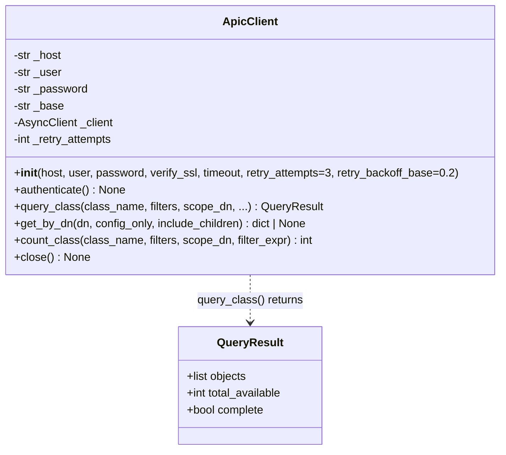
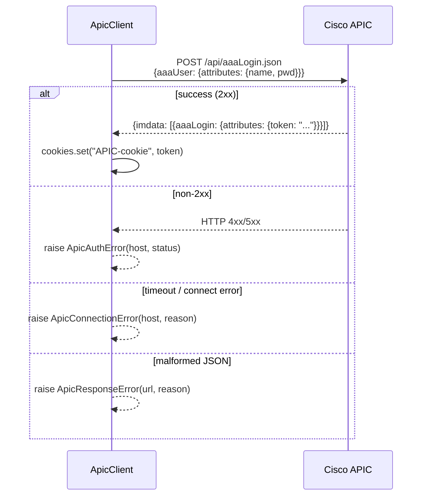
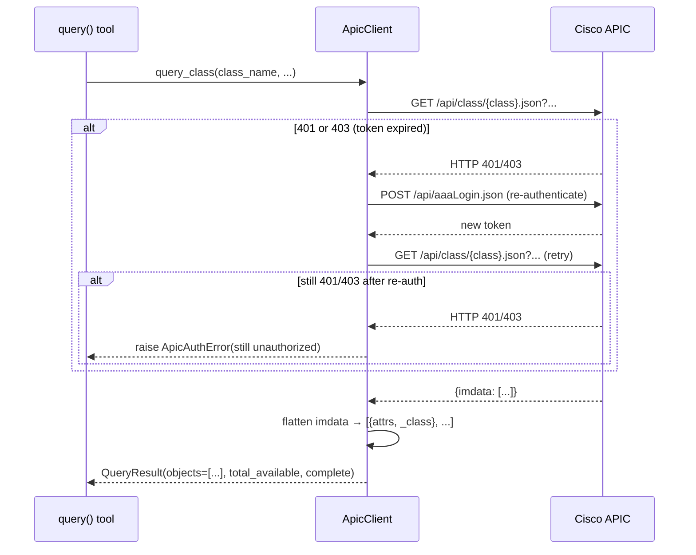

# Internals: APIC Client

`mcp/apic/client.py` — async HTTP client for the Cisco APIC REST API.

---

## Class overview


```mermaid
classDiagram
    class QueryResult {
        +list objects
        +int total_available
        +bool complete
    }

    class ApicClient {
        -str _host
        -str _user
        -str _password
        -str _base
        -AsyncClient _client
        -int _retry_attempts

        +__init__(host, user, password, verify_ssl, timeout, retry_attempts=3, retry_backoff_base=0.2)
        +authenticate() None
        +query_class(class_name, filters, scope_dn, ...) QueryResult
        +get_by_dn(dn, config_only, include_children) dict | None
        +count_class(class_name, filters, scope_dn, filter_expr) int
        +close() None
    }

    ApicClient ..> QueryResult : query_class() returns
```

`query_class()` returns a `QueryResult` dataclass — **not** a bare list — so callers can distinguish a partial page from the whole matching set (`objects`, the APIC-reported `total_available`, and `complete`). A single `ApicClient` instance is created at server startup in `app_lifespan()` and shared across all tool invocations via the FastMCP lifespan context. It is **never** instantiated per-request.

---

## Authentication flow


```mermaid
sequenceDiagram
    participant client as ApicClient
    participant apic as Cisco APIC

    client->>apic: POST /api/aaaLogin.json<br/>{aaaUser: {attributes: {name, pwd}}}

    alt success (2xx)
        apic-->>client: {imdata: [{aaaLogin: {attributes: {token: "..."}}}]}
        client->>client: cookies.set("APIC-cookie", token)
    else non-2xx
        apic-->>client: HTTP 4xx/5xx
        client-->>client: raise ApicAuthError(host, status)
    else timeout / connect error
        client-->>client: raise ApicConnectionError(host, reason)
    else malformed JSON
        client-->>client: raise ApicResponseError(url, reason)
    end
```

The token is stored as a cookie on the underlying `httpx.AsyncClient` instance, so all subsequent requests include it automatically.

---

## Query flow with re-auth


```mermaid
sequenceDiagram
    participant tool as query() tool
    participant client as ApicClient
    participant apic as Cisco APIC

    tool->>client: query_class(class_name, ...)
    client->>apic: GET /api/class/{class}.json?...

    alt 401 or 403 (token expired)
        apic-->>client: HTTP 401/403
        client->>apic: POST /api/aaaLogin.json (re-authenticate)
        apic-->>client: new token
        client->>apic: GET /api/class/{class}.json?... (retry)

        alt still 401/403 after re-auth
            apic-->>client: HTTP 401/403
            client-->>tool: raise ApicAuthError(still unauthorized)
        end
    end

    apic-->>client: {imdata: [...]}
    client->>client: flatten imdata → [{attrs, _class}, ...]
    client-->>tool: QueryResult(objects=[...], total_available, complete)
```

Note: the diagram above shows only the re-auth path. Independently of re-auth, every request also goes through a bounded retry loop for connection errors and transient HTTP statuses (404/500/502/503/504) — see "Exception mapping" below.

---

## URL construction

| Condition | URL pattern |
|---|---|
| `scope_dn` provided | `/api/mo/{scope_dn}.json?query-target=subtree&target-subtree-class={class}` |
| No `scope_dn` | `/api/class/{class}.json` |

The subtree query is more efficient for large fabrics — it limits the APIC search to the subtree under the given DN rather than scanning all objects of the class.

---

## httpx configuration

```python
httpx.AsyncClient(
    verify=verify_ssl,   # False by default — APIC labs often have self-signed certs
    timeout=30.0,        # Per-request timeout in seconds
)
```

`verify_ssl=False` suppresses SSL certificate warnings for lab APICs. Set `APIC_VERIFY_SSL=true` in production.

---

## imdata parsing

APIC returns objects in this structure:

```json
{
  "imdata": [
    {
      "fvBD": {
        "attributes": { "dn": "...", "name": "...", ... },
        "children": [
          { "fvSubnet": { "attributes": { ... } } }
        ]
      }
    }
  ]
}
```

`query_class()` flattens this into `QueryResult.objects`:

```python
QueryResult(
    objects=[
        {
            "dn": "uni/tn-OT/BD-servers",
            "name": "servers",
            "_class": "fvBD",
            "_children": [
                { "ip": "10.0.1.1/24", "_class": "fvSubnet" }
            ],
        }
    ],
    total_available=1,
    complete=True,
)
```

Children are only included when `include_children` is set.

---

## Retry and backoff

`query_class()`, `get_by_dn()`, and `count_class()` all funnel through one shared method, `_request_json()` — the single transport path for every read this client makes. It retries up to `retry_attempts` total attempts (default 3) with exponential backoff (`_backoff_delay`: `base × 2^(attempt-1)`, capped at 2.0 s) for:

- Connection-level errors (`httpx.TimeoutException`, `httpx.ConnectError`)
- HTTP statuses in `_TRANSIENT_STATUSES` = `{404, 500, 502, 503, 504}` — 404 is deliberately included here: nothing in this client ever reaches the backend with a genuinely-unverified class name or treats a missing object as a 404 (see the constant's docstring in `client.py`), so an observed 404 is presumed to be infrastructure noise, not a real "not found"

A **permanent** error — e.g. HTTP 400 from a malformed `filter_expr` — is raised immediately on the first attempt; retrying it would only add latency to a failure that can never succeed. The 401/403 re-authenticate-and-retry flow (`_send()`) is a separate, one-shot step nested inside each attempt and is not part of this retry budget.

## Exception mapping

| httpx exception / condition | aci-mcp exception |
|---|---|
| `httpx.TimeoutException` / `httpx.ConnectError` | `ApicConnectionError`, once the retry budget is exhausted |
| `resp.status_code in (401, 403)` | triggers re-auth; then `ApicAuthError` if still failing |
| `resp.status_code` non-2xx, non-401/403 (e.g. 400, or transient 404/500/502/503/504 that never recovered) | `ApicRequestError` — carries the HTTP status and, when present, the APIC-supplied error text |
| `resp.json()` raises `ValueError` | `ApicResponseError` |
| `"imdata"` missing from body | `ApicResponseError` |
