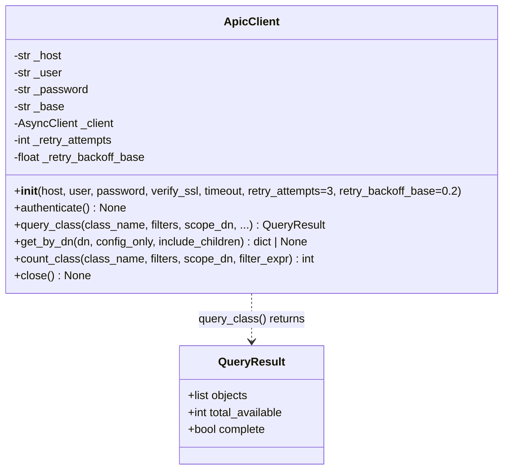
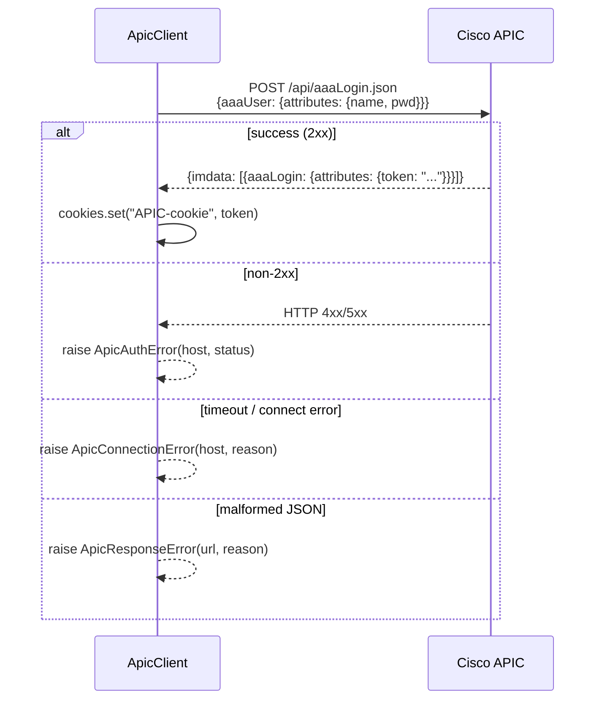
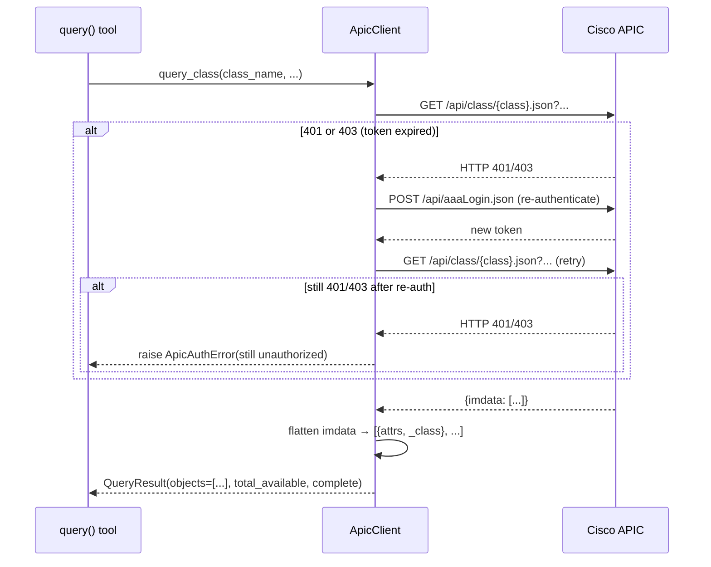

# Internals: APIC Client

`mcp/src/niwashi_mcp/apic/client.py` — async HTTP client for the Cisco APIC REST API.

The transport is unchanged in 2.0. This module never touched the object model — it takes a class name and a filter dict and turns them into an HTTP request — so replacing the data layer left it untouched apart from its import path.

---

## Class overview


```mermaid
classDiagram
    class QueryResult {
        +list objects
        +int total_available
        +bool complete
    }

    class ApicClient {
        -str _host
        -str _user
        -str _password
        -str _base
        -AsyncClient _client
        -int _retry_attempts
        -float _retry_backoff_base

        +__init__(host, user, password, verify_ssl, timeout, retry_attempts=3, retry_backoff_base=0.2)
        +authenticate() None
        +query_class(class_name, filters, scope_dn, ...) QueryResult
        +get_by_dn(dn, config_only, include_children) dict | None
        +count_class(class_name, filters, scope_dn, filter_expr) int
        +close() None
    }

    ApicClient ..> QueryResult : query_class() returns
```

`query_class()` returns a `QueryResult` dataclass — **not** a bare list — so callers can distinguish a partial page from the whole matching set (`objects`, the APIC-reported `total_available`, and `complete`). A single `ApicClient` instance is created at server startup in `app_lifespan()` and shared across all tool invocations via the FastMCP lifespan context. It is **never** instantiated per-request.

---

## Authentication flow


```mermaid
sequenceDiagram
    participant client as ApicClient
    participant apic as Cisco APIC

    client->>apic: POST /api/aaaLogin.json<br/>{aaaUser: {attributes: {name, pwd}}}

    alt success (2xx)
        apic-->>client: {imdata: [{aaaLogin: {attributes: {token: "..."}}}]}
        client->>client: cookies.set("APIC-cookie", token)
    else non-2xx
        apic-->>client: HTTP 4xx/5xx
        client-->>client: raise ApicAuthError(host, status)
    else timeout / connect error
        client-->>client: raise ApicConnectionError(host, reason)
    else malformed JSON
        client-->>client: raise ApicResponseError(url, reason)
    end
```

The token is stored as a cookie on the underlying `httpx.AsyncClient` instance, so all subsequent requests include it automatically.

---

## Query flow with re-auth


```mermaid
sequenceDiagram
    participant tool as query() tool
    participant client as ApicClient
    participant apic as Cisco APIC

    tool->>client: query_class(class_name, ...)
    client->>apic: GET /api/class/{class}.json?...

    alt 401 or 403 (token expired)
        apic-->>client: HTTP 401/403
        client->>apic: POST /api/aaaLogin.json (re-authenticate)
        apic-->>client: new token
        client->>apic: GET /api/class/{class}.json?... (retry)

        alt still 401/403 after re-auth
            apic-->>client: HTTP 401/403
            client-->>tool: raise ApicAuthError(still unauthorized)
        end
    end

    apic-->>client: {imdata: [...]}
    client->>client: flatten imdata → [{attrs, _class}, ...]
    client-->>tool: QueryResult(objects=[...], total_available, complete)
```

Note: the diagram above shows only the re-auth path. Independently of re-auth, every request also goes through a bounded retry loop for connection errors and transient HTTP statuses (404/500/502/503/504) — see "Exception mapping" below.

---

## URL construction

| Condition | URL pattern |
|---|---|
| `scope_dn` provided | `/api/mo/{scope_dn}.json?query-target=subtree&target-subtree-class={class}` |
| No `scope_dn` | `/api/class/{class}.json` |

The subtree query is more efficient for large fabrics — it limits the APIC search to the subtree under the given DN rather than scanning all objects of the class.

---

## httpx configuration

```python
httpx.AsyncClient(
    verify=verify_ssl,   # False by default — APIC labs often have self-signed certs
    timeout=30.0,        # Per-request timeout in seconds
)
```

`verify_ssl=False` suppresses SSL certificate warnings for lab APICs. Set `APIC_VERIFY_SSL=true` in production.

---

## imdata parsing

APIC returns objects in this structure:

```json
{
  "imdata": [
    {
      "fvBD": {
        "attributes": { "dn": "...", "name": "...", ... },
        "children": [
          { "fvSubnet": { "attributes": { ... } } }
        ]
      }
    }
  ]
}
```

`query_class()` flattens this into `QueryResult.objects`:

```python
QueryResult(
    objects=[
        {
            "dn": "uni/tn-OT/BD-servers",
            "name": "servers",
            "_class": "fvBD",
            "_children": [
                { "ip": "10.0.1.1/24", "_class": "fvSubnet" }
            ],
        }
    ],
    total_available=1,
    complete=True,
)
```

Children are only included when `include_children` is set.

---

## Pagination and `fetch_all`

`_build_query_params()` produces the `(url, params)` pair shared by every page request; `page` is deliberately left out of it, because a page loop needs the same base parameters with only that one value varying.

| Mode | Behaviour |
|---|---|
| `fetch_all=False` (default) | One request. `page` is sent only when the caller supplied it. `QueryResult.complete` is always `True` — it describes the loop, not the result set |
| `fetch_all=True` | Pages `0, 1, 2, …` with `page-size = limit`, accumulating into one `QueryResult`. `page` is ignored |

The loop stops at the first short page — fewer objects than `limit`, the natural end of the set — or at one of two safety caps:

```python
_MAX_PAGES = 25
_MAX_OBJECTS = 5000
```

A fabric-wide class scan with no `scope_dn` can be unbounded (a bad filter, or a class with tens of thousands of instances), so the page loop needs a hard stop independent of the caller's `limit`. Hitting either cap sets `complete=False` on the returned `QueryResult`; a natural end leaves it `True`. `total_available` is re-read from every page and always reports the APIC's own `totalCount`, so a capped result still tells the caller how much it did not fetch.

---

## `count_class()` — `totalCount`, not `moCount`

`count_class()` issues the same class or subtree query as `query_class()` with `page-size=1`, then reads `totalCount` from the response envelope. Exactly one object comes back instead of none; every other match stays on the APIC.

It deliberately does **not** use `rsp-subtree-include=count`, which is the obvious idiom for a count and is what this method used until its output was measured against reality. On APIC 6.0(9c) the returned `moCount` disagrees with the actual size of the result set without ever erroring:

| Call | `moCount` | Actual |
|---|---|---|
| `count("fvBD")` | 203 | 403 |
| `count("fvTenant")` | 36 | 48 |
| `count("fvBD", filters={arpFlood: no})` | 99 | 203 |
| `count("faultInst")` | 420 | 420 |
| `count("fvBD", scope_dn=<tenant A>)` | 0 | 192 |
| `count("fvBD", scope_dn=<tenant B>)` | 128 | 128 |

The failure is data-dependent, not systematic — sweeping every tenant on the lab fabric, 5 of the 28 holding bridge domains reported a scoped count of 0 while the subtree really held 1 to 192 — and perfectly deterministic, so a retry cannot paper over it. The `0` is the worst case: it reads as a legitimate finding ("this tenant has no bridge domains") rather than as a failed lookup, which is the error-as-answer failure mode the tool layer works to prevent everywhere else.

`totalCount` was exact in every case measured, and is already what `query_class()` reports as `total_available` — so `count()` and `query()` can no longer disagree about the size of the same result set. Both go through `_parse_total_available()`, which falls back to the number of objects actually parsed when the field is missing or non-numeric rather than raising.

Measured on an APIC 6.0(9c) simulator; the `moCount` behaviour has not been re-confirmed against hardware. The root cause was not determined and is not needed — the field is simply no longer used.

---

## Retry and backoff

`query_class()`, `get_by_dn()`, and `count_class()` all funnel through one shared method, `_request_json()` — the single transport path for every read this client makes. It retries up to `retry_attempts` total attempts (default 3) with exponential backoff (`_backoff_delay`: `base × 2^(attempt-1)`, capped at 2.0 s) for:

- Connection-level errors (`httpx.TimeoutException`, `httpx.ConnectError`)
- HTTP statuses in `_TRANSIENT_STATUSES` = `{404, 500, 502, 503, 504}` — 404 is deliberately included here: nothing in this client ever reaches the backend with a genuinely-unverified class name or treats a missing object as a 404 (see the constant's docstring in `client.py`), so an observed 404 is presumed to be infrastructure noise, not a real "not found"

A **permanent** error — e.g. HTTP 400 from a malformed `filter_expr` — is raised immediately on the first attempt; retrying it would only add latency to a failure that can never succeed. The 401/403 re-authenticate-and-retry flow (`_send()`) is a separate, one-shot step nested inside each attempt and is not part of this retry budget.

`authenticate()` is outside all of this: it posts to `/api/aaaLogin.json` directly, with no retry loop of its own, and raises on the first failure.

---

## Exception mapping

The table below describes the read path (`_request_json()`). See [exceptions.md](exceptions.md) for the full hierarchy.

| httpx exception / condition | Exception raised |
|---|---|
| `httpx.TimeoutException` / `httpx.ConnectError` | `ApicConnectionError`, once the retry budget is exhausted — but immediately, on the first failure, when raised from `authenticate()` |
| `resp.status_code in (401, 403)` | triggers re-auth; then `ApicAuthError` if still failing |
| `resp.status_code` non-2xx, non-401/403 (e.g. 400, or transient 404/500/502/503/504 that never recovered) | `ApicRequestError` — carries the HTTP status and, when present, the APIC-supplied error text |
| `resp.json()` raises `ValueError` | `ApicResponseError` |
| `"imdata"` missing from body | `ApicResponseError` |
| login body carries no `imdata[0].aaaLogin.attributes.token` | `ApicResponseError` — from `authenticate()` only |
