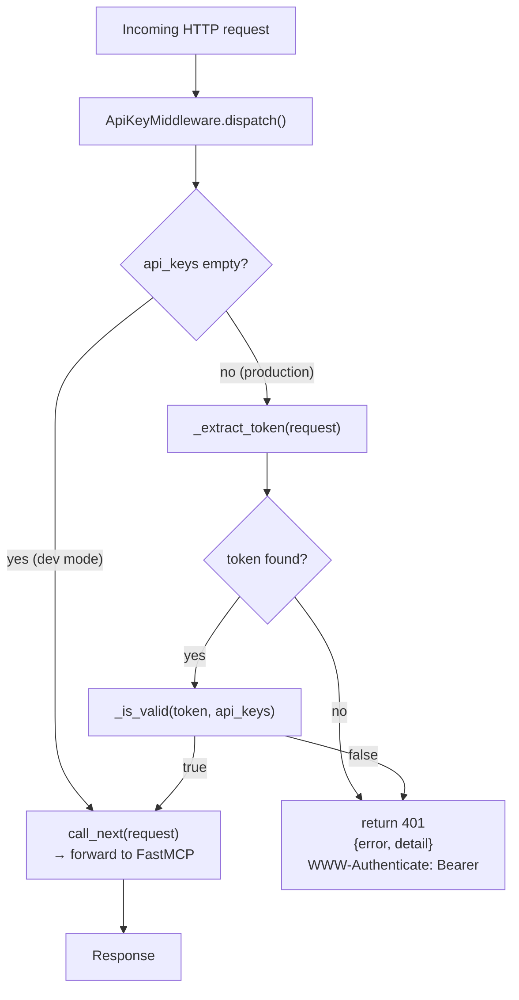
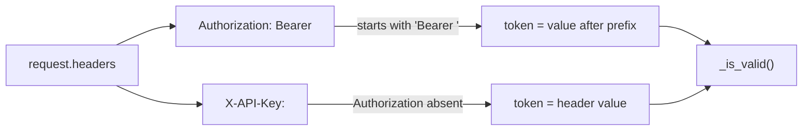

# Internals: Auth Middleware

`mcp/middleware/auth.py` — API key authentication for every incoming HTTP request.

---

## Architecture



---

## Token extraction

Two accepted header forms, checked in priority order:



If `Authorization: Bearer` is present but invalid, `X-API-Key` is **not** used as a fallback. The Bearer header takes full precedence.

---

## Timing-safe comparison

All token comparisons use `hmac.compare_digest` to prevent timing-oracle attacks:

```python
def _is_valid(token: str, keys: frozenset[str]) -> bool:
    token_bytes = token.encode()
    return any(hmac.compare_digest(token_bytes, k.encode()) for k in keys)
```

A naive `token in keys` would return early on the first match, leaking information about whether a partial token is close to a valid one. `hmac.compare_digest` always takes constant time relative to the compared values' length.

---

## Configuration

`MCP_API_KEYS` is read from the environment at server startup via `load_api_keys()`:

```python
def load_api_keys() -> frozenset[str]:
    raw = os.environ.get("MCP_API_KEYS", "")
    return frozenset(k.strip() for k in raw.split(",") if k.strip())
```

| `MCP_API_KEYS` value | Behaviour |
|---|---|
| Not set / empty | Returns empty `frozenset` → middleware is no-op |
| `"token1"` | One valid token |
| `"token1,token2"` | Two valid tokens — each key is independent |
| `" token1 , token2 "` | Whitespace stripped — works correctly |
| `"token1,,token2,"` | Empty segments ignored |

---

## Integration in `_serve()`

The middleware is attached conditionally via FastMCP's `middleware` parameter:

```python
api_keys = load_api_keys()
if api_keys:
    from starlette.middleware import Middleware
    middleware = [Middleware(ApiKeyMiddleware, api_keys=api_keys)]
else:
    logger.warning("MCP_API_KEYS is not set — running WITHOUT authentication.")
    middleware = None

await mcp.run_http_async(middleware=middleware, ...)
```

When `middleware=None` is passed to FastMCP, no middleware is applied.

---

## 401 response shape

```json
{
  "error": "Unauthorized",
  "detail": "A valid API key is required."
}
```

Headers:

```
HTTP/1.1 401 Unauthorized
Content-Type: application/json
WWW-Authenticate: Bearer
```

---

## Key rotation

Rotation is done by updating `MCP_API_KEYS` and restarting the server. Because keys are a comma-separated list, old and new keys can coexist during a rolling rotation:

1. Add the new key: `MCP_API_KEYS=old-key,new-key`
2. Restart the server
3. Update all clients to use `new-key`
4. Remove `old-key`: `MCP_API_KEYS=new-key`
5. Restart again

No code changes required — it is purely configuration.

---

## Test coverage

`mcp/tests/unit/test_middleware_auth.py` covers 26 scenarios:

- `load_api_keys`: unset, single, multiple, whitespace, empty segments
- `_extract_token`: `Authorization: Bearer`, `X-API-Key`, no headers, prefix-only
- `_is_valid`: correct, wrong, one-of-many, empty set
- Middleware no-op mode (empty keys)
- Valid `Bearer` token passes
- Valid `X-API-Key` passes
- Missing header → 401
- Wrong token → 401
- Empty bearer → 401
- 401 response has `WWW-Authenticate: Bearer` header
- 401 response body is valid JSON with `error` and `detail`
- Case-sensitive comparison
- Partial token not accepted
- `Authorization: Bearer` takes precedence over `X-API-Key`
- Invalid `Authorization` with valid `X-API-Key` → 401 (no fallback)
