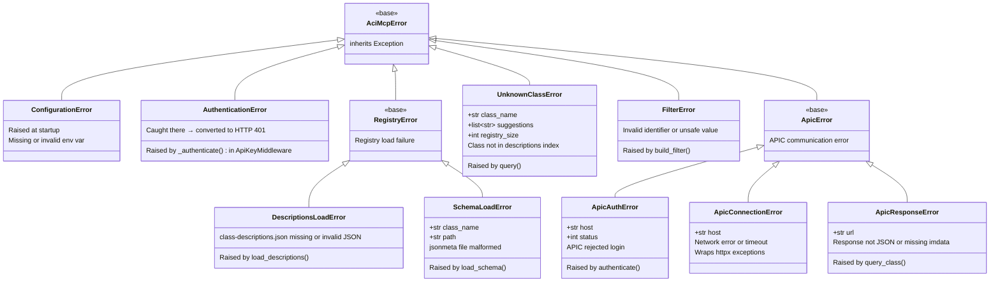

# Internals: Exception Hierarchy

All exceptions are defined in [`mcp/exceptions.py`](../../mcp/exceptions.py) and inherit from a single root `AciMcpError`. This means callers can catch the whole family with one clause, or target a specific subtree.

---

## Class diagram



---

## Where each exception is raised

| Exception | Raised by | Trigger |
|---|---|---|
| `ConfigurationError` | `main.py` lifespan + `_serve()` | `APIC_HOST` or `APIC_PASSWORD` missing; `MCP_PORT` not an integer |
| `AuthenticationError` | `middleware/auth.py` `_authenticate()` | Token absent or does not match any key — caught in `dispatch()` and converted to HTTP 401 |
| `DescriptionsLoadError` | `registry/descriptions.py` | `class-descriptions.json` not found, unreadable, or not valid JSON |
| `SchemaLoadError` | `registry/schema.py` | jsonmeta file exists but contains malformed JSON, or is empty |
| `UnknownClassError` | `main.py` `query()` tool | `class_name` not in the 15k-class descriptions index |
| `FilterError` | `registry/filter.py` | Class name or attribute key contains characters outside `^[A-Za-z][A-Za-z0-9]*$` |
| `ApicAuthError` | `apic/client.py` | APIC returns non-2xx on login; or still 401/403 after re-authentication |
| `ApicConnectionError` | `apic/client.py` | `httpx.TimeoutException` or `httpx.ConnectError` on any request |
| `ApicResponseError` | `apic/client.py` | Response body is not valid JSON; or `imdata` key absent from body |

---

## Catching patterns

```python
from exceptions import AciMcpError, ApicError, UnknownClassError

# Catch everything from this library
try:
    ...
except AciMcpError as exc:
    logger.error("aci-mcp error: %s", exc)

# Catch only APIC communication errors
try:
    await client.authenticate()
except ApicError as exc:
    logger.error("APIC unreachable: %s", exc)

# Catch unknown class — self-correction data available
try:
    results = await query("fvBd", ctx)   # typo in class name
except UnknownClassError as exc:
    print(exc.class_name)     # "fvBd"
    print(exc.suggestions)    # ["fvBD", "fvCEp", ...]
    print(exc.registry_size)  # 15432
```

---

## AuthenticationError design note

`AuthenticationError` is raised by the pure function `_authenticate(token, keys)` in `middleware/auth.py`, and immediately caught by `dispatch()` which converts it to an HTTP 401 response. It is never propagated to FastMCP or to tool code.

The exception exists at the domain layer rather than directly returning the HTTP response, so the authentication logic can be unit-tested without spinning up an HTTP server:

```python
# test: pure function, no HTTP client needed
with pytest.raises(AuthenticationError):
    _authenticate(None, frozenset({"secret"}))
```
