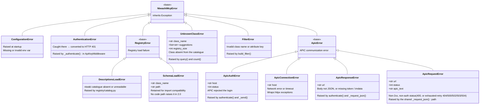

# Internals: Exception Hierarchy

All exceptions are defined in [`mcp/src/niwashi_mcp/exceptions.py`](../../mcp/src/niwashi_mcp/exceptions.py) and inherit from a single root `NiwashiMcpError`. This means callers can catch the whole family with one clause, or target a specific subtree.

The hierarchy is unchanged in 2.0. What changed is which failures can actually occur: the server no longer reads schema files from disk, so the failure modes of a file collection have been replaced by the failure modes of a single embedded database — see [What 2.0 changed](#what-20-changed) below.

---

## Class diagram


```mermaid
classDiagram
    class NiwashiMcpError {
        <<base>>
        inherits Exception
    }

    class ConfigurationError {
        Raised at startup
        Missing or invalid env var
    }

    class AuthenticationError {
        Raised by _authenticate() in ApiKeyMiddleware
        Caught there → converted to HTTP 401
    }

    class RegistryError {
        <<base>>
        Registry load failure
    }

    class DescriptionsLoadError {
        niwaki catalogue absent or unreadable
        Raised by registry/catalog.py
    }

    class SchemaLoadError {
        +str class_name
        +str path
        Retained for import compatibility
        No code path raises it in 2.0
    }

    class UnknownClassError {
        +str class_name
        +list~str~ suggestions
        +int registry_size
        Class absent from the catalogue
        Raised by query() and count()
    }

    class FilterError {
        Invalid class name or attribute key
        Raised by build_filter()
    }

    class ApicError {
        <<base>>
        APIC communication error
    }

    class ApicAuthError {
        +str host
        +int status
        APIC rejected the login
        Raised by authenticate() and _send()
    }

    class ApicConnectionError {
        +str host
        Network error or timeout
        Wraps httpx exceptions
    }

    class ApicResponseError {
        +str url
        Body not JSON, or missing token / imdata
        Raised by authenticate() and _request_json()
    }

    class ApicRequestError {
        +str url
        +int status
        +str apic_text
        Non-2xx, non-auth status (400, or exhausted-retry 404/500/502/503/504)
        Raised by the shared _request_json() path
    }

    NiwashiMcpError <|-- ConfigurationError
    NiwashiMcpError <|-- AuthenticationError
    NiwashiMcpError <|-- RegistryError
    NiwashiMcpError <|-- UnknownClassError
    NiwashiMcpError <|-- FilterError
    NiwashiMcpError <|-- ApicError

    RegistryError <|-- DescriptionsLoadError
    RegistryError <|-- SchemaLoadError

    ApicError <|-- ApicAuthError
    ApicError <|-- ApicConnectionError
    ApicError <|-- ApicResponseError
    ApicError <|-- ApicRequestError
```

---

## Where each exception is raised

Module paths below are relative to `mcp/src/niwashi_mcp/`.

| Exception | Raised by | Trigger |
|---|---|---|
| `ConfigurationError` | `main.py` — `app_lifespan()` and `_serve()` | `APIC_HOST` or `APIC_PASSWORD` unset or empty (lifespan); `MCP_PORT` not parseable as an integer (`_serve()`) |
| `AuthenticationError` | `middleware/auth.py` `_authenticate()` | Token absent or matching no key — caught in `dispatch()` and converted to HTTP 401 |
| `DescriptionsLoadError` | `registry/catalog.py` | The niwaki catalogue (`catalog.db`) is not present at the expected path inside the installed `niwaki` package; or its `manifest` table has no `prop_flags` row; or `prop_flags` no longer declares every flag the adapter reads |
| `SchemaLoadError` | *nothing* | Defined and importable, but unreachable — see below |
| `UnknownClassError` | `main.py` — `query()` and `count()` tools | `catalog.class_exists(class_name)` returned `False`: the name is absent from the catalogue's class table (15,452 entries), case included |
| `FilterError` | `registry/filter.py` `_validate_ident()` | Class name or attribute key does not match `^[A-Za-z][A-Za-z0-9]*$`. Filter *values* are escaped, never rejected — a value cannot raise this |
| `ApicAuthError` | `apic/client.py` | `authenticate()`: the login POST came back non-2xx. `_send()`: the request was still 401/403 after a re-authentication round-trip |
| `ApicConnectionError` | `apic/client.py` | `httpx.TimeoutException` or `httpx.ConnectError`. `authenticate()` has no retry loop and raises on the first failure; the read path (`query_class()`, `get_by_dn()`, `count_class()`, all through `_request_json()`) raises only once the retry budget is exhausted |
| `ApicResponseError` | `apic/client.py` | `authenticate()`: login body is not JSON, or carries no token. `_request_json()`: body is not valid JSON, or has no `imdata` key |
| `ApicRequestError` | `apic/client.py` `_request_json()` | Non-2xx, non-auth status — a permanent one such as 400 on the first attempt, or a transient 404/500/502/503/504 that never recovered within the retry budget. Carries the status and, when the body follows APIC's error shape, its text |

`DescriptionsLoadError` surfaces the first time the catalogue connection is opened, and never again — the connection is opened lazily and cached for the process. In a running server that first time is startup, when the lifespan builds the search index; the connection is nevertheless reached through every catalogue call, which is why `get_schema()` documents the exception too. Whichever caller triggers it, the condition is an installation failure rather than a user error, and the message carries the resolved path and the fix: `pip install --force-reinstall niwaki`.

A grep turns up one further `raise DescriptionsLoadError` in `registry/descriptions.py`, inside the file reader the catalogue replaced. It is not on the server's path — a source test asserts that `main.py` never calls it — and survives only for the comparison suites that diff the rebuilt index against the 1.x reference.

---

## What 2.0 changed

`SchemaLoadError` meant *"a jsonmeta file exists on disk but does not parse"*. The 2.0 data layer reads no files: the object model lives in one SQLite database shipped inside the `niwaki` dependency, and a per-class parse failure has no analogue there. The class is still defined and still inherits `RegistryError`, so existing `except SchemaLoadError:` clauses keep importing and keep compiling — but no code path in the server raises it any more.

The failure that replaces it is `DescriptionsLoadError`: the catalogue is absent or unreadable. It is a strictly coarser condition. In 1.x a corrupt file affected one class and left the other 15,451 working; in 2.0 the database either opens or it does not, and if it does not, nothing works. That is the trade the single-artefact data layer makes, and it is the reason the error message names the package to reinstall rather than the class that failed.

Two consequences worth knowing:

- **`get_schema()` still returns `{}` for an unknown class.** An empty dict is not a failure, and it is deliberately not an exception — an agent recovers from an empty result, not from a traceback. `DescriptionsLoadError` from `get_schema()` therefore always means a broken installation, never a bad `class_name`.
- **`UnknownClassError` is now raised from a single check.** `query()` and `count()` used to consult the descriptions index and then fall back to resolving a schema file, because the two collections disagreed by 213 classes and a class missing from the first could still be perfectly queryable. Both now come from the same catalogue, so the fallback — and the warning it logged on those 213 valid classes — is gone.

New code should not catch `SchemaLoadError`: the clause would compile, and never fire.

---

## UnknownClassError and the two class counts

`UnknownClassError` carries three attributes, and `registry_size` is the one that needs a word of explanation:

| Attribute | Value |
|---|---|
| `class_name` | The name the caller supplied, verbatim |
| `suggestions` | Up to 5 closest matches, from `search()` over the descriptions index |
| `registry_size` | `len(descriptions)` — the size of the **search index**, 15,239 |

Validation itself runs against the catalogue's class table, which holds **15,452** classes. The 213-class difference is the set of classes that carry no label, no comment and no usable property label: there is nothing to index for them, so `search_classes()` cannot reach them — but `query()` and `count()` accept them, because they exist. A class in that gap therefore never raises `UnknownClassError`, even though `search_classes()` will not find it.

Case is part of the check. SQLite's default `BINARY` collation makes it structural rather than a hand-written comparison: `fvBd` does not resolve to `fvBD`, and never silently returns the wrong class's results.

---

## Catching patterns

```python
from niwashi_mcp.exceptions import NiwashiMcpError, ApicError, UnknownClassError

# Catch everything from this library
try:
    ...
except NiwashiMcpError as exc:
    logger.error("niwashi-mcp error: %s", exc)

# Catch only APIC communication errors
try:
    await client.authenticate()
except ApicError as exc:
    logger.error("APIC unreachable: %s", exc)

# Catch unknown class — self-correction data available
try:
    results = await query("fvBd", ctx)   # wrong case
except UnknownClassError as exc:
    print(exc.class_name)     # "fvBd"
    print(exc.suggestions)    # ["fvBD", "fvCEp", ...]
    print(exc.registry_size)  # 15239
```

`RegistryError` remains the right clause for "the object model could not be loaded", and is what a supervisor process should treat as fatal: every one of its subclasses means the installation is broken, not that a request was malformed.

---

## AuthenticationError design note

`AuthenticationError` is raised by the pure function `_authenticate(token, keys)` in `middleware/auth.py`, and immediately caught by `dispatch()`, which converts it to an HTTP 401 (or a 429, when the per-IP rate limiter has already tripped). It is never propagated to FastMCP or to tool code.

The exception exists at the domain layer rather than the HTTP response being returned directly, so the authentication logic can be unit-tested without spinning up an HTTP server:

```python
# test: pure function, no HTTP client needed
with pytest.raises(AuthenticationError):
    _authenticate(None, frozenset({"secret"}))
```

See [auth.md](auth.md) for the full authentication path and [middleware.md](middleware.md) for how it sits in the stack.
