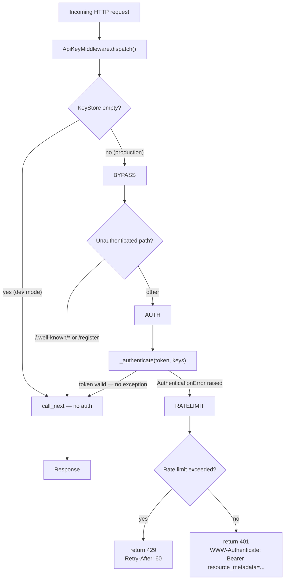

# Internals: Middleware Stack

Three middleware layers are registered in `_serve()` in `mcp/main.py`, outermost first:

```python
middleware = [
    Middleware(HealthMiddleware),
    Middleware(OAuthDiscoveryMiddleware),
    Middleware(ApiKeyMiddleware, key_store=key_store),
]
```

Request flow (outermost → innermost):

```
HealthMiddleware
    │  (pass non-/health requests)
OAuthDiscoveryMiddleware
    │  (pass non-discovery requests)
ApiKeyMiddleware
    │  (validated requests only)
FastMCP dispatcher
```

The order is load-bearing:
- `HealthMiddleware` must be first so `/health` is answered before any auth runs
- `OAuthDiscoveryMiddleware` must precede `ApiKeyMiddleware` so discovery paths are served before token validation

---

## HealthMiddleware

**Source:** `mcp/middleware/health.py`

A pure ASGI middleware (no Starlette `BaseHTTPMiddleware` dependency). It short-circuits any HTTP request to `/health` before auth or discovery middleware run.

### Response

Any HTTP request to `/health` receives:

```
HTTP/1.1 200 OK
Content-Type: application/json
Content-Length: 15

{"status": "ok"}
```

All other requests (including non-HTTP ASGI events such as WebSocket upgrades) pass through unchanged.

### Why pure ASGI

`BaseHTTPMiddleware` buffers the request body and adds overhead. `HealthMiddleware` talks directly to the ASGI `send` callable — it sends one `http.response.start` event and one `http.response.body` event and returns. Zero allocations beyond the two pre-built byte literals.

### Docker healthcheck

The `docker-compose.yml` uses this endpoint:

```yaml
healthcheck:
  test: ["CMD", "python", "-c", "import urllib.request; urllib.request.urlopen('http://localhost:8000/health')"]
  interval: 30s
  timeout: 5s
  retries: 3
  start_period: 15s
```

Caddy waits for the healthcheck to pass (`service_healthy`) before accepting traffic.

---

## OAuthDiscoveryMiddleware

**Source:** `mcp/middleware/oauth.py`

Implements the [RFC 9728](https://www.rfc-editor.org/rfc/rfc9728) OAuth 2.0 Protected Resource Metadata discovery endpoint, required by the MCP 2025-03-26 specification.

### Why this is needed

MCP-compliant clients (Claude Desktop, OpenCode) probe `/.well-known/oauth-protected-resource` before attempting authentication. Without a valid JSON response, the client fails because it tries to parse the FastMCP "Not Found" HTML body as JSON.

### Intercepted paths

```python
_PROTECTED_RESOURCE_PATHS = frozenset({
    "/.well-known/oauth-protected-resource",
    "/.well-known/oauth-protected-resource/mcp",
})
```

### Response shape

```json
{
  "resource": "https://mcp.yourdomain.com/mcp",
  "bearer_methods_supported": ["header"],
  "resource_documentation": "https://modelcontextprotocol.io/specification/2025-03-26/basic/authentication"
}
```

Headers:

```
HTTP/1.1 200 OK
Content-Type: application/json
Cache-Control: no-store
```

`bearer_methods_supported: ["header"]` tells clients to send `Authorization: Bearer <token>` in the request header. There is no OAuth authorization server — clients prompt the user for a pre-shared token.

All non-discovery paths pass through to `ApiKeyMiddleware` unchanged.

---

## ApiKeyMiddleware

**Source:** `mcp/middleware/auth.py`

Validates bearer tokens on every request. Uses `KeyStore` for hot-reloadable keys and `RateLimiter` for per-IP brute-force protection.

### Auth flow



### _authenticate()

The authentication check is extracted into a pure function that raises `AuthenticationError` — no HTTP concerns:

```python
def _authenticate(token: str | None, keys: frozenset[str]) -> None:
    if token is None or not _is_valid(token, keys):
        raise AuthenticationError("missing or invalid API key")
```

`dispatch()` calls it inside a `try/except AuthenticationError` block and converts the exception to the appropriate HTTP response. This makes the auth logic independently testable without spinning up an HTTP server.

### Token extraction

Two header forms are accepted (in priority order):

```
Authorization: Bearer <token>    ← checked first
X-API-Key: <token>               ← fallback when Authorization absent
```

When `Authorization: Bearer` is present but invalid, `X-API-Key` is **not** consulted. The first header takes full precedence.

### Timing-safe comparison

All comparisons use `hmac.compare_digest` to prevent timing-oracle attacks:

```python
def _is_valid(token: str, keys: frozenset[str]) -> bool:
    token_bytes = token.encode()
    return any(hmac.compare_digest(token_bytes, k.encode()) for k in keys)
```

The function always iterates over all keys regardless of where the match is found, so the total comparison time is proportional to the key count — not to the position of the matching key.

### 401 response

```
HTTP/1.1 401 Unauthorized
Content-Type: application/json
WWW-Authenticate: Bearer resource_metadata="https://mcp.yourdomain.com/.well-known/oauth-protected-resource"

{"error": "Unauthorized", "detail": "A valid API key is required."}
```

The `resource_metadata` URL in `WWW-Authenticate` points clients to the OAuth discovery endpoint (RFC 9728 §5.1) so they can find configuration in one round-trip without probing multiple paths.

### Rate limiter

Fixed-window per-IP counter. Default: 30 failed auth attempts per 60-second window.

```
GET /mcp  (no token)  →  401  (attempt 1/30)
GET /mcp  (no token)  →  401  (attempt 30/30)
GET /mcp  (no token)  →  429  Retry-After: 60
```

Only failed attempts are counted. Valid requests never consume rate-limit budget.

### KeyStore — hot-reloadable keys

`KeyStore` wraps the current key set in a `threading.Lock` and exposes an atomic `reload()`:

```python
class KeyStore:
    def reload(self, new_keys: frozenset[str]) -> None:
        with self._lock:
            self._keys = new_keys
```

In-flight requests that already called `KeyStore.get()` continue with the snapshot they received. The reload is invisible to them.

---

## SIGHUP hot-reload

The server registers a `SIGHUP` signal handler that reloads `MCP_API_KEYS` from `.env` without restarting:

```python
def _handle_sighup(signum, frame):  # noqa: ARG001
    load_dotenv(ENV_FILE, override=True)
    new_keys = load_api_keys()
    key_store.reload(new_keys)
```

Trigger a reload:

```bash
kill -HUP $(pgrep -f "python main.py")
```

Log output after reload:

```
INFO  aci-mcp  SIGHUP — API keys reloaded (2 key(s))
```

### Zero-downtime key rotation

1. Add the new key: `MCP_API_KEYS=old-key,new-key` in `.env`
2. Send `SIGHUP` — no restart, both keys are active immediately
3. Update all clients to use `new-key`
4. Remove the old key: `MCP_API_KEYS=new-key` in `.env`
5. Send `SIGHUP` again — old key revoked
