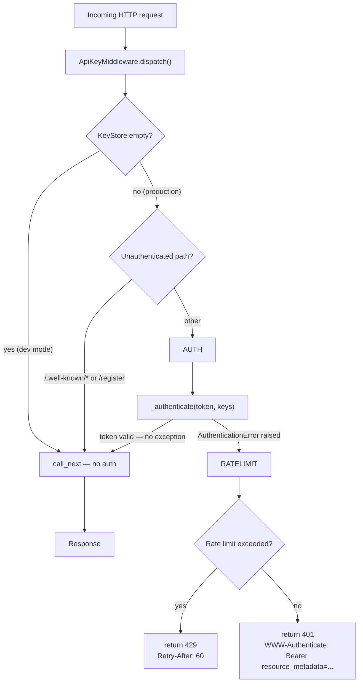

# Internals: Middleware Stack

Three middleware layers are registered in `_serve()` in `mcp/src/niwashi_mcp/main.py`, outermost first:

```python
middleware = [
    Middleware(HealthMiddleware),
    Middleware(OAuthDiscoveryMiddleware),
    Middleware(ApiKeyMiddleware, key_store=key_store),
]

await mcp.run_http_async(
    host="0.0.0.0",
    port=port,
    stateless_http=True,
    json_response=True,
    middleware=middleware,
)
```

The stack is unchanged in 2.0 — none of these layers touches the ACI object model. Only the module paths moved, into the installable `niwashi_mcp` package.

Request flow (outermost → innermost):

```text
HealthMiddleware
    │  (pass non-/health requests)
OAuthDiscoveryMiddleware
    │  (pass non-discovery requests)
ApiKeyMiddleware
    │  (validated requests only)
FastMCP dispatcher
```

The order is load-bearing:

- `HealthMiddleware` must be first so `/health` is answered before any auth runs
- `OAuthDiscoveryMiddleware` must precede `ApiKeyMiddleware` so discovery paths are served before token validation

---

## HealthMiddleware

**Source:** `mcp/src/niwashi_mcp/middleware/health.py`

A pure ASGI middleware (no Starlette `BaseHTTPMiddleware` dependency). It short-circuits any HTTP request to `/health` before auth or discovery middleware run.

### Response

Any HTTP request to `/health` receives:

```http
HTTP/1.1 200 OK
Content-Type: application/json
Content-Length: 16

{"status": "ok"}
```

All other requests (including non-HTTP ASGI events such as WebSocket upgrades) pass through unchanged.

### Why pure ASGI

`BaseHTTPMiddleware` buffers the request body and adds overhead. `HealthMiddleware` talks directly to the ASGI `send` callable — it sends one `http.response.start` event and one `http.response.body` event and returns. The body and the header list are module-level constants, encoded once at import, so a probe every 30 seconds costs nothing but the two `send()` calls.

### Docker healthcheck

`mcp/deploy/docker-compose.yml` probes this endpoint:

```yaml
healthcheck:
  test: ["CMD", "python", "-c", "import urllib.request; urllib.request.urlopen('http://localhost:8000/health')"]
  interval: 30s
  timeout: 5s
  retries: 3
  start_period: 15s
```

Caddy waits for the healthcheck to pass (`service_healthy`) before accepting traffic.

---

## OAuthDiscoveryMiddleware

**Source:** `mcp/src/niwashi_mcp/middleware/oauth.py`

Implements the [RFC 9728](https://www.rfc-editor.org/rfc/rfc9728) OAuth 2.0 Protected Resource Metadata discovery endpoint, required by the MCP 2025-03-26 specification.

### Why this is needed

MCP-compliant clients (Claude Desktop, OpenCode) probe `/.well-known/oauth-protected-resource` before attempting authentication. Without a valid JSON response, the client fails because it tries to parse the FastMCP "Not Found" HTML body as JSON.

### Intercepted paths

```python
_PROTECTED_RESOURCE_PATHS = frozenset({
    "/.well-known/oauth-protected-resource",
    "/.well-known/oauth-protected-resource/mcp",
})
```

### Response shape

```json
{
  "resource": "https://mcp.yourdomain.com/mcp",
  "bearer_methods_supported": ["header"],
  "resource_documentation": "https://modelcontextprotocol.io/specification/2025-03-26/basic/authentication"
}
```

Headers:

```http
HTTP/1.1 200 OK
Content-Type: application/json
Cache-Control: no-store
```

`bearer_methods_supported: ["header"]` tells clients to send `Authorization: Bearer <token>` in the request header. There is no OAuth authorization server — clients prompt the user for a pre-shared token.

All non-discovery paths pass through to `ApiKeyMiddleware` unchanged.

---

## ApiKeyMiddleware

**Source:** `mcp/src/niwashi_mcp/middleware/auth.py`

Validates bearer tokens on every request. Uses `KeyStore` for hot-reloadable keys and `RateLimiter` for per-IP brute-force protection.

### Auth flow


```mermaid
flowchart TD
    REQ["Incoming HTTP request"]
    REQ --> MW["ApiKeyMiddleware.dispatch()"]

    MW --> EMPTY{KeyStore empty?}
    EMPTY -->|"yes (dev mode)"| PASSTHROUGH["call_next — no auth"]
    EMPTY -->|"no (production)"| PATH{Unauthenticated path?}

    PATH -->|"/.well-known/* or /register"| PASSTHROUGH
    PATH -->|"other"| AUTH

    AUTH --> CALL["_authenticate(token, keys)"]
    CALL -->|"token valid — no exception"| PASSTHROUGH
    CALL -->|"AuthenticationError raised"| RATELIMIT

    RATELIMIT --> RL{Rate limit exceeded?}
    RL -->|"yes"| R429["return 429<br/>Retry-After: 60"]
    RL -->|"no"| R401["return 401<br/>WWW-Authenticate: Bearer resource_metadata=..."]

    PASSTHROUGH --> RESP["Response"]
```

### _authenticate()

The authentication check is extracted into a pure function that raises `AuthenticationError` — no HTTP concerns:

```python
def _authenticate(token: str | None, keys: frozenset[str]) -> None:
    if token is None or not _is_valid(token, keys):
        raise AuthenticationError("missing or invalid API key")
```

`dispatch()` calls it inside a `try/except AuthenticationError` block and converts the exception to the appropriate HTTP response. This makes the auth logic independently testable without spinning up an HTTP server.

### Token extraction

Two header forms are accepted (in priority order):

```text
Authorization: Bearer <token>    ← checked first
X-API-Key: <token>               ← fallback whenever Authorization doesn't
                                   start with "Bearer " (absent, empty, or
                                   a different scheme like "Basic ...")
```

When `Authorization: Bearer` is present but invalid, `X-API-Key` is **not** consulted — it's the `Bearer` prefix that decides which header is read, independent of whether the extracted token then turns out to be valid.

### Timing-safe comparison

All comparisons use `hmac.compare_digest` to prevent timing-oracle attacks:

```python
def _is_valid(token: str, keys: frozenset[str]) -> bool:
    token_bytes = token.encode()
    return any(hmac.compare_digest(token_bytes, k.encode()) for k in keys)
```

`any()` short-circuits on the first match, so the loop is **not** position-independent — a valid token matching an early key returns faster than one matching a late key. For an invalid token (the brute-force-guessing case this guards against), every key is compared every time, so timing is constant across guesses. The property that actually matters — resisting byte-by-byte key discovery — comes from `hmac.compare_digest` itself, not from loop-level uniformity. See [internals/auth.md](auth.md) for the full explanation.

### 401 response

```http
HTTP/1.1 401 Unauthorized
Content-Type: application/json
WWW-Authenticate: Bearer resource_metadata="https://mcp.yourdomain.com/.well-known/oauth-protected-resource"

{"error": "Unauthorized", "detail": "A valid API key is required."}
```

The `resource_metadata` URL in `WWW-Authenticate` points clients to the OAuth discovery endpoint (RFC 9728 §5.1) so they can find configuration in one round-trip without probing multiple paths.

### Rate limiter

Fixed-window per-IP counter. Default: 30 failed auth attempts per 60-second window.

```text
GET /mcp  (no token)  →  401  (attempt 1/30)
GET /mcp  (no token)  →  401  (attempt 30/30)
GET /mcp  (no token)  →  429  Retry-After: 60
```

Only failed attempts are counted. Valid requests never consume rate-limit budget.

### KeyStore — hot-reloadable keys

`KeyStore` wraps the current key set in a `threading.Lock` and exposes an atomic `reload()`:

```python
class KeyStore:
    def reload(self, new_keys: frozenset[str]) -> None:
        with self._lock:
            self._keys = new_keys
```

In-flight requests that already called `KeyStore.get()` continue with the snapshot they received. The reload is invisible to them.

---

## SIGHUP hot-reload

`_serve()` registers a `SIGHUP` handler that re-reads the env file and swaps the key set without restarting the process:

```python
def _handle_sighup(_signum, _frame):
    load_dotenv(ENV_FILE, override=True)
    new_keys = load_api_keys()
    key_store.reload(new_keys)
    n = len(new_keys)
    if n:
        logger.info("SIGHUP — API keys reloaded (%d key(s))", n)
    else:
        logger.warning("SIGHUP — MCP_API_KEYS is empty after reload, auth disabled")

signal.signal(signal.SIGHUP, _handle_sighup)
```

`override=True` matters: without it `load_dotenv` would leave the already-exported `MCP_API_KEYS` in place and the reload would be a no-op. `ENV_FILE` is the path resolved once at import — `$ACI_MCP_ENV_FILE`, then `./.env`, then a verified checkout's `.env`, then `~/.config/niwashi-mcp/.env`; see [auth.md](auth.md#mcp_api_keys-format).

Trigger a reload:

```bash
kill -HUP $(pgrep -f niwashi-mcp)
```

Log output after reload:

```text
INFO  aci-mcp  SIGHUP — API keys reloaded (2 key(s))
```

Emptying `MCP_API_KEYS` and reloading disables authentication rather than failing — the `KeyStore` becomes empty and `ApiKeyMiddleware` reverts to its pass-through mode. That is a live change, logged as a warning, not a rejected reload.

### Zero-downtime key rotation

1. Add the new key: `MCP_API_KEYS=old-key,new-key` in `.env`
2. Send `SIGHUP` — no restart, both keys are active immediately
3. Update all clients to use `new-key`
4. Remove the old key: `MCP_API_KEYS=new-key` in `.env`
5. Send `SIGHUP` again — old key revoked
