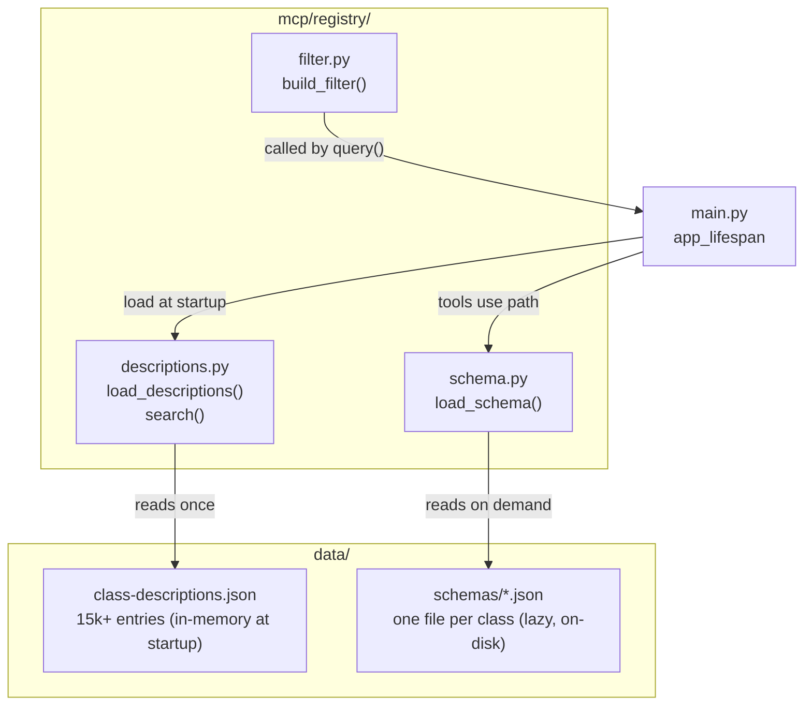
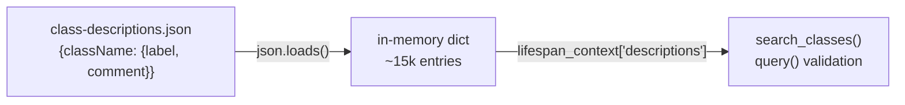
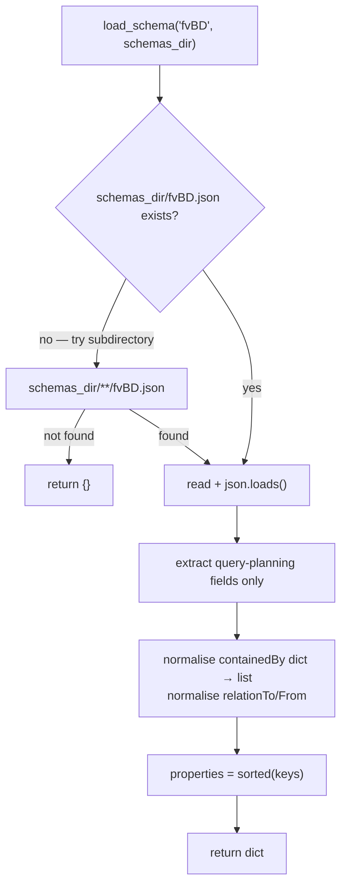

# Internals: Registry

Three modules under `mcp/registry/` that work together to serve `search_classes` and `get_schema`, and to build APIC filter strings for `query`.

---

## Module map



---

## descriptions.py

### `load_descriptions(path)`

Reads `class-descriptions.json` into a Python dict at startup. Called once — the result is stored in the lifespan context and shared across all requests.



**Error handling:**
- File missing → `DescriptionsLoadError` (server refuses to start)
- Not valid JSON → `DescriptionsLoadError`
- OS permission error → `DescriptionsLoadError`

### `search(keyword, descriptions, limit)`

O(n) linear scan with relevance scoring. See [search-algorithm.md](search-algorithm.md) for the full algorithm rationale, measured gains, and evolution history.

**Scoring rules (applied in order):**

```python
score = 0
if keyword in class_name.lower():  score += 3   # class name match
if keyword in label.lower():       score += 2   # label match
if keyword in comment.lower():     score += 1   # comment match

# Fallback: scan prop_labels only when no match found above
if score == 0:
    for pl in meta.get("prop_labels", ()):
        if keyword in pl.lower():
            score = 1
            break   # no accumulation across multiple prop_labels

# Rs/Rt relation classes are penalised: they are internal plumbing and
# should never rank above canonical domain objects.
if score > 0 and _RS_RT_RE.match(class_name):
    score -= 3
```

**Edge cases handled:**
- Empty keyword → returns `[]` immediately (no scan)
- Missing `label`, `comment`, or `prop_labels` key → safe default via `.get()`
- Rs/Rt class whose penalised score reaches 0 → excluded from results

---

## schema.py

### `load_schema(class_name, schemas_dir)`

Lazy per-class loader. No caching — OS page cache handles repeated reads efficiently.



### Extracted fields

Only these fields are kept — heavy fields are discarded at read time to keep tool responses token-efficient:

**Kept:** `identifiedBy`, `rnFormat`, `containedBy`, `dnFormats`, `relationTo`, `relationFrom`, `properties` (names only), `isAbstract`, `isConfigurable`, `className`, `classPkg`, `label`

**Discarded:** `writeAccess`, `events`, `stats`, `faults`, full property metadata (type, validators, etc.)

### containedBy normalisation

In raw jsonmeta, `containedBy` is a dict with class names as keys:

```json
"containedBy": {"fv:Tenant": "", "uni:Infra": ""}
```

`load_schema()` normalises this to a plain list:

```python
["fv:Tenant", "uni:Infra"]
```

---

## filter.py

### `build_filter(class_name, filters)`

Builds an APIC `query-target-filter` string from a plain dict.

```mermaid
flowchart LR
    DICT["{\"name\": \"servers\",\n\"arpFlood\": \"yes\"}"]
    DICT --> VAL["validate class_name and each key\nagainst _IDENT_RE = [A-Za-z][A-Za-z0-9]*"]
    VAL --> PRED["build eq() predicates:\neq(fvBD.name,\"servers\")\neq(fvBD.arpFlood,\"yes\")"]
    PRED --> WRAP{"n predicates?"}
    WRAP -->|"1"| SINGLE["eq(fvBD.name,\"servers\")"]
    WRAP -->|"2+"| AND["and(eq(...),eq(...))"]
```

### Value escaping

`"` and `\` inside filter values are escaped before embedding in the APIC string:

```python
value.replace("\\", "\\\\").replace('"', '\\"')
```

This prevents filter injection when attribute values contain special characters.

### Identifier validation

Class names and attribute keys are validated against `^[A-Za-z][A-Za-z0-9]*$` before use. Values that do not match raise `FilterError`, preventing malformed APIC query strings.

| Input | Result |
|---|---|
| `"fvBD"` | valid |
| `"fv BD"` | `FilterError` (space) |
| `"123abc"` | `FilterError` (starts with digit) |
| `"fvBD; DROP"` | `FilterError` (semicolon) |
