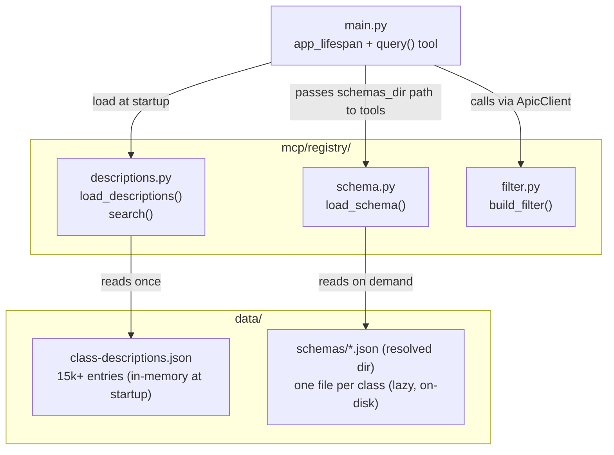
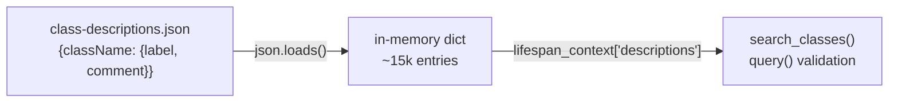
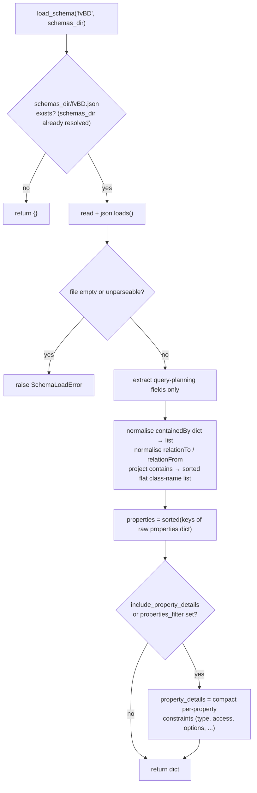

# Internals: Registry

Three modules under `mcp/registry/` that work together to serve `search_classes` and `get_schema`, and to build APIC filter strings for `query`.

---

## Module map


```mermaid
graph TD
    subgraph registry["mcp/registry/"]
        desc["descriptions.py\nload_descriptions()\nsearch()"]
        schema["schema.py\nload_schema()"]
        filt["filter.py\nbuild_filter()"]
    end

    subgraph data["data/"]
        json["class-descriptions.json\n15k+ entries (in-memory at startup)"]
        schemas_dir["schemas/*.json (resolved dir)\none file per class (lazy, on-disk)"]
    end

    main["main.py\napp_lifespan + query() tool"]

    main -->|"load at startup"| desc
    desc -->|"reads once"| json
    main -->|"passes schemas_dir path to tools"| schema
    schema -->|"reads on demand"| schemas_dir
    main -->|"calls via ApicClient"| filt
```

---

## descriptions.py

### `load_descriptions(path)`

Reads `class-descriptions.json` into memory at startup. Called once — the result is stored in the FastMCP lifespan context and shared across all requests.


```mermaid
flowchart LR
    FILE["class-descriptions.json\n{className: {label, comment}}"]
    FILE -->|"json.loads()"| MEM["in-memory dict\n~15k entries"]
    MEM -->|"lifespan_context['descriptions']"| TOOLS["search_classes()\nquery() validation"]
```

**Error handling:**

- File missing → `DescriptionsLoadError` (server refuses to start)
- Not valid JSON → `DescriptionsLoadError`
- OS permission error → `DescriptionsLoadError`

### `search(keyword, descriptions, limit)`

O(n) linear scan with relevance scoring. This is the **v2** algorithm — tokenized matching plus structural priors, not the older substring-scoring scheme. For the full rationale, measured gains, and evolution history (including the retired v1 scheme) see [search-algorithm.md](search-algorithm.md), which is the source of truth for this section.

**Scoring, in order of confidence (all fields tokenized camelCase-aware, via the same tokenizer as the query):**

| Signal | Weight |
|---|---|
| Exact match against label or curated jargon phrase | +20 / +18 |
| Exact match against class name (query squashed, no separators) | +25 |
| Query phrase substring of label/jargon phrase | +6 |
| Token coverage of label/class name (squared) | up to +8 / +5 |
| Query phrase substring of joined property-label haystack | +6 |
| Token coverage of property labels/comment (squared) | up to +2 / +1 |
| Curated synonym hit | up to +3 × coverage |

**Structural priors, applied after the text score, only when it's already positive:**

```python
if isConfigurable:               score += 6
if isAbstract:                   score -= 6
if stats/telemetry suffix match: score -= 10   # e.g. "5min", "15min", "1h"
if _RS_RT_RE.match(class_name):  score -= 8    # internal plumbing, never the primary target
```

**Tie-breaking:** fewer class-name tokens → shorter class name → alphabetical — deterministic, no dependency on JSON insertion order.

**Edge cases:**

- Empty keyword → returns `[]` immediately (no scan)
- Missing `label`, `comment`, or `prop_labels` → safe default via `.get()`
- A class with zero textual signal never surfaces on structural priors alone
- A curated synonym boost is capped so it can never override a genuine exact match on its own

---

## schema.py

### `load_schema(class_name, schemas_dir, include_property_details=False, properties_filter=None)`

Lazy per-class loader. No in-memory cache — the OS page cache handles repeated reads efficiently. This is the **hot path** — called on every `get_schema()` invocation — so it does a single direct file stat/open, **no wildcard scanning**: `schemas_dir` must already be the *resolved* directory (see "Schema file lookup" below), and this function never searches subdirectories itself.


```mermaid
flowchart TD
    CALL["load_schema('fvBD', schemas_dir)"]
    CALL --> EXISTS{"schemas_dir/fvBD.json\nexists? (schemas_dir already resolved)"}
    EXISTS -->|"no"| EMPTY["return {}"]
    EXISTS -->|"yes"| READ["read + json.loads()"]
    READ --> VALIDATE{"file empty or unparseable?"}
    VALIDATE -->|"yes"| ERR["raise SchemaLoadError"]
    VALIDATE -->|"no"| EXTRACT["extract query-planning fields only"]
    EXTRACT --> NORM["normalise containedBy dict → list\nnormalise relationTo / relationFrom\nproject contains → sorted flat class-name list"]
    NORM --> PROPS["properties = sorted(keys of raw properties dict)"]
    PROPS --> DETAILS{"include_property_details\nor properties_filter set?"}
    DETAILS -->|"yes"| PD["property_details = compact per-property\nconstraints (type, access, options, ...)"]
    DETAILS -->|"no"| RETURN
    PD --> RETURN["return dict"]
```

### Extracted fields

Only these fields are kept — heavy fields are discarded to keep tool responses token-efficient:

**Kept (always, when present in the schema):** `identifiedBy`, `rnFormat`, `containedBy`, `contains` (child classes, flat notation), `dnFormats`, `relationTo`, `relationFrom`, `properties` (names only), `isAbstract`, `isConfigurable`, `className`, `classPkg`, `label`

**Kept (opt-in only, token economy):** `property_details` — compact per-property constraints (`type`, `access`, `naming`, `mandatory`, `default`, `options`, `comment`), added only when `include_property_details=True` or `properties_filter` is given. `properties_filter` restricts the dump to named properties and is the preferred, cheaper path; `include_property_details` dumps every property.

**Discarded:** `writeAccess`, `events`, `stats`, `faults`, full raw property metadata (~25 fields per property, most irrelevant to an agent)

### containedBy normalisation

In raw jsonmeta, `containedBy` is a dict with class names as keys:

```json
"containedBy": {"fv:Tenant": "", "uni:Infra": ""}
```

`load_schema()` normalises this to a plain list:

```python
["fv:Tenant", "uni:Infra"]
```

### Schema file lookup

`resolve_schemas_dir(schemas_dir)` runs **once, at server startup** (`main.app_lifespan`), never per call — walking a 15k+-file tree on every `get_schema()` invocation would be far too slow. It resolves whichever layout is actually on disk:

| Layout | Resolves to | Used when |
|---|---|---|
| Flat | `schemas_dir` itself | `data/schemas/*.json` exist directly (the default today — see [quickstart](../getting-started/quickstart.md)) |
| Single versioned subdir | `schemas_dir/{version}/` | Exactly one immediate subdirectory holds `*.json` files |
| Multiple versioned subdirs | The lexicographically last subdirectory | `schema-collector` has run against more than one APIC version; this is a naming heuristic (`mo-apic-v{version}`), not semantic-version comparison |
| Nothing found | `schemas_dir` unchanged | Every subsequent `get_schema()` reports the class as not found |

The *resolved* directory is then passed to every `load_schema()` call for the life of the process — that function itself does one direct stat, never a glob.

---

## filter.py

### `build_filter(class_name, filters)`

Builds an APIC `query-target-filter` string from a plain dict. Called by `ApicClient.query_class()`.

```mermaid
flowchart LR
    DICT["{\"name\": \"servers\",\n\"arpFlood\": \"yes\"}"]
    DICT --> VAL["validate class_name and each key\nagainst ^[A-Za-z][A-Za-z0-9]*$"]
    VAL --> PRED["build eq() predicates:\neq(fvBD.name,\"servers\")\neq(fvBD.arpFlood,\"yes\")"]
    PRED --> WRAP{"n predicates?"}
    WRAP -->|"0"| EMPTY_STR["return ''"]
    WRAP -->|"1"| SINGLE["eq(fvBD.name,\"servers\")"]
    WRAP -->|"2+"| AND["and(eq(...),eq(...))"]
```

### Value escaping

`"` and `\` inside filter values are escaped before embedding:

```python
value.replace("\\", "\\\\").replace('"', '\\"')
```

This prevents injection when attribute values contain special characters.

### Identifier validation

Class names and attribute keys are validated against `^[A-Za-z][A-Za-z0-9]*$` before use:

| Input | Result |
|---|---|
| `"fvBD"` | valid |
| `"fv BD"` | `FilterError` (space) |
| `"123abc"` | `FilterError` (starts with digit) |
| `"fvBD; DROP"` | `FilterError` (semicolon) |

An empty `filters` dict returns `""` — the APIC client omits the `query-target-filter` parameter entirely when the string is empty.
