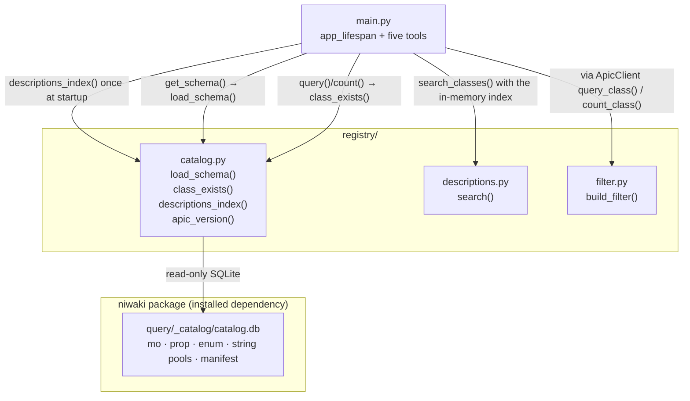
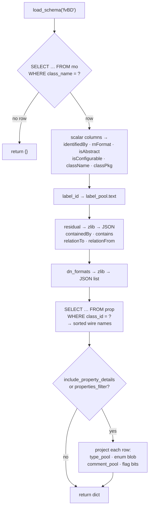
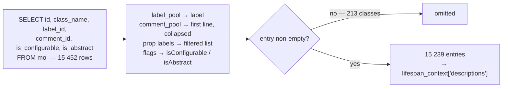

# Internals: Registry

Three modules under `mcp/src/niwashi_mcp/registry/` serve `search_classes` and
`get_schema`, validate class names for `query` / `count`, and build the APIC
filter strings those two send over the wire.

| Module | Role |
|---|---|
| `catalog.py` | The data layer. Reads the ACI object model from the SQLite catalogue shipped inside the `niwaki` dependency |
| `descriptions.py` | Scores `search_classes` against an in-memory index (see [search-algorithm.md](search-algorithm.md)) |
| `filter.py` | Builds `query-target-filter` strings from a plain dict |

---

## What 2.0 changed

Only the source of the data. The five tools keep their signatures, and
`get_schema()` returns the same dict it returned before — pinned field by field
by `mcp/tests/baseline/` and `mcp/tests/unit/test_catalog_adapter.py`.

| | 1.2.2 | 2.0 |
|---|---|---|
| Object model | 15 452 jsonmeta files under `data/schemas/` | One SQLite file inside the installed `niwaki` package |
| Reader | `registry/schema.py` — one file open per `get_schema()` call | `registry/catalog.py` — one indexed `SELECT` per call |
| Directory resolution | `resolve_schemas_dir()` walked the tree once at startup to pick a layout | None. The path is derived from `niwaki.__file__` |
| Search index | Read from a JSON file at startup | Rebuilt from the catalogue at startup by `descriptions_index()` |
| Class validation | Two tiers: descriptions dict, then a schema-file fallback | One `SELECT` against `mo.class_name` |
| Corrupt-source failure | `SchemaLoadError` (a malformed jsonmeta file) | `DescriptionsLoadError` (catalogue absent or unreadable) |

`registry/schema.py` is deleted, along with `resolve_schemas_dir()`,
`schemas_dir` as a lifespan value, and the `ACI_MCP_DATA_DIR` environment
variable. `SchemaLoadError` still exists in `exceptions.py` for import
compatibility, but nothing raises it any more: there is no longer a per-class
file that can be malformed on its own.

---

## Module map


```mermaid
graph TD
    subgraph registry["registry/"]
        cat["catalog.py\nload_schema()\nclass_exists()\ndescriptions_index()\napic_version()"]
        desc["descriptions.py\nsearch()"]
        filt["filter.py\nbuild_filter()"]
    end

    subgraph niwaki["niwaki package (installed dependency)"]
        db["query/_catalog/catalog.db\nmo · prop · enum · string pools · manifest"]
    end

    main["main.py\napp_lifespan + five tools"]

    main -->|"descriptions_index() once at startup"| cat
    main -->|"get_schema() → load_schema()"| cat
    main -->|"query()/count() → class_exists()"| cat
    cat -->|"read-only SQLite"| db
    main -->|"search_classes() with the in-memory index"| desc
    main -->|"via ApicClient query_class() / count_class()"| filt
```

`catalog.py` is the only module in the codebase that imports `niwaki`. Every
other module receives plain dicts, exactly as it did when the source was a
directory of JSON files.

---

## catalog.py

### The database

`catalog_path()` resolves `niwaki.__file__` → `query/_catalog/catalog.db`. The
project pins `niwaki>=1.8,<2.0`; the installed 1.8.0 ships a 36 229 120-byte
catalogue built from APIC **6.0(9c)**.

Two `manifest` rows matter to this server:

| Key | Value | Used for |
|---|---|---|
| `apic_version` | `6.0(9c)` | `apic_version()`, logged at startup — from 2.0 the corpus version is pinned by a dependency, not chosen by the operator, so it has to be visible |
| `prop_flags` | Comma-separated flag names | The bit layout of `prop.flags`, read rather than hard-coded |

Tables the adapter reads:

| Table | Rows | Read for |
|---|---|---|
| `mo` | 15 452 | One row per ACI class: the scalar schema fields, plus two compressed blobs |
| `prop` | 332 297 | One row per property per class. `PRIMARY KEY (class_id, wire_name)`, `WITHOUT ROWID` — a lookup by `class_id` walks a b-tree prefix, not the whole table |
| `label_pool` | 26 654 | Deduplicated human labels, addressed by id |
| `comment_pool` | 25 411 | Deduplicated comment text (a JSON list of lines), addressed by id |
| `type_pool` | 3 458 | ACI model types and primitive base types |
| `enum` | 3 947 | zlib-compressed JSON blobs of enumerated values |
| `manifest` | 16 | Build metadata |

The catalogue also carries `relation`, `inherits`, `subclass`, `fault`,
`scopemeta`, `name_override` and an FTS index. None of them is read here — this
server derives relations from the `mo` residual blob and ranks with its own
scorer.

### Connection and caches

```python
sqlite3.connect(f"file:{path}?immutable=1", uri=True, check_same_thread=False)
```

One connection for the process, held by `lru_cache(maxsize=1)`:

- `immutable=1` tells SQLite the file cannot change underneath us, so locking is
  skipped entirely. Correct here: the catalogue is a build artefact inside a
  wheel.
- `check_same_thread=False` is required because FastMCP serves from a thread
  pool. Safe under SQLite's default serialised threading mode.
- A second connection would load a second copy of the string pools into memory,
  which is why there is deliberately only one.

| Cache | Size | Holds |
|---|---|---|
| `_connect()` | 1 | The connection |
| `_flag_bits()` | 1 | `{flag name: bit}` parsed from `manifest.prop_flags` |
| `apic_version()` | 1 | The APIC release string |
| `_pool(table, column, id)` | 4096 | Pooled strings — labels, comments, types |
| `_pool_blob(table, id)` | 8192 | Compressed enum blobs |

Measured on an Apple-silicon workstation with niwaki 1.8.0: `load_schema("fvBD")`
0.18 ms, the same call with `include_property_details=True` 0.33 ms.

### Where every `get_schema()` field comes from


```mermaid
flowchart TD
    CALL["load_schema('fvBD')"]
    CALL --> MO{"SELECT … FROM mo\nWHERE class_name = ?"}
    MO -->|"no row"| EMPTY["return {}"]
    MO -->|"row"| SCALARS["scalar columns →\nidentifiedBy · rnFormat · isAbstract\nisConfigurable · className · classPkg"]
    SCALARS --> LABEL["label_id → label_pool.text"]
    LABEL --> RES["residual → zlib → JSON\ncontainedBy · contains\nrelationTo · relationFrom"]
    RES --> DNF["dn_formats → zlib → JSON list"]
    DNF --> PROPS["SELECT … FROM prop\nWHERE class_id = ?\n→ sorted wire names"]
    PROPS --> DETAILS{"include_property_details\nor properties_filter?"}
    DETAILS -->|"no"| RETURN["return dict"]
    DETAILS -->|"yes"| PD["project each row:\ntype_pool · enum blob\ncomment_pool · flag bits"]
    PD --> RETURN
```

| Output field | Source | Projection |
|---|---|---|
| `identifiedBy` | `mo.identified_by` | JSON-decoded to a list; `[]` when null |
| `rnFormat` | `mo.rn_format` | Verbatim |
| `isAbstract` / `isConfigurable` | `mo.is_abstract` / `mo.is_configurable` | Coerced to `bool` |
| `className` | `mo.short_name` | Verbatim |
| `classPkg` | `mo.class_pkg` | Verbatim |
| `label` | `mo.label_id` → `label_pool.text` | `""` when absent |
| `containedBy` | `residual["containedBy"]` | Dict keys only, in `"pkg:Class"` notation |
| `contains` | `residual["contains"]` | Colon stripped, sorted flat class names |
| `relationTo` | `residual["relationTo"]` | `{relClass: {targetClass, cardinality}}` |
| `relationFrom` | `residual["relationFrom"]` | `{relClass: {sourceClass}}` |
| `dnFormats` | `mo.dn_formats` | zlib + JSON; `[]` when stored null |
| `properties` | `prop.wire_name` for the class | Sorted names only |
| `property_details` | `prop` row + `enum` + `type_pool` + `comment_pool` | Opt-in only — see below |

**Nine keys are emitted unconditionally**, even when empty: `identifiedBy`,
`rnFormat`, `isAbstract`, `isConfigurable`, `className`, `classPkg`, `label`,
`containedBy`, `dnFormats`. The jsonmeta reader copied them whenever the source
had them, and the source has them on all 15 452 classes. Omitting an empty one
would turn `schema["label"]` into a `KeyError` for a caller that had never seen
one. `contains`, `relationTo`, `relationFrom` and `properties` appear only when
non-empty; `property_details` only when asked for.

An unknown class returns `{}`, never an exception. That is load-bearing: an
agent recovers from an empty result, not from a traceback.

### The residual blob

Everything about a class that is not a scalar column lives in `mo.residual` —
one zlib-compressed JSON object per class. It carries far more than this server
needs:

```text
containedBy   contains   relationTo   relationFrom      ← read
events   stats   statsGroup   readAccess   writeAccess
platformFlavors   relationInfo                          ← never read
```

Discarding the second group is where the token economy of `get_schema()` comes
from: an agent planning a query has no use for event definitions or per-platform
flavours, and they are bulky.

`containedBy` is a `{"fv:Tenant": "", "uni:Infra": ""}` dict in the source and is
normalised to its keys. `contains` keeps colon notation in the source and is
flattened (`"fv:Subnet"` → `"fvSubnet"`) and sorted, so the names can go straight
back into `get_schema()`, `query()` or `include_children` without the caller
converting anything. `relationTo` / `relationFrom` are *not* flattened — they
stay in colon notation, which is a real asymmetry a caller has to know about.

`relationTo` values are plain strings in the catalogue. The dict shape
(`{targetClass, cardinality}`) is kept for compatibility, and **`cardinality` is
`""` for all 2 992 entries** across 1 497 distinct relation classes — as it was
before 2.0. The real cardinality lives on the relation class itself.

### property_details

Opt-in, because many classes carry more than a hundred properties.
`properties_filter=[...]` is the cheap path and preserves the caller's order;
`include_property_details=True` projects every property. Unknown names in
`properties_filter` are skipped silently.

The bit layout of `prop.flags` is read from `manifest.prop_flags`, never
hard-coded — niwaki owns that layout and may extend it. Nine flags must be
present (`isConfigurable`, `needsPropDelimiters`, `createOnly`, `readWrite`,
`readOnly`, `isNaming`, `secure`, `implicit`, `mandatory`); the check runs the
first time the flags are read, and a layout missing any of them raises
`DescriptionsLoadError` rather than silently mis-decoding every property.

| Key | Source | Emitted when |
|---|---|---|
| `type` | `model_type_id` → `type_pool`, falling back to `base_type_id` | A type resolves |
| `access` | `flags` | Always |
| `naming` | `flags & isNaming` | The property is part of the DN |
| `mandatory` | `flags & mandatory` | Required on create |
| `default` | `prop.default_val` | Declared, and neither `None` nor `""` |
| `options` | `enum_id` → `enum.content` | The enumeration has values left after filtering |
| `comment` | `comment_id` → `comment_pool` | Non-empty after the sentinel filter |

`access` collapses the write flags into one mode an agent can act on:

```python
if not configurable or flags & readOnly:  access = "read-only"
elif flags & createOnly:                  access = "create-only"
elif flags & readWrite:                   access = "read-write"
elif flags & isNaming:                    access = "create-only"   # set via the DN, immutable after
else:                                     access = "read-only"
```

One deliberate divergence from the jsonmeta path: properties typed
`mo:MoClassId`, `mo:StatsPropId`, `mo:StatsClassId` or `mo:PropId` no longer
carry an `options` list. These are identifier registers — one `mo:MoClassId`
enumerated 17 653 entries, the entire class list, straight into an agent's
context. 274 properties in the corpus carry one of those four types and none has
an enumeration in the catalogue. Other `mo:*` types keep their small, genuinely
useful enumerations. `mcp/tests/baseline/test_baseline.py` asserts this is the
*only* accepted drift, so a second one cannot hide behind it.

### Trap 1 — the catalogue is bilingual

niwaki addresses a property by either of two names: its **wire** name, the
camelCase identifier the APIC actually accepts (`descr`, `ip`), and its
**readable** name, a snake_case identifier derived at read time from the GUI
label (`description`, `subnet`). The catalogue's public accessors expose both
through `readable_to_wire` / `wire_to_readable` maps.

This server is wire-only end to end, and the reason is that the failure is
silent. A readable name that happens to contain no separator — `subnet`,
`description` — satisfies `filter.py`'s `^[A-Za-z][A-Za-z0-9]*$` identifier
check, is embedded in a perfectly well-formed `eq()` predicate, reaches the APIC,
and comes back as `[]` with no error at all. That is precisely the class of
failure this server exists to prevent, and it would be indistinguishable from
"no objects match".

So `catalog.py` never calls niwaki's accessors and never reads a readable name:
`prop.wire_name` is the only source of a property name, for both `properties` and
`property_details`. `mcp/tests/unit/test_catalog_adapter.py::TestWireOnlyBoundary`
pins it in two ways — spot checks on known renames (`fvBD.descr` exposed and
`description` absent; `fvSubnet.ip` exposed and `subnet` absent), and a sweep
asserting that the exposed property set of a configurable class is always a
subset of its wire names.

### Trap 2 — two shapes leak if taken verbatim

Both were filtered by the jsonmeta reader too; both are easy to lose in a
rewrite, and neither raises anything when lost.

**The `defaultValue` marker.** An enum blob is a list of value objects. 3 558 of
the 3 947 blobs (90.1 %) carry a marker entry whose `localName` is the literal
string `defaultValue` and whose `value` repeats the default — it is bookkeeping,
not a value the APIC accepts. `_project_property()` drops any entry whose
`localName` is `defaultValue`, deduplicates the rest, and keeps source order:

```python
# fvSubnet.scope, raw blob (abridged)
[{"localName": "defaultValue", "value": "private"},
 {"localName": "private", "value": "2", "label": "Private to VRF "},
 {"localName": "public",  "value": "1", "label": "Advertised Externally "},
 {"localName": "shared",  "value": "4", "label": "Shared between VRFs "}]

# get_schema("fvSubnet", properties_filter=["scope"])["property_details"]["scope"]["options"]
["private", "public", "shared"]
```

**The `"null"` sentinel.** `comment_pool` stores a JSON list of lines, and "no
comment" is encoded as the one-element list `["null"]` — a single pooled row that
4 463 property rows point at. Taken verbatim, those properties would each carry
`"comment": "null"`. `_comment_text()` drops any line equal to `"null"` and
returns `None` when nothing is left, so the key is simply absent.

Comments are read by two functions on purpose, because they answer two different
contracts from one source:

| | `_comment_text()` | `_index_comment()` |
|---|---|---|
| Used by | `property_details["comment"]` | The search index |
| Lines | All, space-joined | The first only |
| Whitespace | Stripped at the edges | Collapsed with `" ".join(text.split())` |

The collapse is not cosmetic: ACI comments are full of double spaces, and without
it thousands of index entries would differ from the reference index by whitespace
alone — enough to move tokenised scoring.

### class_exists()

```python
_connect().execute("SELECT 1 FROM mo WHERE class_name = ?", (class_name,))
```

`query()` and `count()` call this before touching the APIC, which would silently
return `[]` for a typo. In 1.2.2 this was a two-tier check — the descriptions
index first, then a fallback to the schema files — because the two collections
disagreed by 213 classes and a class missing from the first could still be
perfectly queryable. Both now come from the same table, so the fallback and the
warning it emitted on those 213 valid classes are gone, and the validated
universe is the full **15 452** classes rather than the 15 239 that are
searchable.

Case sensitivity used to need defending in code: on a case-insensitive
filesystem (APFS, NTFS) `schemas_dir / "fvBd.json"` happily resolved to the real
`fvBD.json`, so the old reader had to re-derive the class name from the file's
*contents* to catch it. SQLite's default BINARY collation makes the hazard
structurally impossible — `fvBd` simply does not match `fvBD`. The guard is now
the storage engine, and a test pins the property so that adding `COLLATE NOCASE`
some day fails loudly.

### descriptions_index()

Called once, in `app_lifespan`, to rebuild the in-memory search index. Same
shape and same content as the JSON index 2.0 removed — `label`, `comment`,
`prop_labels`, `isConfigurable`, `isAbstract`, all sparse (a false flag is
omitted, not written as `false`).


```mermaid
flowchart LR
    MO["SELECT id, class_name, label_id,\ncomment_id, is_configurable, is_abstract\nFROM mo  — 15 452 rows"]
    MO --> BUILD["label_pool → label\ncomment_pool → first line, collapsed\nprop labels → filtered list\nflags → isConfigurable / isAbstract"]
    BUILD --> GUARD{"entry non-empty?"}
    GUARD -->|"no — 213 classes"| DROP["omitted"]
    GUARD -->|"yes"| OUT["15 239 entries\n→ lifespan_context['descriptions']"]
```

Property labels are what let a functional query reach a class through one of its
properties — "ARP flooding" finds `fvBD` through its `arpFlood` label. Four
filters keep that signal from turning into noise, reproducing the previous index
exactly:

| Dropped | Why |
|---|---|
| Hidden properties (`flags & isHidden`) | Not part of the model an operator works with |
| Eight generic labels — `Name`, `Description`, `Annotation`, `Tag`, `Owner`, `Display Name`, `Managed By`, `Monitoring policy` | Present on nearly every class; one query would match all of them |
| Labels of three characters or fewer | `dn`, `rn` — no search value |
| Labels equal to the property's own name (case-insensitively) | No human label exists; keeping it would double-count the technical name |

Composition of the resulting index:

| | Count |
|---|---|
| Classes in the catalogue | 15 452 |
| Indexed (something searchable) | 15 239 |
| Carrying at least one textual field | 15 152 |
| With a label | 13 681 |
| With a comment | 12 129 |
| With property labels | 12 856 |
| Reachable *only* through property labels | 549 |
| Flagged `isConfigurable` | 3 010 |
| Flagged `isAbstract` | 1 954 |

The 213-class gap is a property of the `if entry:` guard, not an accident: those
classes have no label, no comment, and no usable property label, so there is
nothing to index. They remain fully queryable — `class_exists()` reads `mo`, not
the index.

The rebuild costs ~430 ms once at startup, inside a lifespan that already
performs an APIC authentication round trip.
`mcp/tests/unit/test_search_source.py` caps it at 3 s and separately asserts that
the tokenised index is built once and reused — handing `search()` a freshly
built dict on every call would re-tokenise 15 239 entries per query and turn a
~14 ms search into seconds, with every correctness test still green.

### Failure modes

| Condition | Result |
|---|---|
| Catalogue file missing | `DescriptionsLoadError` with a reinstall hint — the server refuses to start |
| `manifest.prop_flags` absent, or missing an expected flag | `DescriptionsLoadError` — niwaki changed the layout |
| Class not in `mo` | `load_schema()` → `{}`, `class_exists()` → `False` |
| Property named in `properties_filter` not on the class | Skipped silently |

---

## descriptions.py

### `search(keyword, descriptions, limit)`

O(n) scan with relevance scoring over the in-memory index built by
`descriptions_index()`. The scorer, its curated tables and its structural priors
are **unchanged in 2.0** — only the origin of the index moved. For the full
rationale, the evolution history and the measured numbers, see
[search-algorithm.md](search-algorithm.md), which is the source of truth for
this section.

**Scoring, in order of confidence** (every field tokenised camelCase-aware, with
the same tokenizer applied to the query):

| Signal | Weight |
|---|---|
| Exact match against label or curated jargon phrase | +20 / +18 |
| Exact match against class name (query squashed, no separators) | +25 |
| Query phrase substring of label/jargon phrase | +6 |
| Token coverage of label / class name (squared) | up to +8 / +5 |
| Query phrase substring of the joined property-label haystack | +6 |
| Query phrase substring of comment | +2 |
| Token coverage of property labels (squared), when no substring hit | up to +2 |
| Token coverage of comment (squared), when no substring hit | up to +1 |
| Curated synonym hit | up to +3 × coverage |

**Structural priors**, applied after the text score and only when it is already
positive:

```python
if isConfigurable:               score += 6
if isAbstract:                   score -= 6
if stats/telemetry suffix match: score -= 10   # 5min, 15min, 1h, 1d, 1w, 1mo, 1qtr, 1year
if _RS_RT_RE.match(class_name):  score -= 8    # relation plumbing, never the primary target
```

`isConfigurable` and `isAbstract` come from `mo.is_configurable` /
`mo.is_abstract`, carried into the index by `descriptions_index()`.

**Tie-breaking:** fewer class-name tokens → shorter class name → alphabetical.
Deterministic, with no dependence on dict iteration order.

**Edge cases:**

- Empty keyword → `[]` immediately, no scan
- `limit` below 1 is raised to 1 rather than slicing from the end
- Missing `label`, `comment` or `prop_labels` → safe default via `.get()`
- A class with zero textual signal never surfaces on structural priors alone —
  the priors run only after a positive text score, which is why the 87 index
  entries that carry flags but no text can never be returned
- A curated synonym boost is capped so it cannot override a genuine exact match

### `load_descriptions(path)`

Retired from the server path. It reads the JSON index file that 2.0 removed and
survives only so tests can compare the rebuilt index against that file when a
maintainer still has a copy; they skip when it is absent. Nothing in
`main.py` calls it — a test asserts that too.

---

## filter.py

### `build_filter(class_name, filters)`

Builds an APIC `query-target-filter` string from a plain dict. Called by
`ApicClient.query_class()` and `ApicClient.count_class()`.

```mermaid
flowchart LR
    DICT["{\"name\": \"servers\",\n\"arpFlood\": \"yes\"}"]
    DICT --> VAL["validate class_name and each key\nagainst ^[A-Za-z][A-Za-z0-9]*$"]
    VAL --> PRED["build eq() predicates:\neq(fvBD.name,\"servers\")\neq(fvBD.arpFlood,\"yes\")"]
    PRED --> WRAP{"n predicates?"}
    WRAP -->|"0"| EMPTY_STR["return ''"]
    WRAP -->|"1"| SINGLE["eq(fvBD.name,\"servers\")"]
    WRAP -->|"2+"| AND["and(eq(...),eq(...))"]
```

### Value escaping

`"` and `\` inside filter values are escaped before embedding:

```python
value.replace("\\", "\\\\").replace('"', '\\"')
```

This prevents injection when attribute values contain special characters.

### Identifier validation

Class names and attribute keys are validated against `^[A-Za-z][A-Za-z0-9]*$`
before use:

| Input | Result |
|---|---|
| `"fvBD"` | valid |
| `"fv BD"` | `FilterError` (space) |
| `"123abc"` | `FilterError` (starts with digit) |
| `"fvBD; DROP"` | `FilterError` (semicolon) |

An empty `filters` dict returns `""` — the APIC client omits the
`query-target-filter` parameter entirely when the string is empty.

Note what this check cannot do: it rejects malformed identifiers, not wrong ones.
A snake_case readable name would fail it, but a single-word one like `subnet`
passes and produces a valid predicate the APIC answers with `[]`. That is the
reason [trap 1](#trap-1--the-catalogue-is-bilingual) exists upstream, in
`catalog.py`, rather than being caught here.
