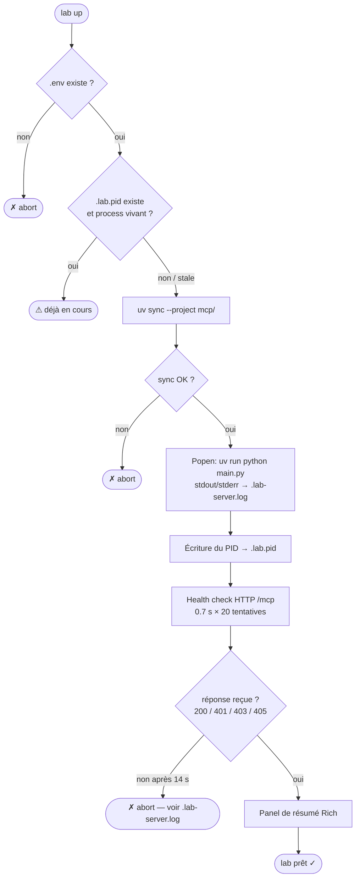

# lab.py — Lab Control CLI

`scripts/lab.py` est le point d'entrée unique pour le cycle de développement local.
Il remplace l'enchaînement manuel de commandes (`uv sync`, `python main.py`, `pytest` …)
par une interface en ligne de commande cohérente, avec une sortie colorée et lisible.

**Il n'est pas destiné à la production** — c'est un outil de développement et de test
contre le sandbox Cisco ACI DevNet ou un APIC de lab.

---

## Prérequis

| Outil | Version minimale | Installation rapide |
|---|---|---|
| Python | 3.11+ | `brew install python` |
| [uv](https://github.com/astral-sh/uv) | dernière | `brew install uv` |
| `.env` configuré | — | `cp .env.example .env` puis remplir les variables |

Les dépendances Python du script lui-même (`click`, `rich`, `pyfiglet`) sont déclarées
en métadonnées inline [PEP 723](https://peps.python.org/pep-0723/) — `uv` les installe
automatiquement à la première exécution, sans `pip install` préalable.

---

## Démarrage rapide

```bash
# Lancer le lab complet (splash + deps + server + health check)
make lab

# Équivalent direct
uv run scripts/lab.py up
```

---

## Commandes

### `up` — Démarrer le lab

```bash
make lab
# ou
uv run scripts/lab.py up
```

La séquence complète exécutée :



> **Pourquoi 401 = "server is up" ?**
> Le middleware d'authentification répond 401 aux requêtes sans token valide.
> C'est la preuve que le serveur tourne et que l'auth est active — le comportement attendu.

Sortie attendue :

```text
 ____   __  __  ___    ____     _     ____ ___
|  _ \ |  \/  ||  _|  |  _ \  / \   / ___|_ _|
| | | || |\/| || |    | |_) |/ _ \ | |    | |
| |_| || |  | || |_   |  __// ___ \| |___ | |
|____/ |_|  |_||____|  |_|  /_/   \_\\____|___|

                        Khalid El-Ouiali · Monark AIOPS srl  © 2026

→ syncing mcp dependencies …
✓ dependencies up to date
→ starting MCP server on port 8000 …
✓ MCP server is up  (pid 84312)

╭─────── lab ready ────────╮
│ endpoint  http://localhost:8000/mcp  │
│ auth      enabled (2 keys)           │
│ apic      https://sandboxapicdc...   │
│ schema    12m ago                    │
│ pid       84312                      │
│ logs      .lab-server.log            │
╰──────────────────────────╯
```

---

### `logs` — Voir les logs en temps réel

```bash
# Affiche les 50 dernières lignes puis suit le flux (défaut)
uv run scripts/lab.py logs

# Afficher les 200 dernières lignes
uv run scripts/lab.py logs -n 200
```

Stream le fichier `.lab-server.log` en temps réel via `tail -f`. Affiche
d'abord les `N` dernières lignes déjà enregistrées, puis suit les nouvelles
entrées au fur et à mesure que le serveur les écrit. **Ctrl-C** pour arrêter.

> Si `.lab-server.log` n'existe pas, le serveur n'a pas encore été démarré —
> lancer `make lab` d'abord.

---

### `down` — Arrêter le serveur

```bash
uv run scripts/lab.py down
```

Envoie `SIGTERM` au processus référencé dans `.lab.pid`, attend jusqu'à 3 secondes
pour une sortie propre, puis supprime `.lab.pid`.

Si le fichier `.lab.pid` n'existe pas (serveur déjà arrêté ou démarré manuellement),
la commande le signale sans erreur.

---

### `status` — État du lab

```bash
uv run scripts/lab.py status
```

Affiche un tableau de bord instantané sans modifier aucun état :

| Champ | Ce qu'il indique |
|---|---|
| server | process vivant ou arrêté (détecte les PIDs stale) |
| endpoint | URL complète du MCP calculée depuis `MCP_PORT` |
| apic | valeur de `APIC_HOST` — confirme quel environnement est ciblé |
| api keys | nombre de tokens configurés dans `MCP_API_KEYS` |
| schema | âge de `data/class-descriptions.json` (vert < 1 h, jaune < 24 h, rouge sinon) |

---

### `test` — Lancer les tests

```bash
# Tests unitaires uniquement (rapide, sans réseau)
uv run scripts/lab.py test

# Tests d'intégration inclus (nécessite le lab en cours + APIC joignable)
uv run scripts/lab.py test --live
```

| Mode | Tests inclus | Prérequis réseau |
|---|---|---|
| défaut | `mcp/tests/unit/` | aucun |
| `--live` | `mcp/tests/unit/` + `mcp/tests/integration/` | serveur MCP en cours + APIC |

Le code de sortie de `lab test` est celui de pytest — compatible avec les pipelines CI.

---

### `collect` — Régénérer l'index des classes ACI

```bash
uv run scripts/lab.py collect
```

Lance le pipeline complet du dossier `schema-collector/` :

```text
fetch_cobra.py      → télécharge le wheel acimodel depuis l'APIC
gen_classes.py      → extrait la liste de toutes les classes → classes.yaml
fetch_schemas.py    → récupère les fichiers jsonmeta → mo-schemas/
gen_descriptions.py → construit l'index de recherche → data/class-descriptions.json
```

**Après un collect, redémarrer le serveur** pour qu'il recharge l'index en mémoire :

```bash
uv run scripts/lab.py down
make lab
```

Durée typique : 5 à 15 minutes selon la taille du fabric (15 000+ classes).

---

### `keys` — Générer des clés API

```bash
# Générer 1 clé (défaut)
uv run scripts/lab.py keys

# Générer 3 clés d'un coup
uv run scripts/lab.py keys 3
```

Chaque clé est produite par `secrets.token_urlsafe(32)` — 256 bits d'entropie,
adapté à un usage en production comme bearer token pré-partagé.

Les nouvelles clés sont **ajoutées** à la liste existante de `MCP_API_KEYS` dans `.env`
(les clés existantes ne sont pas supprimées). Elles sont aussi affichées en clair dans le
terminal pour pouvoir les distribuer aux clients MCP.

Maximum 20 clés par appel.

---

## Fichiers créés par le script

| Fichier | Rôle | Supprimé par |
|---|---|---|
| `.lab.pid` | PID du processus MCP en arrière-plan | `lab down` |
| `.lab-server.log` | stdout + stderr du serveur MCP | écrasé à chaque `lab up` |

Ces deux fichiers sont listés dans `.gitignore` — ne jamais les committer.

---

## Dépannage

### Le serveur ne démarre pas (`server process exited unexpectedly`)

```bash
cat .lab-server.log
```

Causes fréquentes : port déjà occupé, variable `APIC_HOST` manquante, erreur de syntaxe
dans le code suite à une modification locale.

### `⚠ MCP server already running` alors que rien ne tourne

Le fichier `.lab.pid` contient un PID d'une session précédente qui n'est plus en vie
mais `lab` n'a pas pu le détecter (ex : reboot machine). Solution :

```bash
uv run scripts/lab.py down   # nettoie le .lab.pid stale
make lab                     # redémarre proprement
```

### Les tests d'intégration échouent avec `ConnectionRefused`

Le serveur MCP n'est pas en cours d'exécution. Lancer `make lab` d'abord,
vérifier avec `uv run scripts/lab.py status`, puis relancer les tests avec `--live`.

### L'index des classes est introuvable (`schema: not found`)

```bash
uv run scripts/lab.py collect
```

Puis redémarrer le serveur. Voir [schema-collector](../../schema-collector/) pour les
détails du pipeline.
