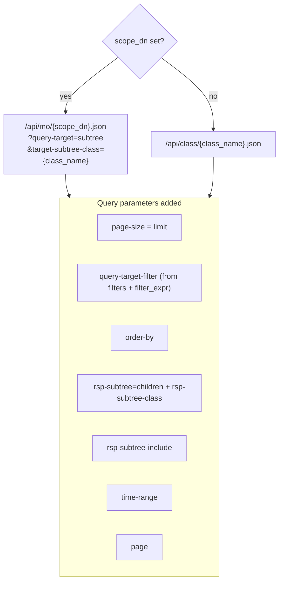

# Tool: query

Execute a filtered class query against the APIC. **Only call this after `search_classes` and `get_schema`.**

---

## Signature

```python
query(
    class_name: str,
    filters: dict[str, str] | None = None,
    scope_dn: str | None = None,
    limit: int = 20,
    order_by: str | None = None,
    include_children: list[str] | None = None,
    filter_expr: str | None = None,
    rsp_subtree_include: str | None = None,
    time_range: str | None = None,
    page: int | None = None,
) -> list[dict[str, Any]]
```

---

## Parameters

### Required

| Parameter | Type | Description |
|---|---|---|
| `class_name` | `str` | Exact ACI class name — **must** be verified with `search_classes()` first |

### Filtering

| Parameter | Type | Default | Description |
|---|---|---|---|
| `filters` | `dict[str, str]` | `{}` | Simple equality filters `{attr: value}`. Keys must be valid property names from `get_schema()`. Multiple entries are combined with APIC `and()`. |
| `filter_expr` | `str` | — | Raw APIC filter for complex predicates. Combined with `filters` via `and()` when both set. |

### Scoping

| Parameter | Type | Default | Description |
|---|---|---|---|
| `scope_dn` | `str` | — | DN of a parent object. Restricts the query to a subtree — faster than a fabric-wide scan on large deployments. |

### Pagination and ordering

| Parameter | Type | Default | Description |
|---|---|---|---|
| `limit` | `int` | `20` | Maximum objects to return. **Capped at 200.** |
| `page` | `int` | — | 0-based page number for paginated result sets. |
| `order_by` | `str` | — | APIC ordering expression, e.g. `"faultInst.severity\|desc"`. |

### Children and subtrees

| Parameter | Type | Default | Description |
|---|---|---|---|
| `include_children` | `list[str]` | — | Child class names to embed inline. Each result dict gains a `_children` key. |
| `rsp_subtree_include` | `str` | — | Subtree categories: `"faults"`, `"health"`, `"audit-logs"`, `"faults,no-scoped"`, `"faults,required"`. |

### Time-based queries

| Parameter | Type | Description |
|---|---|---|
| `time_range` | `str` | For log record classes (`faultRecord`, `aaaModLR`, `eventRecord`). Examples: `"24h"`, `"1week"`, `"2026-01-01\|2026-01-31"`. |

---

## Return value

List of attribute dicts. Each dict contains:

- All APIC attributes for the object (from `obj.attributes`)
- `"_class"` — the ACI class name
- `"dn"` — always present, encodes the full object path
- `"_children"` — present only when `include_children` is set

```json
[
  {
    "_class": "fvBD",
    "dn": "uni/tn-OT/BD-servers",
    "name": "servers",
    "arpFlood": "no",
    "unicastRoute": "yes",
    "_children": [
      {
        "_class": "fvSubnet",
        "dn": "uni/tn-OT/BD-servers/subnet-[10.0.1.0/24]",
        "ip": "10.0.1.1/24"
      }
    ]
  }
]
```

---

## Raises

| Exception | Condition |
|---|---|
| `UnknownClassError` | `class_name` is not in the 15k-class registry. Includes `.suggestions` (list) and `.registry_size` (int). |

---

## APIC URL construction



---

## Filter syntax

`filters` is converted to APIC `eq()` syntax automatically:

| `filters` dict | Generated filter |
|---|---|
| `{}` | *(no filter parameter)* |
| `{"name": "servers"}` | `eq(fvBD.name,"servers")` |
| `{"name": "servers", "arpFlood": "yes"}` | `and(eq(fvBD.name,"servers"),eq(fvBD.arpFlood,"yes"))` |

`filter_expr` accepts raw APIC predicates for operations not covered by `filters`:

```python
# Objects with severity greater than minor
query("faultInst", filter_expr='gt(faultInst.severity,"minor")')

# Wildcard on DN
query("fvBD", filter_expr='wcard(fvBD.dn,"uni/tn-OT")')

# Not equal
query("fabricNode", filter_expr='ne(fabricNode.role,"controller")')
```

When both `filters` and `filter_expr` are set they are combined:

```python
query("fvBD",
      filters={"unicastRoute": "yes"},
      filter_expr='wcard(fvBD.dn,"uni/tn-OT")')
# → and(wcard(fvBD.dn,"uni/tn-OT"),eq(fvBD.unicastRoute,"yes"))
```

---

## Recipes

### All bridge domains in a tenant

```python
tenants = await query("fvTenant", filters={"name": "OT"})
bds = await query("fvBD", scope_dn=tenants[0]["dn"])
```

### Bridge domain with its subnets and VRF relation

```python
results = await query("fvBD",
    filters={"name": "servers"},
    include_children=["fvSubnet", "fvRsCtx"])
```

### Recent faults (last 24 hours)

```python
faults = await query("faultRecord", time_range="24h", order_by="faultRecord.created|desc")
```

### Paginated results

```python
page_0 = await query("faultInst", limit=50, page=0)
page_1 = await query("faultInst", limit=50, page=1)
```

### Active faults on a specific EPG

```python
epgs = await query("fvAEPg", filters={"name": "web"})
dn = epgs[0]["dn"]
faults = await query("faultInst", scope_dn=dn, rsp_subtree_include="faults,no-scoped")
```

### All fabric nodes (excluding controllers)

```python
nodes = await query("fabricNode",
    filter_expr='ne(fabricNode.role,"controller")',
    order_by="fabricNode.id|asc")
```

---

## Performance tips

- Always use `scope_dn` when you know the parent — it issues a subtree query which is faster than a fabric-wide class scan.
- Use `limit` conservatively — the default is 20. Only increase if you know the result set is larger.
- Use `filters` to pre-filter at the APIC level rather than filtering the returned list in code.
