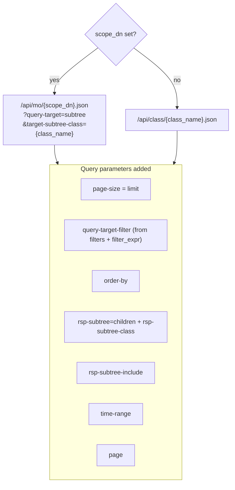

# Tool: query

Execute a filtered class query against the APIC. **Only call this after `search_classes` and `get_schema`.**

---

## Signature

```python
query(
    class_name: str,
    filters: dict[str, str] | None = None,
    scope_dn: str | None = None,
    limit: int = 20,
    order_by: str | None = None,
    include_children: list[str] | None = None,
    filter_expr: str | None = None,
    rsp_subtree_include: str | None = None,
    time_range: str | None = None,
    page: int | None = None,
    config_only: bool = False,
    fetch_all: bool = False,
) -> dict[str, Any]
```

**Returns an envelope dict, not a bare list** — see [Return value](#return-value) below. This is a breaking-looking change for any code written against an older version of this doc: `result["results"][0]["dn"]`, not `result[0]["dn"]`.

---

## Parameters

### Required

| Parameter | Type | Description |
|---|---|---|
| `class_name` | `str` | Exact ACI class name — **must** be verified with `search_classes()` first |

### Filtering

| Parameter | Type | Default | Description |
|---|---|---|---|
| `filters` | `dict[str, str]` | `{}` | Simple equality filters `{attr: value}`. Keys must be valid property names from `get_schema()`. Multiple entries are combined with APIC `and()`. |
| `filter_expr` | `str` | — | Raw APIC filter for complex predicates. Combined with `filters` via `and()` when both set. |

### Scoping

| Parameter | Type | Default | Description |
|---|---|---|---|
| `scope_dn` | `str` | — | DN of a parent object. Restricts the query to a subtree — faster than a fabric-wide scan on large deployments. |

### Pagination and ordering

| Parameter | Type | Default | Description |
|---|---|---|---|
| `limit` | `int` | `20` | Maximum objects to return per page. Clamped to `[1, 200]` — values below 1 are raised to 1 rather than passed to the APIC as an invalid page-size. Also the page size used internally when `fetch_all=True`. |
| `page` | `int` | — | 0-based page number for paginated result sets. Ignored when `fetch_all=True`. |
| `order_by` | `str` | — | APIC ordering expression, e.g. `"faultInst.severity\|desc"`. |
| `fetch_all` | `bool` | `False` | Walk every page (using `limit` as page size) and return the complete matching set in one call — the reliable way to answer a max/min/total/all-of question over a whole class instead of paging manually. Stops early only if a safety cap (thousands of objects) is hit, in which case `complete` is `False` in the response; narrow the query (e.g. `scope_dn`) and combine results. |

### Children and subtrees

| Parameter | Type | Default | Description |
|---|---|---|---|
| `include_children` | `list[str]` | — | Child class names to embed inline. Each result dict gains a `_children` key. |
| `rsp_subtree_include` | `str` | — | Subtree categories: `"faults"`, `"health"`, `"audit-logs"`, `"faults,no-scoped"`, `"faults,required"`. |

### Attribute projection

| Parameter | Type | Default | Description |
|---|---|---|---|
| `config_only` | `bool` | `False` | When `True`, return only user-configurable attributes (APIC `rsp-prop-include=config-only`) instead of the full ~40-attribute set. Ideal for comparison, drift detection, and backup — drops runtime state, timestamps, and monitoring counters. |

### Time-based queries

| Parameter | Type | Description |
|---|---|---|
| `time_range` | `str` | For log record classes (`faultRecord`, `aaaModLR`, `eventRecord`). Examples: `"24h"`, `"1week"`, `"2026-01-01\|2026-01-31"`. |

---

## Return value

An **envelope dict** — not a bare list:

```json
{
  "results": [
    {
      "_class": "fvBD",
      "dn": "uni/tn-OT/BD-servers",
      "name": "servers",
      "arpFlood": "no",
      "unicastRoute": "yes",
      "_children": [
        {
          "_class": "fvSubnet",
          "dn": "uni/tn-OT/BD-servers/subnet-[10.0.1.0/24]",
          "ip": "10.0.1.1/24"
        }
      ]
    }
  ],
  "returned": 1,
  "total_available": 1,
  "truncated": false,
  "next_page": null,
  "complete": true,
  "note": null
}
```

| Field | Type | Description |
|---|---|---|
| `results` | `list[dict]` | The objects themselves — each dict has all APIC attributes, a `"_class"` key, an always-present `"dn"`, and `"_children"` when `include_children` is set. Same per-object shape as before; the change is the wrapper around it. |
| `returned` | `int` | `len(results)` |
| `total_available` | `int` | True match count, fabric- or subtree-wide — independent of how many were actually fetched |
| `truncated` | `bool` | `total_available > returned` — a default-page result is a **partial page**, not the whole matching set. Never conclude a max/min/total/complete-list answer from a truncated result. |
| `next_page` | `int \| None` | `page + 1` when truncated and `fetch_all` was not used; `None` otherwise |
| `complete` | `bool` | `False` only if `fetch_all=True` hit the safety cap before exhausting all matches |
| `note` | `str \| None` | Guidance text, present only when truncated or capped |

Any code written against the older (pre-envelope) shape of this doc needs updating: `result["results"][0]["dn"]`, not `result[0]["dn"]`.

---

## Raises

| Exception | Condition |
|---|---|
| `UnknownClassError` | `class_name` is neither in the 15k-class descriptions registry nor resolvable to a schema file. Includes `.suggestions` (list) and `.registry_size` (int). A class with a schema file but no descriptions entry is allowed through with a warning instead of raising. |
| `FilterError` | An entry in `filters` has a class/attribute name or value that cannot be safely embedded in an APIC filter string. |
| `ApicRequestError` | APIC returned a non-2xx, non-auth response — e.g. 400 for a malformed `filter_expr`, or a transient 5xx that never recovered. Carries the HTTP status and, when present, the APIC error text. |

---

## APIC URL construction


```mermaid
flowchart TD
    SD{scope_dn set?}

    SD -->|"yes"| URL_MO["/api/mo/{scope_dn}.json\n?query-target=subtree\n&target-subtree-class={class_name}"]
    SD -->|"no"| URL_CLASS["/api/class/{class_name}.json"]

    URL_MO --> PARAMS
    URL_CLASS --> PARAMS

    subgraph PARAMS["Query parameters added"]
        P1["page-size = limit"]
        P2["query-target-filter (from filters + filter_expr)"]
        P3["order-by"]
        P4["rsp-subtree=children + rsp-subtree-class"]
        P5["rsp-subtree-include"]
        P6["time-range"]
        P7["page"]
    end
```

---

## Filter syntax

`filters` is converted to APIC `eq()` syntax automatically:

| `filters` dict | Generated filter |
|---|---|
| `{}` | *(no filter parameter)* |
| `{"name": "servers"}` | `eq(fvBD.name,"servers")` |
| `{"name": "servers", "arpFlood": "yes"}` | `and(eq(fvBD.name,"servers"),eq(fvBD.arpFlood,"yes"))` |

`filter_expr` accepts raw APIC predicates for operations not covered by `filters`:

```python
# Objects with severity greater than minor
query("faultInst", filter_expr='gt(faultInst.severity,"minor")')

# Wildcard on DN
query("fvBD", filter_expr='wcard(fvBD.dn,"uni/tn-OT")')

# Not equal
query("fabricNode", filter_expr='ne(fabricNode.role,"controller")')
```

When both `filters` and `filter_expr` are set they are combined:

```python
query("fvBD",
      filters={"unicastRoute": "yes"},
      filter_expr='wcard(fvBD.dn,"uni/tn-OT")')
# → and(wcard(fvBD.dn,"uni/tn-OT"),eq(fvBD.unicastRoute,"yes"))
```

---

## Recipes

### All bridge domains in a tenant

```python
tenants = await query("fvTenant", filters={"name": "OT"})
bds = await query("fvBD", scope_dn=tenants["results"][0]["dn"])
```

### Bridge domain with its subnets and VRF relation

```python
result = await query("fvBD",
    filters={"name": "servers"},
    include_children=["fvSubnet", "fvRsCtx"])
bd = result["results"][0]
```

### Recent faults (last 24 hours)

```python
faults = await query("faultRecord", time_range="24h", order_by="faultRecord.created|desc")
records = faults["results"]
```

### Paginated results

```python
page_0 = await query("faultInst", limit=50, page=0)
page_1 = await query("faultInst", limit=50, page=1)
# page_0["truncated"] / page_0["next_page"] tell you whether to keep paging
```

### Every fault, regardless of page size (fetch_all)

```python
all_faults = await query("faultInst", fetch_all=True)
if not all_faults["complete"]:
    # hit the safety cap — narrow with scope_dn and combine
    ...
count = all_faults["returned"]
```

### Active faults on a specific EPG

```python
epgs = await query("fvAEPg", filters={"name": "web"})
dn = epgs["results"][0]["dn"]
faults = await query("faultInst", scope_dn=dn, rsp_subtree_include="faults,no-scoped")
```

### All fabric nodes (excluding controllers)

```python
nodes = await query("fabricNode",
    filter_expr='ne(fabricNode.role,"controller")',
    order_by="fabricNode.id|asc")
node_list = nodes["results"]
```

### Configuration snapshot for backup / diff

```python
# Only the intended config, no operational churn
bds = await query("fvBD", scope_dn="uni/tn-OT", config_only=True)
config = bds["results"]
```

---

## Performance tips

- Always use `scope_dn` when you know the parent — it issues a subtree query which is faster than a fabric-wide class scan.
- Use `limit` conservatively — the default is 20. Only increase if you know the result set is larger.
- Use `filters` to pre-filter at the APIC level rather than filtering the returned list in code.
