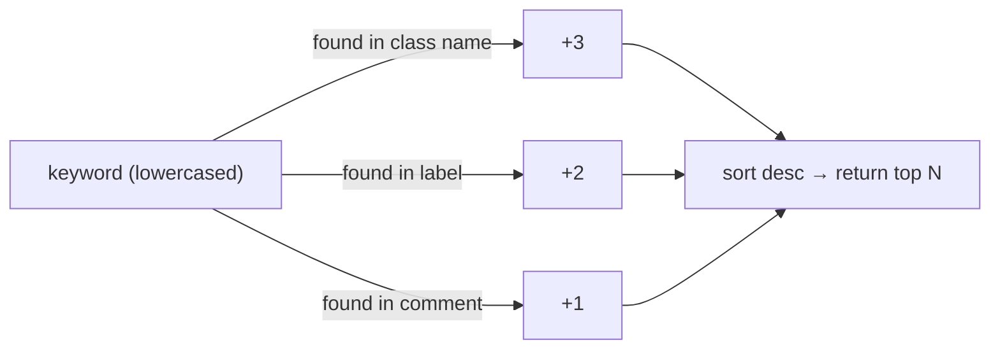

# Tool: search_classes

Discover ACI class names by keyword. **Always call this first** — never assume a class name.

---

## Signature

```python
search_classes(keyword: str, limit: int = 10) -> list[dict[str, str]]
```

| Parameter | Type | Default | Description |
|---|---|---|---|
| `keyword` | `str` | — | Plain English term or partial ACI class name |
| `limit` | `int` | `10` | Maximum results to return. **Capped at 50.** |

---

## Return value

List of dicts, sorted by relevance score (descending):

```json
[
  {
    "class_name": "fvBD",
    "label": "Bridge Domain",
    "comment": "A bridge domain is a unique layer 2 forwarding domain that contains one or more subnets."
  }
]
```

| Field | Description |
|---|---|
| `class_name` | Exact ACI class name — use this in `get_schema()` and `query()` |
| `label` | Short human-readable label from the APIC schema |
| `comment` | One-sentence description from the APIC schema |

An empty list means no class matched the keyword. Refine or broaden the search term.

---

## Scoring



A class that matches in both its name and label scores 5 and ranks above a comment-only match (score 1).

---

## Examples

```python
# Find the Bridge Domain class
search_classes("bridge domain")
# → [{"class_name": "fvBD", "label": "Bridge Domain", ...}]

# Find all tenant-related classes
search_classes("tenant", limit=20)

# Partial class name (you remember part of it)
search_classes("fvAEP")

# Operational data
search_classes("fault")
search_classes("audit log")

# Network topology
search_classes("node")
search_classes("path endpoint")
```

---

## Common searches

| You want | Use keyword |
|---|---|
| Bridge domains | `bridge domain` |
| Tenants | `tenant` |
| EPGs | `endpoint group` |
| Contracts | `contract` |
| VRFs | `vrf` or `layer 3` |
| Faults | `fault` |
| Fabric nodes | `node` or `fabric node` |
| Interface policies | `interface policy` |
| Physical ports | `path endpoint` |
| Subnets | `subnet` |

---

## Edge cases

- **Empty keyword** → returns `[]` immediately (no scan)
- **No match** → returns `[]`
- **`limit=0`** → returns `[]`
- **`limit > 50`** → silently capped at 50
- Search is **case-insensitive** — `"BRIDGE"` and `"bridge"` produce the same results
